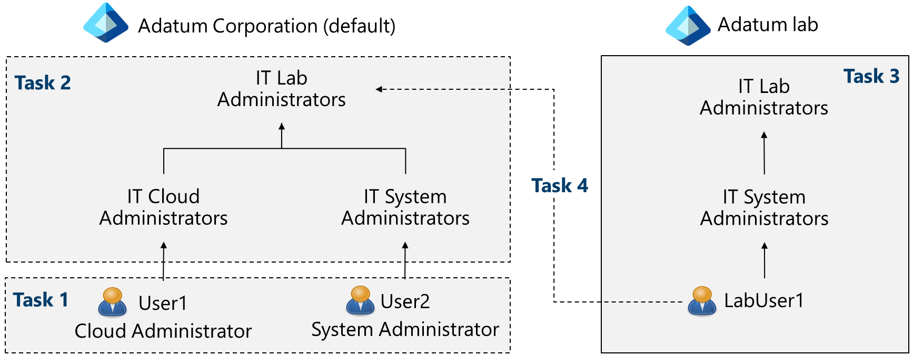
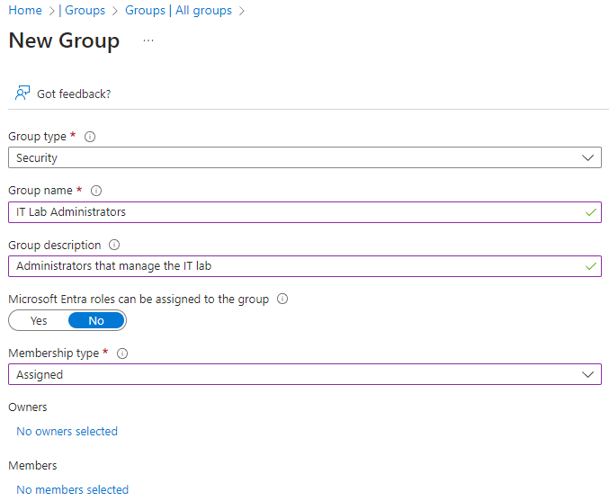

---
lab:
    title: 'Lab 01: Manage Microsoft Entra ID Identities'
    module: 'Administer Identity'
---

# Lab 01 - Manage Microsoft Entra ID Identities

## Lab introduction

This is the first in a series of labs for Azure Administrators. In this lab, you learn about users and groups. Users and groups are the basic building blocks for an identity solution. You also get familiar with basic administrator tools. 

This lab requires an Azure subscription. Your subscription type may affect the availability of features in this lab. You may change the region, but the steps are shown in **East US**.

## Estimated timing: 30 minutes

## Lab scenario

Your organization is building a new lab environment for pre-production testing of apps and services.  A few engineers are being hired to manage the lab environment, including the virtual machines. To allow the engineers to authenticate by using Microsoft Entra ID, you have been tasked with provisioning users and group accounts. To minimize administrative overhead, membership of the groups should be updated automatically based on job titles. You also need to know how to delete users to prevent access after an engineer leaves your organization.

## Interactive lab simulation

There are interactive lab simulations that you might find useful for this topic. The simulation lets you to click through a similar scenario at your own pace. There are differences between the interactive simulation and this lab, but many of the core concepts are the same. An Azure subscription is not required. 

+ [Manage Entra ID Identities](https://mslabs.cloudguides.com/guides/AZ-104%20Exam%20Guide%20-%20Microsoft%20Azure%20Administrator%20Exercise%201). Create and configure users and assign to groups. Create an Azure tenant and manage guest accounts. 

## Architecture diagram


## Job skills

+ Task 1: Create a resource group.
+ Task 2: Create and configure user accounts.
+ Task 3: Create group accounts and add members.
+ Task 4: Use the Cloud Shell.
+ Task 5: Use Azure PowerShell.
+ Task 6: Use the Bash shell.

## Task 1: Create a resource group

In this task, you create a resource group. A resource group is a grouping of related resources. For example, all the resources for a project, a department, or an application. 


1. Sign in to the **Azure portal** - `https://portal.azure.com`.

    >**Note:** The Azure portal is used in all the labs. If you are new to the Azure, search for and select `Quickstart Center`. Take a few minutes to watch the **Getting started in the Azure portal** video. Even if you have used the portal before, you will find a few tips and tricks on navigating and customizing the interaface. 
   
1. In the Azure portal, search for and select `Resource groups`.

>**Note:** For each lab in this course you will create a new resource group. This lets you quickly locate and manage your lab resources. 
   
1. On the **Resource groups** blade, click **+ Create**, and provide the required information. 

    | Setting | Value |
    | --- | --- |
    | Subscription name | your subscription |
    | Resource group name | `az104-rg1` |
    | Location | **East US** |

    >**Did you know?** The **Quickstart Center** has a video on how to **Select the best region**.
    
1. Click **Review + create** and then click **Create**.

    >**Note**: Wait for the resource group to deploy. Use the **Notification** icon (top right) to track the progress of the deployment.

## Task 2: Create and configure user accounts

In this task, you will create and configure user accounts. User accounts will store user data such as name, department, location, and contact information.

1. Continue in the Azure portal. 

1. Search for and select `Microsoft Entra ID`.

1. Microsoft Entra ID is Azure's cloud-based identity and access management solution. Take a few minutes to familiarize yourself with some of the features listed in the left pane. 

   + **Administrative units** lets you group users, groups, or devices into a single manageable unit.
   + **Licenses** lets you purchase a license, manage the licenses you have, and assign licenses to users and groups.
   + **Self service password reset** allow your users to manage their password from any device, at any time, from any location. This feature requires a premium license. 

### Create a new user

1. Select **Users**, then in the **New user** drop-down select **Create new user**. 

1. Create a new user with the following settings (leave others with their defaults). On the **Properties** tab notice all the different types of information that can be included in the user account. 

    | Setting | Value |
    | --- | --- |
    | User principal name | `az104-user1` |
    | Display name | `az104-user1` |
    | Auto-generate password | de-select |
    | Initial password | **Provide a secure password** |
    | Job title (Properties tab) | `IT Lab Administrator` |
    | Department (Properties tab) | `IT` |
    | Usage location (Properties tab) | **United States** |

1. Once you have finished reviewing, select **Review + create** and then **Create**.

### Invite an external user

1. Select **Users**, then in the **New user** drop-down select **Invite an external user**. 

    | Setting | Value |
    | --- | --- |
    | Email | your email address |
    | Display name | your name |
    | Send invite message | **check the box** |
    | Message | **Welcome to Azure and our group project** |

1. Move to the **Properties** tab. Notice the **User type** is **Guest**. Notice the user account information is similar to creating a new user.

1. Select **Review + invite**, and then **Invite**. 

>**Note:** It is unlikely you will be creating user accounts individually. Do you know how your organization plans to create and manage user accounts?

### Task 4: Create group accounts and add members

In this task, you create a group account. Group accounts can include user accounts or devices. These are two basic ways member are assigned to groups: Statically and Dynamically. Static groups require administrators to add and remove members manually.  Dynamic groups update automatically based on the properties of a user account or devices. For example, job title. 

1. In the Azure portal, search for and select `Groups`.

1. Take a minute to familiarize yourself group settings in the left pane.

   + **Expiration** lets you configre a group lifetime in days. The group must be renewed by the owner.
   + **Naming policy** lets you configure blocked words and add a prefix or suffix to group names.

1. Select **+ New group** and create a new group. 

    | Setting | Value |
    | --- | --- |
    | Group type | **Security** |
    | Group name | `IT Lab Administrators` (adjust the name if this one is not available) |
    | Group description | `Administrators that manage the IT lab` |
    | Membership type | **Assigned** |

    >**Note**: Notice the other options in the **Membership type** drop-down. An Entra ID Premium P1 or P2 license is required for dynamic membership. 

    

1. Select **No owners selected**.

1. In the **Add owners** page, search for and **select** yourself as the owner. Notice you can have more than one owner. 
   
1. Select **No members selected**.

1. In the **Add members** pane, search for and **select** the **az104-user1** and add them to the group. 

1. Select **Create** to deploy the group.

>**Note:** You may be managing a large number of groups. Does your organization have a plan for creating groups and adding members?

## Task 5: Use the Cloud Shell.

In this task, you work with the Azure Cloud Shell. Azure Cloud Shell is an interactive, authenticated, browser-accessible terminal for managing Azure resources. It provides the flexibility of choosing the shell experience that best suits the way you work, either Bash or PowerShell. You will use this tool often in this course. 

1. Select the **Cloud Shell** icon in the top right of the Azure Portal. Alternately, you can navigate directly to `https://shell.azure.com`.

   

1. When prompted to select either **Bash** or **PowerShell**, select **PowerShell**. 

    >**Did you know?**  If you mostly work with Linux systems, Bash feels more familiar. If you mostly work with Windows systems, Azure PowerShell feels more familiar. 

1. On the **You have no storage mounted** screen select **Show advanced settings** and provide the required information. When completed select **Create storage**.

    >**Note:** As you work with the Cloud Shell a storage accound and file share is required. 

    | Settings | Values |
    |  -- | -- |
    | Resource Group | **az104-rg1** |
    | Storage account (Create new) | `sa-cloudshell` (must be globally unique) |
    | File share (create new) | **fs-cloudshell** |

    >**Note:** If you would like to practice with **Azure PowerShell**, continue to **Task 6**. If you want to practice with **Bash (CLI)**, then skip to **Task 7**. 

## Task 6: Use Azure PowerShell

In this task, you create a resource group and a group account by using Azure PowerShell session within the Cloud Shell. Azure PowerShell scripts will be provided throughout the course. 

>**Did you know?** You can use the arrow keys to move through the command history. Use the tab key to autocomplete commands and parameters. At any time use **cls** to clear the command window.

1. Azure PowerShell uses a *Verb*-*Noun* format for commands. For example, the command to create a new resource group is **New-AzResourceGroup**. To view how to use a command, run the Get-Help command.

   ```powershell
   Get-Help New-AzResourceGroup -detailed
   ```
1. To create a resource group, run the following commands. Note that the commands starting with a dollar sign ($) are creating variables. Ensure you receive a succeeded message. 

   ```powershell
   $location = 'eastus'
   $rgName = 'az104-rg-ps'
   New-AzResourceGroup -Name $rgName -Location $location
   ```

1. To retrieve properties of the newly created resource group, run the following command:

   ```powershell
   Get-AzResourceGroup -Name $rgName
   ```

1. Now, let's try learn how to create an Azure group.

   ```powershell
   Get-Help New-AzureADGroup -detailed
   ```

1. Using the example in the Help, try these commands. Notice you must first connect to Azure AD.

   ```powershell
   Connect-AzureAD 
   New-AzureADGroup -DisplayName "MyPSgroup" -MailEnabled $false -SecurityEnabled $true -MailNickName "MyPSgroup"
   ```

1. Return to the Azure portal. Confirm you have a new resource group and a new Azure group. You may need to Refresh the pages. 

## Task 7: Use the Bash shell

In this task, you create a resource group and an Azure group by using Azure CLI within the Cloud Shell. Azure CLI scripts will be provided throughout the course. 

1. Continue in the Cloud Shell. Use the drop-down to switch to **Bash**.

>**Did you know?** You can use the arrow keys to move through the command history. Use the tab key to autocomplete commands and parameters. At any time use **clear** to clear the command window.

1. The Azure CLI uses an easy-to-read syntax. For example, to interact with resource groups, the command is **az group**.  

   ```sh
   az group --help
   ```

1. The **create** option looks promising. Note the capitalized names create variables that you can reference in subsequent commands. 

   ```sh
   RGNAME='az104-rg1-cli'
   LOCATION='eastus'
   az group create --name $RGNAME --location $LOCATION
   ```
   
1. To verify and retrieve properties for the newly created resource group, use the **show** command. 

   ```sh
   az group show --name $RGNAME
   ```
1. Now, let's use help to learn more about creating an Azure group.

    ```sh
    az ad group --help
    ```
1. **Create** the group and **list** the groups to verify.

   ```sh
   az ad group create --display-name MyCLIgroup --mail-nickname MyCLIgroup
   az ad group list
   ```

1. Return to the Azure portal. Confirm you have a new resource group and a new Azure group. You may need to Refresh the pages.   
    
## Key takeaways

Congratulations on completing the lab. Here are some main takeways for this lab:

+ The Azure portal is a good way to get started with creating and managing Azure resources. Administrators can customize the portal and share dashboards.
+ Resource groups are a way of grouping related resources,. You can use a resource group for a project, a department, or an application. This makes it easy to manage and monitor a group of related resources. 
+ There are different types of user accounts in Microsoft Entra ID. Each user account type has a level of access specific to the scope of work expected. 
+ Group accounts group together related users or devices. Group membership can be assigned statically or dynamically. 
+ The Cloud Shell is an interactive, authenticated terminal for managing Azure resources. The Cloud Shell provides access to Bash or Azure PowerShell.
+ Azure PowerShell and Bash provide a scripted way to create resources. 

## Learn more with self-paced training

+ [Understand Microsoft Entra ID](https://learn.microsoft.com/training/modules/understand-azure-active-directory/). Compare Microsoft Entra ID to Active Directory DS, learn about Microsoft Entra ID P1 and P2, and explore Microsoft Entra Domain Services for managing domain-joined devices and apps in the cloud.
+ [Create Azure users and groups in Microsoft Entra ID](https://learn.microsoft.com//training/modules/create-users-and-groups-in-azure-active-directory/). Create users in Microsoft Entra ID. Understand different types of groups. Create a group and add members. Manage business-to-business guest accounts.
+ [Allow users to reset their password with Microsoft Entra self-service password reset](https://learn.microsoft.com/training/modules/allow-users-reset-their-password/). Evaluate self-service password reset to allow users in your organization to reset their passwords or unlock their accounts. Set up, configure, and test self-service password reset.


## Cleanup your resources

If you are working with your own subscription take a minute to delete the lab resources. This will ensure resources are freed up and cost is minimized. The easiest way to delete the lab resources is to delete the lab resource group. 

+ In the Azure portal, select the resource group, select **Delete the resource group**, **Enter resource group name**, and then click **Delete**.
+ Using Azure PowerShell, `Remove-AzResourceGroup -Name resourceGroupName`.
+ Using the CLI, `az group delete --name resourceGroupName`.

