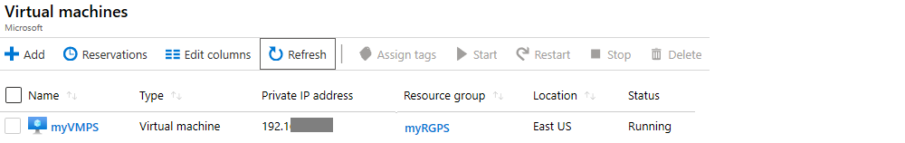
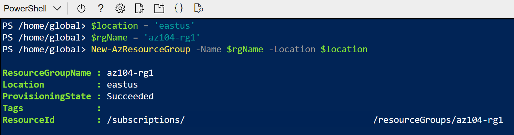

---
lab:
    title: 'Lab 01: Manage Microsoft Entra ID Identities'
    module: 'Administer Identity'
---

# Lab 01 - Manage Microsoft Entra ID Identities

## Lab scenario

Your organization is building out a new lab environment for pre-production testing of apps and services.  A few engineers are being hired to manage the lab environment, including the virtual machines. In order to allow the engineers to authenticate by using Microsoft Entra ID, you have been tasked with provisioning users and group accounts. To minimize administrative overhead, membership of the groups should be updated automatically based on job titles. You also need to know how to delete users to prevent access after an engineer leaves your organization.

**Note:** An **[interactive lab simulation](https://mslabs.cloudguides.com/guides/AZ-104%20Exam%20Guide%20-%20Microsoft%20Azure%20Administrator%20Exercise%201)** is available that allows you to click through this lab at your own pace. You may find slight differences between the interactive simulation and the hosted lab, but the core concepts and ideas being demonstrated are the same.

## Lab requirements

This lab requires access to the Azure portal and the ability to create group accounts. 

## Estimated timing: 30 minutes

## Tasks

In this lab, you will:

+ Task 1: Familiarize yourself with the Azure portal 
+ Task 2: Create a resource group
+ Task 3: Familiarize yourself with user accounts and group membership
+ Task 4: Create groups with assigned and dynamic membership
+ Task 5: Familiarize yourself with the Cloud Shell
+ Task 6: Practice with Azure PowerShell
+ Task 7: Practice with Bash

## Architecture diagram


## Task 1: Familiarize yourself with the Azure portal 

In this task, you familiarize yourself with the Azure portal. The Azure portal is a web-based, unified console that provides an alternative to command-line tools. With the Azure portal, you can manage your Azure subscription using a graphical user interface. You can build, manage, and monitor everything from simple web apps to complex cloud deployments in the portal. 

1. Sign in to the [Azure portal](https://portal.azure.com). 

1. Begin your tour of the Azure portal, by selecting the top left menu icon. 

   + Select **Home** to view recent services and resources. You can also create favorites. 
   + Select **Dashboard** for a customized view. [Dashboards](https://learn.microsoft.com/zure/azure-portal/azure-portal-dashboards) are a focused and organized view of your cloud resources in the Azure portal. Use dashboards as a workspace where you can monitor resources and quickly launch tasks for day-to-day operations.
   + Select **All services** to view a categorized list of Azure services.

1. You may find it quicker to **Search resources, services, and docs** using the search box in the top center of the portal. The search box provides autocomplete and suggestions for services or resources. For example, try `virt` and notice the suggested matches.

1. On the right side of the top menu bar, select the **Settings** icon. Settings lets you customize the portal appearance, language and region.

1. Lastly, in the top right corner is your user account information.
   
## Task 2: Create a new resource group

In this task, you will create a new resource group. A resource group is a grouping of related resources (such as all the resources for a project, a department, or an application). For each lab in this course you will create a resource group. 
    
1. In the Azure portal, search for and select **Resource groups**.
   
1. On the **Resource groups** blade, click **+ Create**, and provide the required information. 

    | Setting | Value |
    | --- | --- |
    | Subscription name | the name of your Azure subscription |
    | Resource group name | `az104-rg1` |
    | Location | **East US** |
    
1. Click **Review + create** and then click **Create**.

    >**Note**: Wait for the resource group to deploy. Use the **Notification** icon (top right) to track progress of the deployment.

1. Back on the **Resource groups** blade, refresh the page and verify your new resource group appears in the list of resource groups.


## Task 2: Familiarize yourself with user accounts and group membership 

In this task, you will familiarize yourself with user account and profiles. You also view group membership.

1. In the Azure portal, search for and select `Microsoft Entra ID`.

1. In the **Manage** section, select the **Users** blade. 

1. Select **New user** from the top menu. Notice the selections for **Create new user** and **Invite external user**. We will not be creating new users in this lab.

1. **Search** for and select your user account. Your user account is shown in the upper right corner of the portal. 

1. Select the **Properties** tab and review all the profile information that can be provided for a user account. 

1. In the **Manage** section, select **Groups**. If you are part of a group, select the group.

1. Notice the group information like **Membership type**, **Source**, and **Type**. Also notice, the number of members in the group. 

## Task 4: Create groups with assigned and dynamic membership

In this task, you will create a group. Groups are used for user accounts or devices. Some groups have members that are statically assigned. Some groups have members that are dynamically assigned. Dynamic groups update automatically based on the properties of user accounts or devices. Static groups require more administrative overhead (administrators have to add and remove members manually).

1. In the Azure portal, search for and select **Groups**.

1. Select **+ New group** and create a new group. 

    | Setting | Value |
    | --- | --- |
    | Group type | **Security** |
    | Group name | `IT Lab Administrators` (adjust the name if this one is not available) |
    | Group description | `Administrators that manage the IT lab` |
    | Membership type | **Assigned** |

    >**Note**: Your **Membership type** drop-down list might be grayed out. This is where you can switch from an assigned group to a dynamic group if you have an Entra ID Premium P1 or P2 license.

    

1. Select **No members selected**.

1. From the **Add members** blade, search for your user account. **Select** your user account to add to the group. 

1. Click **Create** to finish creating the group. 

## Task 4: Configure the Cloud Shell

In this task, you work with the Azure Cloud Shell. Azure Cloud Shell is an interactive, authenticated, browser-accessible terminal for managing Azure resources. It provides the flexibility of choosing the shell experience that best suits the way you work, either Bash or PowerShell. In this task, we will use PowerShell. 

1. Select the **Cloud Shell** icon in the top right of the Azure Portal.

    

1. When prompted to select either **Bash** or **PowerShell**, select **PowerShell**. Bash will be used in the next task.

1. On the **You have no storage mounted** screen select **Show advanced settings** and provide the required information. When completed select **Create storage**. 

    | Settings | Values |
    |  -- | -- |
    | Resource Group | **Create new resource group** |
    | Storage account (Create a new account a use a globally unique name (ex: cloudshellstoragemystorage)) | **cloudshellxxxxxxx** |
    | File share (create new) | **shellstorage** |

    >**Note:** If you are working in a hosted lab environment, you will need to configure cloud shell storage each time a new lab environement is created.

    >**Note:** When working in the Cloud Shell you are automatically connected to Azure. 

## Practice with PowerShell

1. Continue working in the Cloud Shell. At anytime use **cls** to clear the command window.

1. Azure PowerShell uses a *Verb*-*Noun* format for cmdlets. For example, the cmdlet to create a new resource group is **New-AzResourceGroup**. To view how to use the cmdlet, run the Get-Help command.

   ```powershell
   Get-Help New-AzResourceGroup -detailed
   ```


1. To create a resource group from the PowerShell session within Cloud Shell, run the following commands. Note that the commands starting with a dollar sign ($) are creating variables that you can use in later commands.

   ```powershell
   $location = 'eastus'
   $rgName = 'az104-rg-ps'
   New-AzResourceGroup -Name $rgName -Location $location
   ```
   

1. To retrieve properties of the newly created resource group, run the following command:

   ```powershell
   Get-AzResourceGroup -Name $rgName
   ```

1. Let's try to create new Azure AD group.

   ```powershell
   Get-Help New-AzureADGroup -detailed
   ```

1. Using the example in the help, here are the commands. Notice you must first connect to Azure AD.

    ``powershell
   Connect-AzureAD
   New-AzureADGroup -DisplayName "My new group" -MailEnabled $false -SecurityEnabled $true -MailNickName "NotSet"
   ``
1.  Return to Azure portal. Confirm you have a new resource group and a new Azure AD group. 

## Practice with Bash


## Review

Congratulations! You created and configured user accounts, created a group, created a resource group, assigned a role to a user, and deleted a user account.


