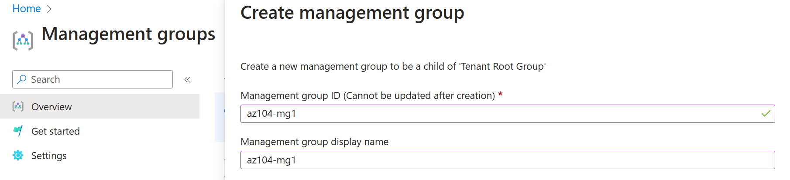
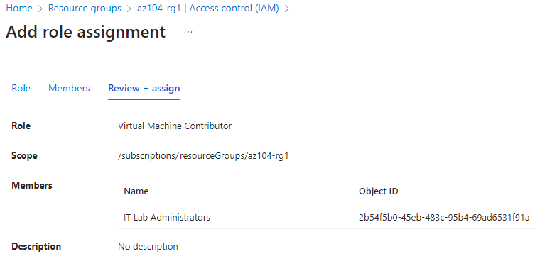
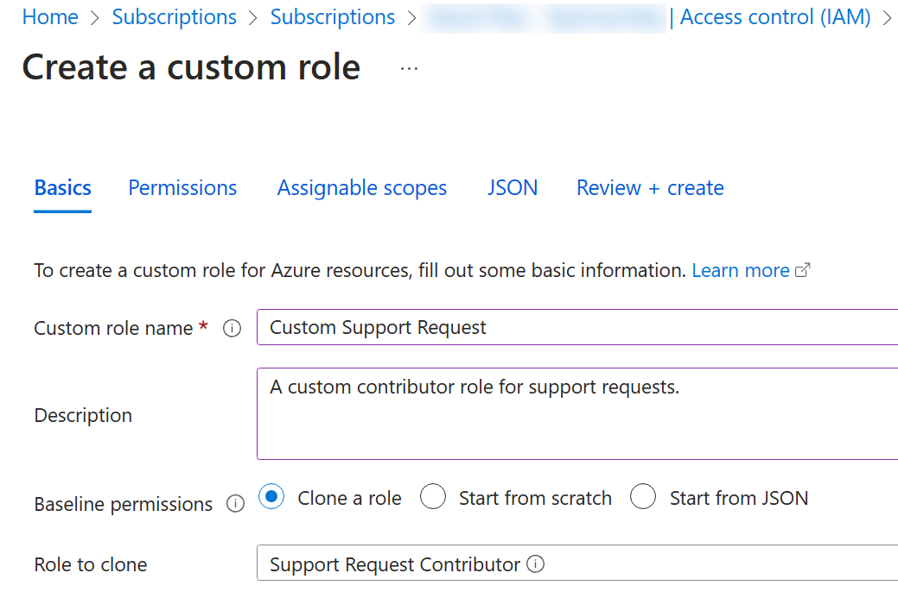
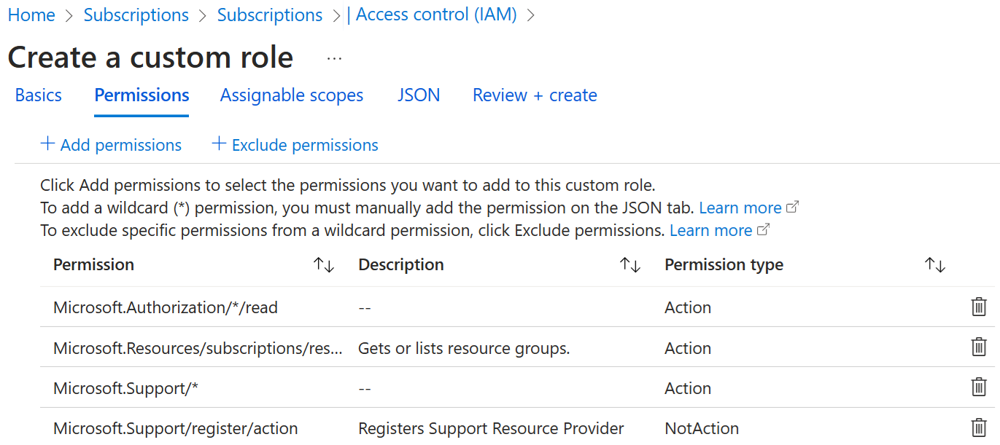
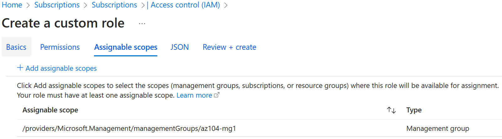
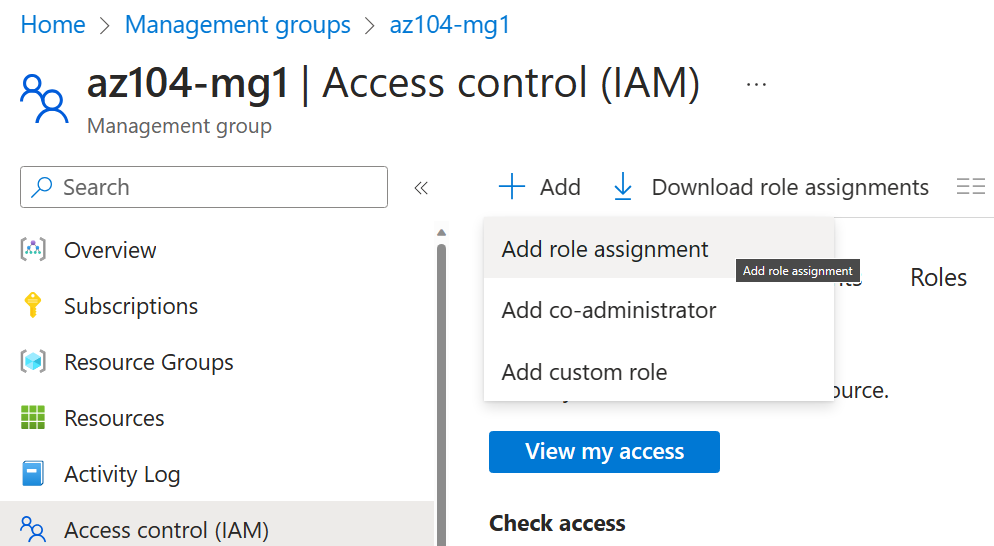
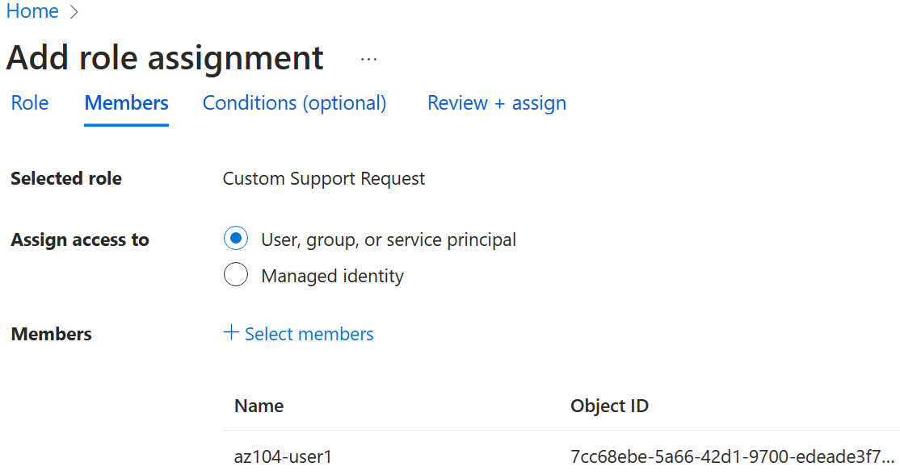

---
lab:
    title: 'Lab 02a: Manage Subscriptions and RBAC'
    module: 'Administer Governance and Compliance'
---

# Lab 02a - Manage Subscriptions and RBAC

## Lab requirements

This lab requires an Azure subscription. Your subscription type may affect the availability of features in this lab. You may change the region, but the steps are written using **East US**. 

## Estimated timing: 30 minutes

## Lab scenario

In order to simplify management of Azure resources in your organization, you have been tasked with implementing the following functionality:

- Creating a management group that includes all your Azure subscriptions.

- Granting permissions to submit support requests for all subscriptions in the management group to a designated user. That user's permissions should be limited only to: 

    - Creating support request tickets
    - Viewing resource groups

## Interactive lab scenario

An **[interactive lab simulation](https://mslabs.cloudguides.com/guides/AZ-104%20Exam%20Guide%20-%20Microsoft%20Azure%20Administrator%20Exercise%202)** is available for this topic. The simulation lets you to click through a similar scenario at your own pace. There are differences between the interactive simulation and this hosted lab, but the core concepts and ideas being demonstrated are the same. An Azure subscription is not required. 

## Tasks

+ Task 1: Implement management groups.
+ Task 2: Review and assign a built-in Azure role.
+ Task 3: Create and assign a custom RBAC roles. 
+ Task 4: Monitor role assignments with the Activity Log.
+ Task 5: Experiment with PowerShell (optional)
+ Task 6: Experiment with CLI (optional)

## Architecture diagram

<!-- Update diagram - simplify names, get rid of custom role JSON--> 

## Task 1: Implement Management Groups

In this task, you will create and configure management groups. Management groups are used to logically organize subscriptions. Subscriptions should be segmented as part of the [Microsoft Well-Architected Framework](https://learn.microsoft.com/en-us/azure/well-architected/), and allow for RBAC and Azure Policy to be assigned and inherited to other management groups and subscriptions. For example, if your organization has a dedicated support team for Europe, you can organize European subscriptions into a management group to provide the support staff access to those subscriptions (without providing individual access to all subscriptions). In our scenario everyone on the Help Desk will need to create a support request across all subscriptions. 

1. Sign in to the **Azure portal** - `http://portal.azure.com`.

1. Search for and select **Management groups** to navigate to the **Management groups** blade.

1. Review the messages at the top of the **Management groups** blade. If you are seeing the message stating **You are registered as a directory admin but do not have the necessary permissions to access the root management group**, perform the following sequence of steps:

    + In the Azure portal, search for and select **Microsoft Entra ID**.
    
    + On the blade displaying properties of your tenant, in the vertical menu on the left side, in the **Manage** section, select **Properties**.
    
    + On the **Properties** blade of your tenant, in the **Access management for Azure resources** section, select **Yes** and then select **Save**.
    
    + Navigate back to the **Management groups** blade, and select **Refresh**.

1. On the **Management groups** blade, click **+ Create**.

1. Create a management group with the following settings. Select **Submit** when you are done. 

    | Setting | Value |
    | --- | --- |
    | Management group ID | `az104-mg1` |
    | Management group display name | `az104-mg1` |

    

1. In this scenario, all subscriptions would now be added to the management group. RBAC would then be applied to management group and scoped to the Help Desk. 

## Task 2: Review and assign a built-in Azure role

In this task, you will assign the VM Contributor role to your user account.  

1. In the portal, search for and the **az104-mg1** management group.

1. Select the **Access control (IAM)** blade, and then the **Roles** tab.

1. Scroll through the role definitions that are available. **View** a role to get detailed information about the **Permissions**, **JSON**, and **Assignments**.

1. Select **+ Add**, and then **Add role assignment**. 

1. On the **Add role assignment** blade, specify the following settings and click **Next** after each step:

    | Setting | Value |
    | --- | --- |
    | Role in the search tab | **Virtual Machine Contributor** |
    | Assign access to (Under Members pane) | **User, group, or service principal** |
    | Select (+Select Members) | *your user account* (shown in upper right corner of the portal) |

    

4. Click **Review + assign** twice to create the role assignment.

    >**Note:** The Virtual machine contributor role lets you manage virtual machines, but not access their operating system or manage the virtual network and storage account they are connected to.

    >**Note:** This assignment might not actually grant you any additional provileges. If you already have the Owner role, this role includes all privileges associated with the Contributor role.

## Task 3: Create custom RBAC roles

In this task, you will create a custom RBAC role. Custom roles are a core part of implementing the principle of least privilege for an environment. Built-in roles might have too many permissions for your organization. In this task we will create a new role and remove permissions that are not be necessary.

### Create the custom RBAC role for the Help Desk users

1. In the portal, search for and select the **az104-mg1** management group.

1. Select the **Access control (IAM)** blade, and then the **Roles** tab.

1. Select the **Check access** tab, then in the Create a custom role box, select **Add**.

    

1. On the Basics tab of Create a custom role, provide the name `Custom Support Request`. In the Description field, enter `A custom contributor role for support requests.`

1. In the Baseline permissions field, select **Clone a role**. In the Role to clone drop-down menu, select **Support Request Contributor**.

    

1. Select the **Permissions** tab, and then select **+ Exclude permissions**.

1. In the resource provider search field, enter `.Support` and select **Microsoft.Support**.

1. In the list of permissions, place a checkbox next to **Other: Registers Support Resource Provider** and then select **Add**. The role should be updated to include this permission as a *NotAction*.

    

1. Select the **Assignable scopes** tab. Select the **Delete** icon on the row for the subscription.

1. Select **+ Add assignable scopes**. Select the **az104-mg1** management group, then click **Select**.

    

1. Select the **JSON** tab. Review the JSON for the *Actions*, *NotActions*, and *AssignableScopes* that are customized in the role. 

1. Selct **Review + Create**, and then select **Create**.

    >**Note:** At this point, you have created a custom role. Your next step is to assign the role to a Help Desk user. 

### Identity the Help Desk user account you will use for testing the new role and assign the custom role. 

1. In the Azure portal, search for and select **Microsoft Entra ID**, then select the **Users** blade.

    >**Note**: This task requires a user account for testing. For this lab we will use, **HelpDesk-user1**. Please take a minute to identify a test user, if necessary **Add** a new user. If you are creating a new user, require the password to be set when they login. 

1. Before continuing ensure you have the **User principal name** for your test account. You will need this to login to the portal. Use the icon to copy this information to the clipboard. 

1. In the Azure portal, navigate back to the **az104-mg1** management group and display its details.

1. Click **Access Control (IAM)**, click **+ Add** and then **Add role assignment**. 

    

1. On the **Role** tab, search for `Custom Support Request`. 

    >**Note**: if your custom role is not visible, it can take up to 10 minutes for the custom role to appear after creation.

1. Select the **Role** and click **Next**. On the **Members** tab, click **+ Select members** and **select** user account **HelpDesk-user1**.  

    

1. Select **Review + assign** twice.

    >**Note:** At this point, you have a Help Desk user account with custom privleges to create a support ticket. Your next step is to test the account.
    
### Test the Help Desk user account to ensure it has the correct privileges

1. Open an **InPrivate** browser window and sign in to the [Azure portal](https://portal.azure.com) using the test user account. If prompted to update the password, change the password for the user.

    >**Note**: Rather than typing the user name, you can paste the content of clipboard.

1. In the **InPrivate** browser window, in the Azure portal, search and select **Resource groups** to verify that the Help Desk user can see all resource groups.

1. In the **InPrivate** browser window, in the Azure portal, search and select **All resources** to verify that the Help Desk user cannot see any resources.

1. In the **InPrivate** browser window, in the Azure portal, search and select **Help + support** and then click **+ Create a support request**. 

    >**Note**: Many organizations opt to provide all of the cloud administrators access to open support cases. This enables administrators to resolve support cases faster.

1. In the **InPrivate** browser window, on the **Problem Description/Summary** tab of the **Help + support - New support request** blade, type **Service and subscription limits** in the Summary field and select the **Service and subscription limits (quotas)** issue type. Note that the subscription you are using in this lab is listed in the **Subscription** drop-down list.

    >**Note**: The presence of the subscription you are using in this lab in the **Subscription** drop-down list indicates that the account you are using has the permissions required to create the subscription-specific support request.

    >**Note**: If you do not see the **Service and subscription limits (quotas)** option, sign out from the Azure portal and sign in back.

1. Take a few minutes to explore creating a **New support request**, but do not continue with creating the support request. Instead, sign out as the Help Desk user from the Azure portal and close the InPrivate browser window.

1. You have finished testing your custom role and reviewed how to create a support ticket. 

## Task 4: Monitor role assignments with the Activity Log

In this task, you view the activity log to determine if anyone has created a new role. 

1. Return to the **az104-mg1** resource, and select **Activity log**.

2. Select **Add filter**, select **Operation**, and then **Create role assignment**.

    

3. Verify the Activity log shows the role creation activities. 

## Experiment with PowerShell (optional)

## Review

Congratulations on completing the lab. Here are the main takeaways for this lab. 

+ Management groups are used to logically organize subscriptions.
+ Azure AD has a large number of built-in roles. You can assign these roles to control access to resources.
+ You can create new Azure AD roles or customize existing roles. Roles are specified in a JSON formatted file and include *Actions*, *NotActions*, and *AssignableScopes*.
+ You can use the Activity Log to monitor role assignments. 
