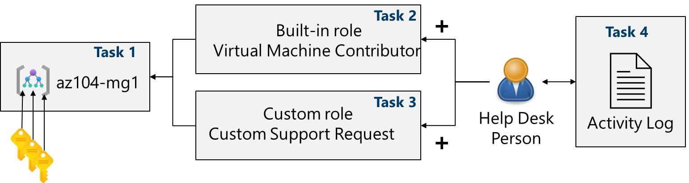
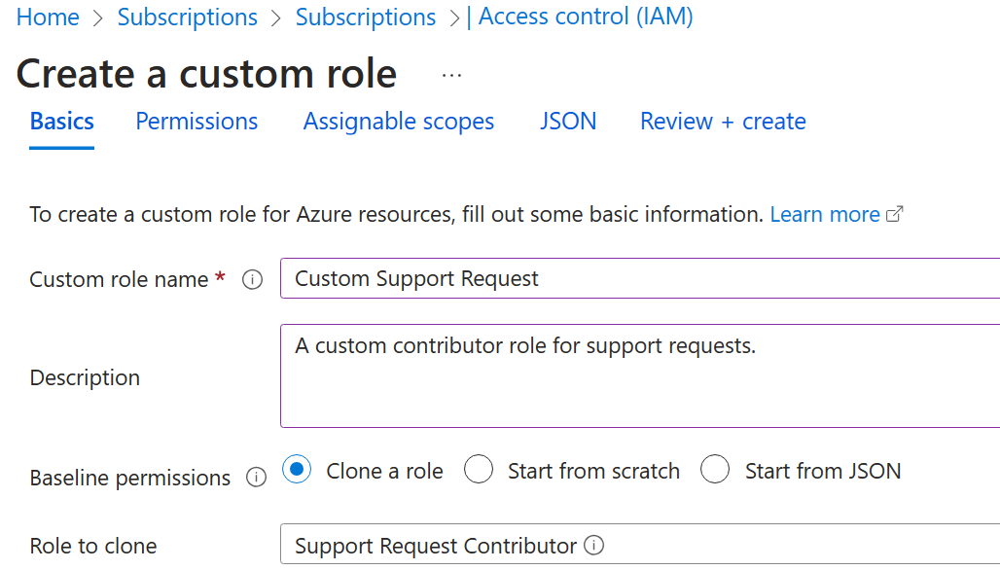
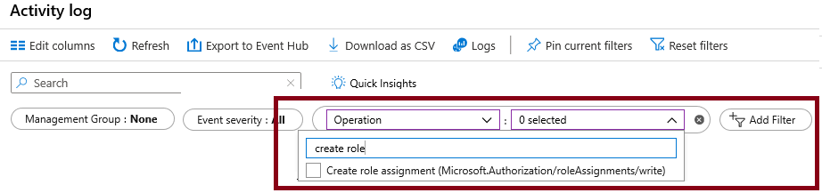

---
lab:
    title: 'Lab 02a: Manage Subscriptions and RBAC'
    module: 'Administer Governance and Compliance'
---

# Lab 02a - Manage Subscriptions and RBAC

## Lab introduction

In this lab, you learn about role-based access control. You learn how to use permissions and scopes to control what actions identities can and cannot perform. You also learn how to make subscription management easier using management groups. 

This lab requires an Azure subscription. Your subscription type may affect the availability of features in this lab. You may change the region, but the steps are written using **East US**. 

## Estimated timing: 30 minutes

## Lab scenario

To simplify management of Azure resources in your organization, you have been tasked with implementing the following functionality:

- Creating a management group that includes all your Azure subscriptions.

- Granting permissions to submit support requests for all subscriptions in the management group to a designated user. That user's permissions should be limited only to: 

    - Creating support request tickets
    - Viewing resource groups

## Interactive lab simulation

There are some interactive lab simulations that you might find useful for this topic. The simulation lets you to click through a similar scenario at your own pace. There are differences between the interactive simulation and this lab, but many of the core concepts are the same. An Azure subscription is not required. 

+ [Manage access with RBAC](https://mslearn.cloudguides.com/en-us/guides/AZ-900%20Exam%20Guide%20-%20Azure%20Fundamentals%20Exercise%2014). Assign built-in role to a user and monitor the activity logs. 

+ [Manage subscriptions and RBAC](https://mslabs.cloudguides.com/guides/AZ-104%20Exam%20Guide%20-%20Microsoft%20Azure%20Administrator%20Exercise%202). Implement a management group and create and assign a custom RBAC role.

+ [Open a support request](https://mslearn.cloudguides.com/en-us/guides/AZ-900%20Exam%20Guide%20-%20Azure%20Fundamentals%20Exercise%2022). Review support plan options, then create and monitor a support request, technical or billing.

## Architecture diagram

## Tasks

+ Task 1: Implement management groups.
+ Task 2: Review and assign a built-in Azure role.
+ Task 3: Create a custom RBAC role for the Help Desk personnel.
+ Task 4: Test the custom role to ensure it has the correct permissions
+ Task 5: Monitor role assignments with the Activity Log.

## Task 1: Implement Management Groups

In this task, you will create and configure management groups. Management groups are used to logically organize subscriptions. Subscriptions should be segmented and allow for RBAC and Azure Policy to be assigned and inherited to other management groups and subscriptions. For example, if your organization has a dedicated support team for Europe, you can organize European subscriptions into a management group to provide the support staff access to those subscriptions (without providing individual access to all subscriptions). In our scenario everyone at the Help Desk will need to create a support request across all subscriptions. 

1. Sign in to the **Azure portal** - `https://portal.azure.com`.

1. Search for and select `Management groups`.

1. Review the messages at the top of the **Management groups** blade. If you are seeing the message stating **You are registered as a directory admin but do not have the necessary permissions to access the root management group**, perform the following sequence of steps:

    + In the Azure portal, search for and select **Microsoft Entra ID**.
    
    + On the blade displaying properties of your tenant, in the vertical menu on the left side, in the **Manage** section, select **Properties**.
    
    + On the **Properties** blade of your tenant, in the **Access management for Azure resources** section, select **Yes** and then select **Save**.
    
    + Navigate back to the **Management groups** blade and select **Refresh**.

1. On the **Management groups** blade, click **+ Create**.

1. Create a management group with the following settings. Select **Submit** when you are done. 

    | Setting | Value |
    | --- | --- |
    | Management group ID | `az104-mg1` |
    | Management group display name | `az104-mg1` |

1. In this scenario, all the applicable subscriptions would be added to the management group. RBAC and policies can then be scoped to the management group. 

1. **Refresh** the management group page until your new management group displays. 

   >**Note:** Did you notice the root management group? All management groups and subscriptions are part of the root management group.

## Task 2: Review and assign a built-in Azure role

In this task, you will review the built-in roles and assign the VM Contributor role to your user account. Azure provides a large number of [built-in roles](https://learn.microsoft.com/azure/role-based-access-control/built-in-roles).

1. Select the **az104-mg1** management group.

1. Select the **Access control (IAM)** blade, and then the **Roles** tab.

   >**Note:** Notice the other choices for **Check access**, **Role assignment**, and **Deny assignments**. 

1. Scroll through the built-in role definitions that are available. **View** a role to get detailed information about the **Permissions**, **JSON**, and **Assignments**. 

1. Select **+ Add**, from the drop-down menu, select **Add role assignment**. 

1. On the **Add role assignment** blade, search for and select the **Virtual Machine Contributor**. The Virtual machine contributor role lets you manage virtual machines, but not access their operating system or manage the virtual network and storage account they are connected to. Select **Next**. 

1. On the **Members** tab, **Select Members**.

1. Search for and select your user account. User account information is shown in the upper right corner of the portal. Click **Select**. 

1. Click **Review + assign** twice to create the role assignment.

1. Return to your management group. Select **Access control (IAM)**. On the **Role assignments** tab, confirm you have the **Virtual Machine Contributor** role. 

    >**Note:** This assignment might not actually grant you any additional provileges. If you already have the Owner role, this role includes all privileges associated with the VM Contributor role.
    >
    >**Note:** This task demonstrates how to assign a built-in role.  As a best practice always assign roles to groups not individuals. 

## Task 3: Create a custom RBAC role for the Help Desk personnel

In this task, you will create a custom RBAC role. Custom roles are a core part of implementing the principle of least privilege for an environment. Built-in roles might have too many permissions for your organization. In this task we will create a new role and remove permissions that are not be necessary.

1. Continue working on your management group. In the **Access control (IAM)** blade, select the **Check access** tab.

1. In the **Create a custom role** box, select **Add**.

1. On the Basics tab of **Create a custom role**, provide the name `Custom Support Request`. In the Description field, enter `A custom contributor role for support requests.` 

1. For **Baseline permissions**, select **Clone a role**. In the **Role to clone** drop-down menu, select **Support Request Contributor**.

    

1. Select **Next** to move to the **Permissions** tab, and then select **+ Exclude permissions**.

1. In the resource provider search field, enter `.Support` and select **Microsoft.Support**.

1. In the list of permissions, place a checkbox next to **Other: Registers Support Resource Provider** and then select **Add**. The role should be updated to include this permission as a *NotAction*.

    >**Note:** An Azure resource provider is a set of REST operations that enable functionality for a specific Azure service. We do not want the Help Desk to be able to have this capability, so it is being removed from the cloned role. 

1. Select **+ Add assignable scopes**. Select the **az104-mg1** management group, then click **Next**.

1. Review the JSON for the *Actions*, *NotActions*, and *AssignableScopes* that are customized in the role. 

1. Select **Review + Create**, and then select **Create**.

    >**Note:** At this point, you have created a custom role. Your next step would be to assign the role to a Help Desk. Before we do that, we will test a user. 

## Task 4: Assign and test the custom RBAC role.

In this task, you add the custom role to a test user and confirm their permissions. 

1. In the Azure portal, search for and select **Microsoft Entra ID**, then select the **Users** blade.

    >**Note**: This task requires a user account for testing. For this lab we will use, **helpdesk-user1**. If necessary you can **Add** a new user. If you are creating a new user, require the password to be set when they login. 

1. Before continuing ensure you have the **User principal name** for your test user account. You will need this to login to the portal. You can copy the UPN to the clipboard. 

1. In the Azure portal, navigate back to the **az104-mg1** management group.

1. Click **Access Control (IAM)**, click **+ Add** and then **Add role assignment**. 

1. On the **Role** tab, search for `Custom Support Request`. 

    >**Note**: if your custom role is not visible, it can take up to 5 minutes for the custom role to appear after creation. **Refresh** the page. 

1. Select the **Role** and click **Next**. On the **Members** tab, click **+ Select members** and **select** user account **helpdesk-user1**.  

1. Select **Review + assign** twice.

    >**Note:** At this point, you have a Help Desk user account with custom privileges to create a support ticket. Your next step is to test the account.
    
1. Open an **InPrivate** browser window and navigate to the Azure portal at `https://portal.azure.com`.

1. Provide the user principle name for helpdesk-user1. When prompted to update the password, change the password for the user.

1. In the **InPrivate** browser window, in the Azure portal, search and select **Resource groups** to verify that the Help Desk user can view resource groups.

1. In the **InPrivate** browser window, in the Azure portal, search and select **All resources** to verify that the Help Desk user cannot see any individual resources.

1. In the **InPrivate** browser window, in the Azure portal, search and select **Help + support** and then click **+ Create a support request**. 

    >**Note**: Many organizations opt to provide all of the cloud administrators access to open support cases. This enables administrators to resolve support cases faster.

1. For **Issue type** select **Service and subscription limits**. Notice your other choices.

1. in the Summary field and select the **Service and subscription limits (quotas)** issue type. Select **Next**.

    >**Note**: Since the role was assigned to the management group, all subscriptions should be available to the Help Desk. If you do not see the **Service and subscription limits (quotas)** option, sign out from the Azure portal and sign in back.

1. Take a few minutes to explore creating a **New support request**, but do not continue with creating the support request. Instead, sign out as the Help Desk user from the Azure portal and close the InPrivate browser window.

    >**Note:** You have now verified a Help Desk user has the correct permissions.

## Task 5: Monitor role assignments with the Activity Log

In this task, you view the activity log to determine if anyone has created a new role. 

1. Return to the portal and in the **az104-mg1** resource select **Activity log**.

2. Select **Add filter**, select **Operation**, and then **Create role assignment**.

    

3. Verify the Activity log shows role creation activities. 

## Key takeaways

Congratulations on completing the lab. Here are the main takeaways for this lab. 

+ Management groups are used to logically organize subscriptions.
+ Azure has many built-in roles. You can assign these roles to control access to resources.
+ You can create new roles or customize existing roles.
+ Roles are defined in a JSON formatted file and include *Actions*, *NotActions*, and *AssignableScopes*.
+ You can use the Activity Log to monitor role assignments. 

## Learn more with self-paced training

+ [Secure your Azure resources with Azure role-based access control (Azure RBAC)](https://learn.microsoft.com/training/modules/secure-azure-resources-with-rbac/). Use Azure RBAC to manage access to resources in Azure.
+ [Create custom roles for Azure resources with role-based access control (RBAC)](https://learn.microsoft.com/training/modules/create-custom-azure-roles-with-rbac/). Understand the structure of role definitions for access control. Identify the role properties to use that define your custom role permissions. Create an Azure custom role and assign to a user.

## Cleanup your resources

If you are working with your own subscription take a minute to delete the lab resources. This will ensure resources are freed up and cost is minimized. The easiest way to delete the lab resources is to delete the lab resource group. 

+ In the Azure portal, select the resource group, select **Delete the resource group**, **Enter resource group name**, and then click **Delete**.
+ Using Azure PowerShell, `Remove-AzResourceGroup -Name resourceGroupName`.
+ Using the CLI, `az group delete --name resourceGroupName`.

