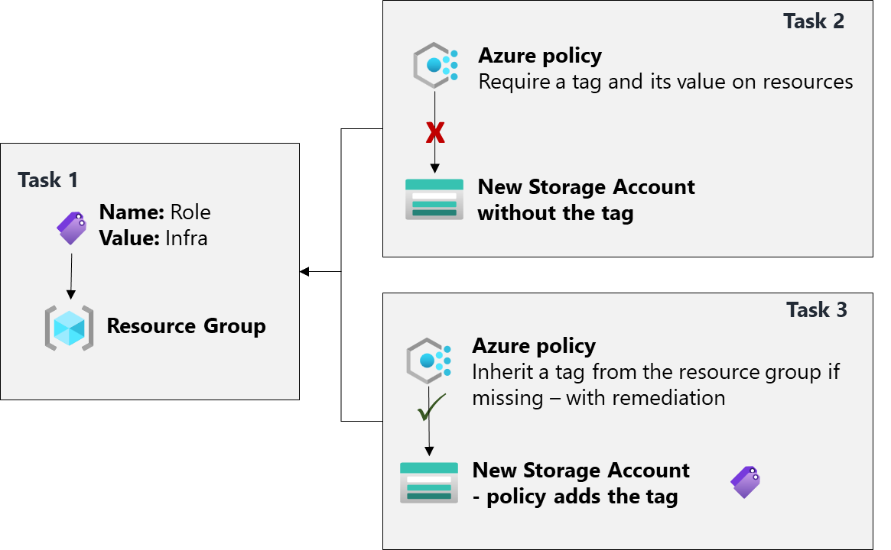
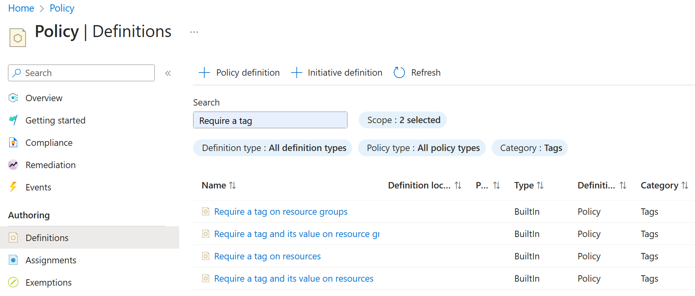
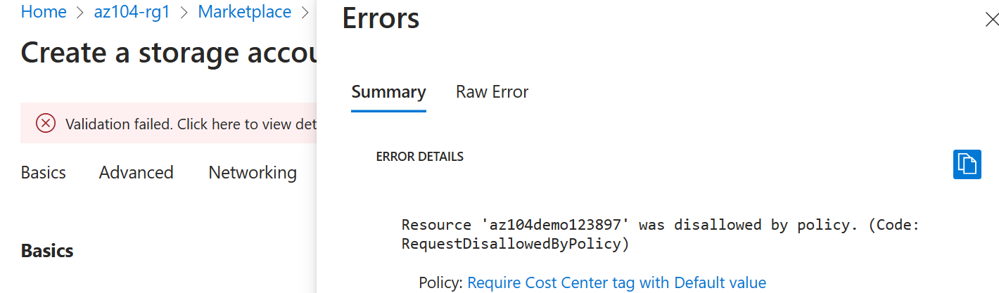
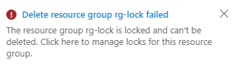

---
lab:
    title: 'Lab 02b: Manage Governance via Azure Policy'
    module: 'Administer Governance and Compliance'
---

# Lab 02b - Manage Governance via Azure Policy

## Lab introduction

In this lab, you learn how to implement your organization’s governance plans. You learn how Azure policies can ensure operational decisions are enforced across the organization. You learn how to use resource tagging to improve reporting. 

This lab requires an Azure subscription. Your subscription type may affect the availability of features in this lab. You may change the region, but the steps are written using **East US**. 

## Estimated timing: 30 minutes

## Lab scenario

Your organization's cloud footprint has grown considerably in the last year. During a recent audit, you discovered a substantial number of resources that do not have a defined owner, project, or cost center. In order to improve management of Azure resources in your organization, you decide to implement the following functionality:

- apply resource tags to attach important metadata to Azure resources

- enforce the use of resource tags for new resources by using Azure policy

- update existing resources with resource tags

- use resource locks to protect configured resources

## Interactive lab simulations

There are several interactive lab simulations that you might find useful for this topic. The simulation lets you to click through a similar scenario at your own pace. There are differences between the interactive simulation and this lab, but many of the core concepts are the same. An Azure subscription is not required. 

+ [Manage resource locks](https://mslearn.cloudguides.com/en-us/guides/AZ-900%20Exam%20Guide%20-%20Azure%20Fundamentals%20Exercise%2015). Add a resource lock and test to confirm.
  
+ [Create an Azure policy](https://mslearn.cloudguides.com/en-us/guides/AZ-900%20Exam%20Guide%20-%20Azure%20Fundamentals%20Exercise%2017). Create an Azure policy that restricts the location resources can be located. Create a new resource and ensure the policy is enforced. 

+ [Manage governance via Azure policy](https://mslabs.cloudguides.com/guides/AZ-104%20Exam%20Guide%20-%20Microsoft%20Azure%20Administrator%20Exercise%203). Create and assign tags via the Azure portal. Create an Azure policy that requires tagging. Remediate non-compliant resources.

## Architecture diagram

## Job skills

+ Task 1: Create and assign tags via the Azure portal.
+ Task 2: Enforce tagging via an Azure Policy.
+ Task 3: Apply tagging via an Azure Policy.
+ Task 4: Configure and test resource locks. 

## Task 1: Assign tags via the Azure portal

In this task, you will create and assign a tag to an Azure resource group via the Azure portal. Tags are a critical component of a governance strategy as outlined by the Microsoft Well-Architected Framework and Cloud Adoption Framework. Tags can allow you to quickly identify resource owners, sunset dates, group contacts, and other name/value pairs that your organization  deems important. For this task, you assign a tag identifying the resource role ('Infra' for 'Infrastructure').

1. Sign in to the **Azure portal** - `https://portal.azure.com`.
      
1. Search for and select `Resource groups`.

1. From the Resource groups, select **+ Create**.

    | Setting | Value |
    | --- | --- |
    | Subscription name | your subscription |
    | Resource group name | `az104-rg2` |
    | Location | **East US** |

    >**Note:** For each lab in this course you will create a new resource group. This lets you quickly locate and manage your lab resources. 

1. Select **Next: Tags** and create a new tag.

    | Setting | Value |
    | --- | --- |
    | Name | `Cost Center` |
    | Value | `000` |

1. Select **Review + Create**, and then select **Create**.

## Task 2: Enforce tagging via an Azure Policy

In this task, you will assign the built-in *Require a tag and its value on resources* policy to the resource group and evaluate the outcome. Azure Policy can be used to enforce configuration, and in this case, governance, to your Azure resources. 

1. In the Azure portal, search for and select `Policy`. 

1. In the **Authoring** blade, select **Definitions**. Take a moment to browse through the list of [built-in policy definitions](https://learn.microsoft.com/azure/governance/policy/samples/built-in-policies) that are available for you to use. Notice you can also search for a definition.

    

1. Click the entry representing the **Require a tag and its value on resources** built-in policy. Take a minute to review the definition. 

1. On the **Require a tag and its value on resources** built-in policy definition blade, click **Assign**.

1. Specify the **Scope** by clicking the ellipsis button and selecting the following values. Click **Select** when you are done. 

    | Setting | Value |
    | --- | --- |
    | Subscription | *your subscription* |
    | Resource Group | **az104-rg2** |

    >**Note**: You can assign policies on the management group, subscription, or resource group level. You also have the option of specifying exclusions, such as individual subscriptions, resource groups, or resources. In this scenario, we want the tag on all the resources in the resource group.

1. Configure the **Basics** properties of the assignment by specifying the following settings (leave others with their defaults):

    | Setting | Value |
    | --- | --- |
    | Assignment name | `Require Cost Center tag with Default value`|
    | Description | `Require Cost Center tag with default value for all resources in the resource group`|
    | Policy enforcement | Enabled |

    >**Note**: The **Assignment name** is automatically populated with the policy name you selected, but you can change it. The **Description** is optional. Notice you can disable the policy at any time. 

1. Click **Next** twice and set **Parameters** to the following values:

    | Setting | Value |
    | --- | --- |
    | Tag Name | `Cost Center` |
    | Tag Value | `000` |

1. Click **Next** and review the **Remediation** tab. Leave the **Create a Managed Identity** checkbox unchecked. 

1. Click **Review + Create** and then click **Create**.

    >**Note**: Now you will verify that the new policy assignment is in effect by attempting to create an Azure Storage account in the resource group. You will create the storage account without adding the required tag. 
    
    >**Note**: It might take between 5 and 10 minutes for the policy to take effect.

1. In the portal, search for and select `Storage Account`, and select **+ Create**. 

1. On the **Basics** tab of the **Create storage account** blade, complete the configuration.

    | Setting | Value |
    | --- | --- |
    | Resource group | **az104-rg2** |
    | Storage account name | *any globally unique combination of between 3 and 24 lower case letters and digits, starting with a letter* |

1. Select **Review** and then click **Create**:

1. Once you create the deployment, you should see the **Deployment failed** message in the **Notifications** list of the portal. From the **Notifications** list, navigate to the deployment overview and click the **Deployment failed. Click here for details** message to identify the reason for the failure. 

     

    >**Note**: Verify the error message states that the resource deployment was disallowed by the policy. 

    >**Note**: By clicking the **Raw Error** tab, you can find more details about the error, including the name of the role definition **Require Cost Center tag with Default value**. The deployment failed because the storage account you attempted to create did not have a tag named **Cost Center** with its value set to **Default**.

## Task 3: Apply tagging via an Azure policy

In this task, we will use the new policy definition to remediate any non-compliant resources. In this scenario, we will make any child resources of a resource group inherit the **Cost Center** tag that was defined on the resource group.

1. In the Azure portal, search for and select `Policy`. 

1. In the **Authoring** section, click **Assignments**. 

1. In the list of assignments, click the ellipsis icon in the row representing the **Require Cost Center tag with Default value** policy assignment and use the **Delete assignment** menu item to delete the assignment.

1. Click **Assign policy** and specify the **Scope** by clicking the ellipsis button and selecting the following values:

    | Setting | Value |
    | --- | --- |
    | Subscription | your Azure subscription |
    | Resource Group | `az104-rg2` |

1. To specify the **Policy definition**, click the ellipsis button and then search for and select `Inherit a tag from the resource group if missing`.

1. Select **Add** and then configure the remaining **Basics** properties of the assignment.

    | Setting | Value |
    | --- | --- |
    | Assignment name | `Inherit the Cost Center tag and its value 000 from the resource group if missing` |
    | Description | `Inherit the Cost Center tag and its value 000 from the resource group if missing` |
    | Policy enforcement | Enabled |

1. Click **Next** twice and set **Parameters** to the following values:

    | Setting | Value |
    | --- | --- |
    | Tag Name | `Cost Center` |

1. Click **Next** and, on the **Remediation** tab, configure the following settings (leave others with their defaults):

    | Setting | Value |
    | --- | --- |
    | Create a remediation task | enabled |
    | Policy to remediate | **Inherit a tag from the resource group if missing** |

    >**Note**: This policy definition includes the **Modify** effect. So, a managed identity is required. 

     

1. Click **Review + Create** and then click **Create**.

    >**Note**: To verify that the new policy assignment is in effect, you will create another Azure storage account in the same resource group without explicitly adding the required tag. 
    
    >**Note**: It might take between 5 and 10 minutes for the policy to take effect.

1. Search for and select `Storage Account`, and click **+ Create**. 

1. On the **Basics** tab of the **Create storage account** blade, verify that you are using the Resource Group that the Policy was applied to and specify the following settings (leave others with their defaults) and click **Review**:

    | Setting | Value |
    | --- | --- |
    | Storage account name | *any globally unique combination of between 3 and 24 lower case letters and digits, starting with a letter* |

1. Verify that this time the validation passed and click **Create**.

1. Once the new storage account is provisioned, click **Go to resource**.

1. On the **Tags** blade, note that the tag **Cost Center** with the value **000** has been automatically assigned to the resource.

    >**Did you know?** If you search for and select **Tags** in the portal, you can view the resources with a specific tag. 

## Task 4: Configure and test resource locks

In this task, you configure and test a resource lock. Locks prevent either deletions or modifications of a resource. 

1. Search for and select your resource group.
   
1. In the **Settings** blade, select **Locks**.

1. Select **Add** and complete the resource lock information. When finished select **Ok**. 

    | Setting | Value |
    | --- | --- |
    | Lock name | `rg-lock` |
    | Lock type | **delete** (notice the selection for read-only) |
    
1. Navigate to the resource group **Overview** blade, and select **Delete resource group**.

1. In the **Enter resource group name to confirm deletion** textbox provide the resource group name, `az104-rg2`. Notice you can copy and paste the resource group name. 

1. Notice the warning: Deleting this resource group and its dependent resources is a permanent action and cannot be undone. Select **Delete**.

1. You should receive a notification denying the deletion. 

     

## Cleanup your resources

If you are working with **your own subscription** take a minute to delete the lab resources. This will ensure resources are freed up and cost is minimized. The easiest way to delete the lab resources is to delete the lab resource group. 

+ In the Azure portal, select the resource group, select **Delete the resource group**, **Enter resource group name**, and then click **Delete**.
+ Using Azure PowerShell, `Remove-AzResourceGroup -Name resourceGroupName`.
+ Using the CLI, `az group delete --name resourceGroupName`.

## Key takeaways

Congratulations on completing the lab. Here are the main takeaways for this lab. 

+ Azure tags are metadata that consists of a key-value pair. Tags describe a particular resource in your environment. In particular, tagging in Azure enables you to label your resources in a logical manne.
+ Azure Policy establishes conventions for resources. Policy definitions describe resource compliance conditions and the effect to take if a condition is met. A condition compares a resource property field or a value to a required value. There are many built-in policy definitions and you can customize the policies. 
+ The Azure Policy remediation task feature is used to bring resources into compliance based on a definition and assignment. Resources that are non-compliant to a modify or deployIfNotExist definition assignment, can be brought into compliance using a remediation task.
+ You can configure a resource lock on a subscription, resource group, or resource. The lock can protect a resource from accidental user deletions and modifications. The lock overrides any user permissions.
+ Azure Policy is pre-deployment security practice. RBAC and resource locks are post-deployment security practice. 

## Learn more with self-paced training

+ [Design an enterprise governance strategy](https://learn.microsoft.com/training/modules/enterprise-governance/). Use RBAC and Azure Policy to limit access to your Azure solutions, and determine which method is right for your security goals.
  

