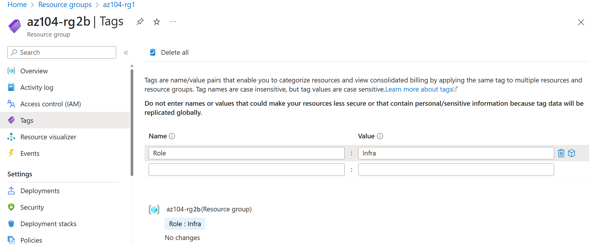
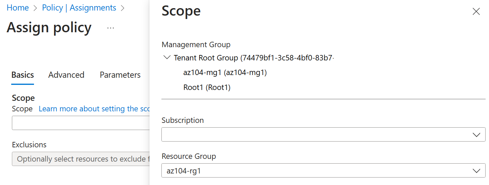

---
lab:
    title: 'Lab 02b: Manage Governance via Azure Policy'
    module: 'Administer Governance and Compliance'
---

# Lab 02b - Manage Governance via Azure Policy

## Lab requirements

This lab requires an Azure subscription. Your subscription type may affect the availability of features in this lab. You may change the region, but the steps are written using **East US**. 

## Estimated timing: 30 minutes

## Lab scenario

Your organization's cloud footprint has grown considerably in the last year. During a recent audit, you discovered a substantial number of resources that do not have a defined owner, project, or cost center. In order to improve management of Azure resources in your organization, you decide to implement the following functionality:

- apply resource tags to attach important metadata to Azure resources

- enforce the use of resource tags for new resources by using Azure policy

- update existing resources with resource tags

## Interactive lab simulations

There are several interactive lab simulations that you might find useful for this topic. The simulation lets you to click through a similar scenario at your own pace. There are differences between the interactive simulation and this lab, but many of the core concepts are the same. An Azure subscription is not required. 

+ [Create an Azure policy](https://mslearn.cloudguides.com/en-us/guides/AZ-900%20Exam%20Guide%20-%20Azure%20Fundamentals%20Exercise%2017). Create an Azure policy that restricts the location resources can be located. Create a new resource and ensure the policy is enforced. 

+ [Manage governance via Azure policy](https://mslabs.cloudguides.com/guides/AZ-104%20Exam%20Guide%20-%20Microsoft%20Azure%20Administrator%20Exercise%203). Create and assign tags via the Azure portal. Create an Azure policy that requires tagging. Remediate non-compliant resources.

## Architecture diagram

## Tasks

+ Task 1: Create and assign tags via the Azure portal.
+ Task 2: Enforce tagging via an Azure Policy.
+ Task 3: Apply tagging via an Azure Policy.

## Task 1: Assign tags via the Azure portal

In this task, you will create and assign a tag to an Azure resource group via the Azure portal. Tags are a critical component of a governance strategy as outlined by the Microsoft Well-Architected Framework and Cloud Adoption Framework. Tags can allow you to quickly identify resource owners, sunset dates, group contacts, and other name/value pairs that your organinzation deems important. For this exercise, you will assign a tag identifying the resource role ('Infra' for 'Infrastructure').

1. Sign in to the **Azure portal** at `https://portal.azure.com`.
      
1. Search for and select **Resource groups**.

1. From the Resource groups, select **+ Create**.

1. Provide the name `az104-rg2b` and ensure that the Region is set to **East US**.

1. Select **Review + Create**, and then select **Create**.

1. After the resource group is deployed, select **Go to resource group**, or navigate to the newly created resource group.

1. On the resource group blade, select **Tags** in the left menu and create a new tag.

1. Create a tag with the following settings and apply your change:

    | Setting | Value |
    | --- | --- |
    | Name | `Role` |
    | Value | `Infra` |

1. Select **Apply**. You have now manually added a tag to a resource group. 

    

## Task 2: Enforce tagging via an Azure Policy

In this task, you will assign the built-in *Require a tag and its value on resources* policy to the resource group and evaluate the outcome. Azure Policy can be used to enforce configuration, and in this case, governance, to your Azure resources. 

1. In the Azure portal, search for and select **Policy**. 

1. In the **Authoring** section, select **Definitions**. Take a moment to browse through the list of built-in policy definitions that are available for you to use. It might also help to search for `Require a tag`.

    

1. Select the entry representing the **Require a tag and its value on resources** built-in policy and review its definition.

1. On the **Require a tag and its value on resources** built-in policy definition blade, select **Assign**.

1. Specify the **Scope** by clicking the ellipsis button and selecting the following values:

    | Setting | Value |
    | --- | --- |
    | Subscription | *your subscription* |
    | Resource Group | **az-rg2b** |

    >**Note**: A scope determines the resources or resource groups where the policy assignment takes effect. You could assign policies on the management group, subscription, or resource group level. You also have the option of specifying exclusions, such as individual subscriptions, resource groups, or resources (depending on the assignment scope).

1. Configure the **Basics** properties of the assignment by specifying the following settings (leave others with their defaults):

    | Setting | Value |
    | --- | --- |
    | Assignment name | `Require Cost Center tag with Default value`|
    | Description | `Require Cost Center tag with default value for all resources in the resource group`|
    | Policy enforcement | Enabled |

    >**Note**: The **Assignment name** is automatically populated with the policy name you selected, but you can change it. The **Description** is optional. **Assigned by** is automatically populated based on the user name creating the assignment. 

1. Select **Next** twice and set **Parameters** to the following values:

    | Setting | Value |
    | --- | --- |
    | Tag Name | `Cost Center` |
    | Tag Value | `Default` |

1. Select **Next** and review the **Remediation** tab. Leave the **Create a Managed Identity** checkbox unchecked. 

    >**Note**: This setting can be used when the policy or initiative includes the **deployIfNotExists** or **Modify** effect.

1. Select **Review + Create** and then select **Create**.

    >**Note**: Now you will verify that the new policy assignment is in effect by attempting to create another Azure Storage account in the resource group without explicitly adding the required tag. 
    
    >**Note**: It might take between 5 and 15 minutes for the policy to take effect.

1. Navigate back to the blade of the resource group that you created in the previous task, select **+ Create** and then search for and select **Storage Account**, and select **Create**. 

1. On the **Basics** tab of the **Create storage account** blade, verify that you are using the resource group that the policy was applied to and specify the following settings (leave others with their defaults), select **Review** and then select **Create**:

    | Setting | Value |
    | --- | --- |
    | Resource group | **az104-rg2b** |
    | Storage account name | *any globally unique combination of between 3 and 24 lower case letters and digits, starting with a letter* |

    >**Note**: You may receive a **Validation failed. Click here for details** error. If so, select the error message to identify the reason for the failure and skip the next step. 

1. Once you create the deployment, you should see the **Deployment failed** message in the **Notifications** list of the portal. From the **Notifications** list, navigate to the deployment overview and select the **Deployment failed. Click here for details** message to identify the reason for the failure. 

     

    >**Note**: Verify whether the error message states that the resource deployment was disallowed by the policy. 

    >**Note**: By clicking the **Raw Error** tab, you can find more details about the error, including the name of the role definition **Require Cost Center tag with Default value**. The deployment failed because the storage account you attempted to create did not have a tag named **Cost Center** with its value set to **Default**.

## Task 3: Apply tagging via an Azure policy

In this task, we will use a new policy definition to remediate any non-compliant resources. This will use a remedation task as part of the policy to modify existing resources to be compliant with the policy. In this scenario, we will make any child resources of a resource group inherit the **Role** tag that was defined on the resource group.

1. In the Azure portal, search for and select **Policy**. 

1. In the **Authoring** section, select **Assignments**. 

1. In the list of assignments, select the ellipsis icon in the row representing the **Require Cost Center tag with Default value** policy assignment and use the **Delete assignment** menu item to delete the assignment.

1. Select **Assign policy** and specify the **Scope** by clicking the ellipsis button and selecting the following values:

    | Setting | Value |
    | --- | --- |
    | Subscription | the name of the Azure subscription you are using in this lab |
    | Resource Group | the name of the resource group containing the Cloud Shell account you identified in the first task |

     

1. To specify the **Policy definition**, select the ellipsis button and then search for and select `Inherit a tag from the resource group if missing`.

1. Configure the remaining **Basics** properties of the assignment by specifying the following settings (leave others with their defaults):

    | Setting | Value |
    | --- | --- |
    | Assignment name | **Inherit the Role tag and its Infra value from the resource group if missing**|
    | Description | **Inherit the Role tag and its Infra value from the resource group if missing**|
    | Policy enforcement | Enabled |

1. Select **Next** twice and set **Parameters** to the following values:

    | Setting | Value |
    | --- | --- |
    | Tag Name | `Role` |

1. Select **Next** and, on the **Remediation** tab, configure the following settings (leave others with their defaults):

    | Setting | Value |
    | --- | --- |
    | Create a remediation task | enabled |
    | Policy to remediate | **Inherit a tag from the resource group if missing** |

    >**Note**: This policy definition includes the **Modify** effect.

     

1. Select **Review + Create** and then select **Create**.

    >**Note**: To verify that the new policy assignment is in effect, you will create another Azure storage account in the same resource group without explicitly adding the required tag. 
    
    >**Note**: It might take between 5 and 15 minutes for the policy to take effect.

1. Navigate back to the blade of the resource group that you created in the first task.

1. On the resource group blade, select **+ Create** and then search for and select **Storage Account**, and select **Create**. 

1. On the **Basics** tab of the **Create storage account** blade, verify that you are using the Resource Group that the Policy was applied to and specify the following settings (leave others with their defaults) and select **Review**:

    | Setting | Value |
    | --- | --- |
    | Storage account name | *any globally unique combination of between 3 and 24 lower case letters and digits, starting with a letter* |

1. Verify that this time the validation passed and select **Create**.

1. Once the new storage account is provisioned, select **Go to resource** button. On the **Overview** blade, note that the tag **Role** with the value **Infra** has been automatically assigned to the resource.

## Review the main points of the lab

Congratulations on completing the lab. Here are the main takeaways for this lab. 

+ Azure tags are metadata that consists of a key-value pair. Tags describe a particular resource in your environment. In particular, tagging in Azure enables you to label your resources in a logical manne.
+ Azure Policy establishes conventions for resources. Policy definitions describe resource compliance conditions and the effect to take if a condition is met. A condition compares a resource property field or a value to a required value. There are many built-in policy definitions.
+ The Azure Policy remediation task feature is used to bring resources into compliance based on a definition and assignment. Resources that are non-compliant to a modify or deployIfNotExist definition assignment, can be brought into compliance using a remediation task.

## Cleanup your resources

If you are working with your own subscription take a minute to delete the lab resources. This will ensure resources are freed up and cost is minimized. The easiest way to delete the lab resources is to delete the lab resource group. 

+ In the Azure portal, select the resource group, select **Delete the resource group**, **Enter resource group name**, and then select **Delete**.

+ Using Azure PowerShell, `Remove-AzResourceGroup -Name resourceGroupName`.

+ Using the CLI, `az group delete --name resourceGroupName`.
