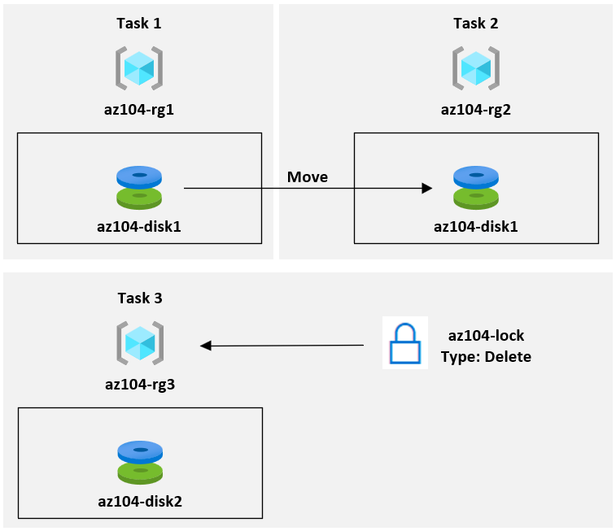
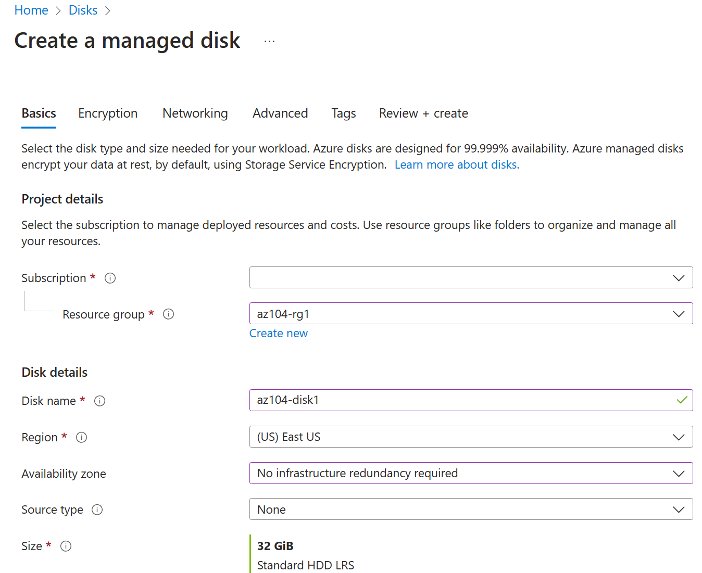
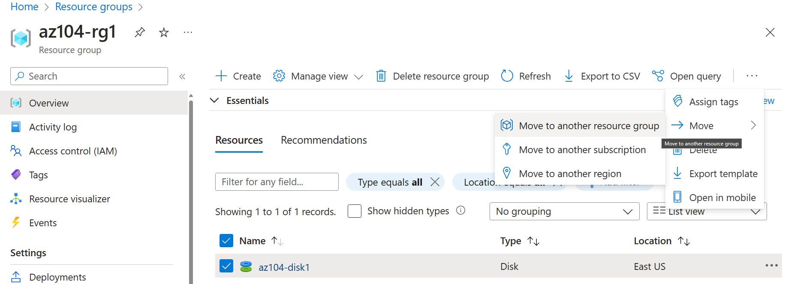
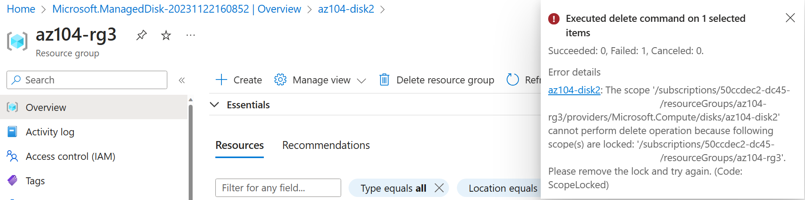

---
lab:
    title: 'Lab 03a: Manage Azure resources by Using the Azure Portal'
    module: 'Administer Azure Resources'
---

# Lab 03a - Manage Azure resources by Using the Azure Portal
# Student lab manual

## Lab scenario

You need to explore the basic Azure administrative capabilities associated with provisioning resources and organizing them.  You want to understand the most common methods in Azure to organize the resources. You also want to understand how to move resources. Lastly, you  want to test protecting disk resources from being accidentally deleted, while still allowing for modifying the performance characteristics and size.

**Note:** An **[interactive lab simulation](https://mslabs.cloudguides.com/guides/AZ-104%20Exam%20Guide%20-%20Microsoft%20Azure%20Administrator%20Exercise%204)** is available that allows you to click through this lab at your own pace. You may find slight differences between the interactive simulation and the hosted lab, but the core concepts and ideas being demonstrated are the same. 

## Objectives

In this lab, we will:

+ Task 1: Create resource groups, create resources, and deploy resources to resource groups
+ Task 2: Move resources between resource groups
+ Task 3: Implement and test resource locks

## Estimated timing: 30 minutes

## Architecture diagram

### Instructions

## Exercise 1

## Task 1: Create resource groups and deploy resources to resource groups

In this task, you will use the Azure portal to create a managed disk. In the next task, we will move this disk to another resource group. 

1. Sign in to the [**Azure portal**](http://portal.azure.com).

1. In the Azure portal, search for and select **Disks**, click **+ Create** and specify the following settings:

    |Setting|Value|
    |---|---|
    |Subscription| the name of your Azure subscription  |
    |Resource Group| select **create new** resource group - `az104-rg3a`|
    |Disk name| `az104-disk1` |
    |Region| **(US) East US** |
    |Availability zone| **No infrastructure redundancy required** |
    |Source type| **None** |

1. Select **Change size** and choose **Standard HDD** and **32 GiB**. Select **OK** when complete. 

    

1. Click **Review + Create** and then click **Create**.

    >**Note**: Wait until the disk is created. This should take less than a minute.

## Task 2: Move resources between resource groups 

In this task, we will move the disk resource you created in the previous task to a new resource group. Individual resources, such as disks, can only be placed in a single resource group. Often, organizations apply role-based access control, tagging, or Azure Policy at the resource group level. You might need to move a resource to a different resource group if the resource is reallocated to another project, if you want to take advantage of the existing configuration of a resource group (for example, the role-based access control and tagging are already configured), or if you are planning to decommission the original resource group.

1. Search for and select **Resource groups**. 

1. On the **Resource groups** blade, click the entry representing the **az104-rg3a** resource group you created in the previous task.

1. From the **Overview** blade of the resource group, in the list of resource group resources, select the entry representing the newly created disk.

1. Use the tool bar ellipses (...) to select **Move**, and then in the drop-down list, select **Move to another resource group**. Notice your choices to move to another subscription or region. 

    

1. Below the **Resource group** text box, click **Create new** then type `az104-rg3move` in the text box. Select **OK** to create the new resource group.

1. On the **Resources to move** tab, verify **Succeeded** is the validation status. It may take a minute for the validation to finish. In the meantime, review the [list of supported move operations](https://learn.microsoft.com/azure/azure-resource-manager/management/move-support-resources). Select **Next** to proceed. 

1. On the Review tab, select the checkbox **I understand that tools and scripts associated with moved resources will not work until I update them to use new resource IDs**, and click **Move**.

    >**Note**: Do not wait for the move to complete but instead proceed to the next task. The move might take about 10 minutes. You can determine that the operation was completed by monitoring activity log entries of the source or target resource group. Revisit this step once you complete the next task.

## Task 3: Implement resource locks

In this task, you will apply a resource lock to an Azure resource group containing a disk resource. A resource lock can either prevent any types of changes to a resource, such as the size of a disk. Or, a resource lock can prevent accidental deletions. These two lock types are *Delete* locks and *Read-Only* locks.

### Create a new managed disk. 

1. In the Azure portal, search for and select **Disks**, click **+ Create** and specify the following settings:

    |Setting|Value|
    |---|---|
    |Subscription| the name of the subscription you are using in this lab |
    |Resource Group| click **create new** resource group and name it `az104-rg3` |
    |Disk name| `az104-disk2` |
    |Region| the name of the Azure region where you created the other resource groups in this lab |
    |Availability zone| **No infrastructure redundancy required** |
    |Source type| **None** |

1. Select **Change size** and choose **Standard HDD** and **32 GiB**. Select **OK** when complete. 

    

1. Click **Review + Create** and then click **Create**.

1. Wait for the disk to deploy, then select **Go to resource**.

### Lock the resource group so resources cannot be delected. 

1. From the **Overview** blade, select your resource group.

1. In the **Settings** section, select **Locks**, and then select **+ Add**. Specify the following settings and then select **OK**. 

    |Setting|Value|
    |---|---|
    |Lock name| `az104-rglock` |
    |Lock type| **Delete** |

    

1. From the resource group **Overview** blade, select the managed disk, and then select **Delete** in the toolbar. 

1. On the **Delete resources** page, in the **Confirm delete** text box, type `delete` and click **Delete**. Confirm your **Delete confirmation**. 

1. You should see an error message, notifying you that the delete operation failed.

    >**Note**: This is expected. The message states there is a lock on the resource group. 

    

1. Select the **az104-disk2** resource. 

1. In the **Settings** section, click **Size + performance**. Change to **Premium SSD** and **64 GiB**. Click **Save** to apply the change.

1. From the **Overview** blade, confirm you were able to change the disk size. 

    >**Note**: This is expected. The resource group-level lock applies to delete operations only. 

     

## Review

Congratulations! You have successfully created a resource group and resource, moved the resource to another group, and implemented resource locks.
