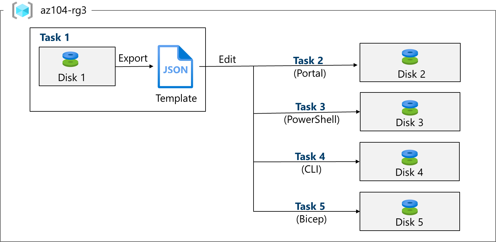

---
lab:
    title: 'Lab 03: Manage Azure resources by using Azure Resource Manager Templates'
    module: 'Administer Azure Resources'
---

# Lab 03 - Manage Azure resources by using Azure Resource Manager Templates

## Lab introduction

In this lab, you learn how to automate resource deployments. You learn about Azure Resource Manager templates and Bicep templates. You learn about the different ways of deploying the templates. 

This lab requires an Azure subscription. Your subscription type may affect the availability of features in this lab. You may change the region, but the steps are written using **East US**. 

## Estimated timing: 50 minutes

## Interactive lab simulations

There are interactive lab simulations that you might find useful for this topic. The simulation lets you to click through a similar scenario at your own pace. There are differences between the interactive simulation and this lab, but many of the core concepts are the same. An Azure subscription is not required. 

+ [Manage Azure resources by using Azure Resource Manager templates](https://mslabs.cloudguides.com/guides/AZ-104%20Exam%20Guide%20-%20Microsoft%20Azure%20Administrator%20Exercise%205). Review, create, and deploy a managed disks with a template.
  
+ [Create a virtual machine with a template](https://mslearn.cloudguides.com/en-us/guides/AZ-900%20Exam%20Guide%20-%20Azure%20Fundamentals%20Exercise%209). Deploy a virtual machine with a QuickStart template.
  
## Lab scenario

Your team wants to look at ways to automate and simplify resource deployments. Your organization is looking for ways to reduce administrative overhead, reduce human error and increase consistency.  

## Architecture diagram



## Job skills

+ Task 1: Create an Azure Resource Manager template.
+ Task 2: Edit an Azure Resource Manager template and redeploy the template.
+ Task 3: Configure the Cloud Shell and deploy a template with Azure PowerShell.
+ Task 4: Deploy a template with the CLI. 
+ Task 5: Deploy a resource by using Azure Bicep.

## Task 1: Create an Azure Resource Manager template

In this task, we will create a managed disk in the Azure portal. Managed disks are storage designed to be used with virtual machines. Once the disk is deployed you will export a template that you can use in other deployments.

1. Sign in to the **Azure portal** - `https://portal.azure.com`.

1. Search for and select `Disks`.

1. On the Disks page, select **Create**.

1. On the **Create a managed disk** page, configure the disk and then select **Ok**. 
    
    | Setting | Value |
    | --- | --- |
    | Subscription | *your subscription* | 
    | Resource Group | `az104-rg3` (If necessary, select **Create new**.)
    | Disk name | `az104-disk1` | 
    | Region | **East US** |
    | Availability zone | **No infrastructure redundancy required** | 
    | Source type | **None** |
    | Performance | **Standard HDD** (change size) |
    | Size | **32 Gib** | 

    >**Note:** We are creating a simple managed disk so you can practice with templates. Azure managed disks are block-level storage volumes that are managed by Azure.

1. Click **Review + Create** then select **Create**.

1. Monitor the notifications (upper right) and after the deployment select **Go to resource**. 

1. In the **Automation** blade, select **Export template**. 

1. Take a minute to review the **Template** and **Parameters** files.

1. Click **Download** and save the templates to the local drive. This creates a compressed zipped file. 

1. Use File Explorer to extract the content of the downloaded file into the **Downloads** folder on your computer. Notice there are two JSON files (template and parameters). 

   >**Did you know?**  You can export an entire resource group or just specific resources within that resource group.

## Task 2: Edit an Azure Resource Manager template and then redeploy the template

In this task, you use the downloaded template to deploy a new managed disk. This task outlines how to quicky and easily repeat deployments. 

1. In the Azure portal, search for and select `Deploy a custom template`.

1. On the **Custom deployment** blade, notice there is the ability to use a **Quickstart template**. There are many built-in templates as shown in the drop-down menu. 

1. Instead of using a Quickstart, select **Build your own template in the editor**.

1. On the **Edit template** blade, click **Load file** and upload the **template.json** file you downloaded to the local disk.

1. Within the editor pane, make these changes.

    + Change **disks_az104_disk1_name** to `disk_name` (two places to change)
    + Change **az104_disk1** to `az102_disk2` (one place to change)

1. Notice this is a **Standard** disk. The location is **eastus**. The disk size is **32GB**.

1. **Save** your changes.

1. Dpn't forget the parameters file. Select **Edit parameters**, click **Load file** and upload the **parameters.json**. 

1. Make this change so it matches the template file.

    Change **disks_az104_disk1_name** to **disk_name** (one place to change)

1. **Save** your changes. 

1. Complete the custom deployment settings:

    | Setting | Value |
    | --- |--- |
    | Subscription | *your subscription* |
    | Resource Group | `az104-rg3` |
    | Region | **(US) East US)** |
    | Disk_name | `az104-disk2` |

1. Select **Review + Create** and then select **Create**.

1. Select **Go to resource**. Verify **az104-disk2** was created.

1. On the **Overview** blade, select the resource group, **az104-rg3**. You should now have two disks.
   
1. In the **Settings** section, click **Deployments**.

    >**Note:** All deployments details are documented in the resource group. It is a good practice to review the first few template-based deployments to ensure success prior to using the templates for large-scale operations.

1. Select a deployment and review the content of the **Input** and **Template** blades.

## Task 3: Configure the Cloud Shell and deploy a template with Azure PowerShell

In this task, you work with the Azure Cloud Shell and Azure PowerShell. Azure Cloud Shell is an interactive, authenticated, browser-accessible terminal for managing Azure resources. It provides the flexibility of choosing the shell experience that best suits the way you work, either Bash or PowerShell. In this task, you use PowerShell to deploy a template. 

1. Select the **Cloud Shell** icon in the top right of the Azure Portal. Alternately, you can navigate directly to `https://shell.azure.com`.

   

1. When prompted to select either **Bash** or **PowerShell**, select **PowerShell**. 

    >**Did you know?**  If you mostly work with Linux systems, Bash (CLI) feels more familiar. If you mostly work with Windows systems, Azure PowerShell feels more familiar. 

1. On the **You have no storage mounted** screen select **Show advanced settings** and provide the required information. 

    >**Note:** As you work with the Cloud Shell a storage account and file share is required. 

    | Settings | Values |
    |  -- | -- |
    | Resource Group | **az104-rg3** |
    | Storage account (Create new) | `sacloudshell` (must be globally unique, between 3 and 24 characters in length and use numbers and lower case letters only) |
    | File share (Create new) | `fs-cloudshell` |

1. When completed select **Create storage**. You only need to do this the first time you use the Cloud Shell. It will take a couple of minutes to provision the storage.

1. Use the **Upload/Download files** icon to upload the template and parameters file from the downloads directory. You will need to upload each file separately.

1. Verify your files are available in the Cloud Shell storage. 

    ```powershell
    dir
    ```
    >**Note**: If you need to, you can use **cls** to clear the command window. You can use the arrow keys to move the command history.
   
1. Select the **Editor** (curly brackets) icon and navigate to the parameters JSON file.

1. Make a change. For example, change the disk name to **az104-disk3**. Use **Ctrl +S** to save your changes. 

    >**Note**: You can target your template deployment to a resource group, subscription, management group, or tenant. Depending on the scope of the deployment, you use different commands.

1. To deploy to a resource group, use **New-AzResourceGroupDeployment**.

    ```powershell
    New-AzResourceGroupDeployment -ResourceGroupName az104-rg3 -TemplateFile template.json -TemplateParameterFile parameters.json
    ```
1. Ensure the command completes and the ProvisioningState is **Succeeded**.

1. Confirm the disk was created.

   ```powershell
   Get-AzDisk
   ```
   
## Task 5: Deploy a template with the CLI 

1. Continue in the **Cloud Shell** select **Bash**. **Confirm** your choice.

1. Verify your files are available in the Cloud Shell storage. If you completed the previous task your template files should be available. 

    ```sh
    ls
    ```

1. Select the **Editor** (curly brackets) icon and navigate to the parameters JSON file.

1. Make a change. For example, change the disk name to **az104-disk4**. Use **Ctrl +S** to save your changes. 

    >**Note**: You can target your template deployment to a resource group, subscription, management group, or tenant. Depending on the scope of the deployment, you use different commands.

1. To deploy to a resource group, use **az deployment group create**.

    ```sh
    az deployment group create --resource-group az104-rg3 --template-file template.json --parameters parameters.json
    ```
    
1. Ensure the command completes and the ProvisioningState is **Succeeded**.

1. Confirm the disk was created.

     ```sh
     az disk list --output table
     ```
   
## Task 6: Deploy a resource by using Azure Bicep

In this task, you will use a Bicep file to deploy a managed disk. Bicep is a declarative automation tool that is built on ARM templates.

1. Continue working in the **Cloud Shell** in a **Bash** session.

1. Locate and download the **\Allfiles\Lab03\azuredeploydisk.bicep** file.

1. **Upload** the bicep file to the Cloud Shell. 

1. Select the **Editor** (curly brackets) icon and navigate to the file.

1. Take a minute to read through the bicep template file. Notice how the disk resource is defined. 
   
1. Make the following changes:

    + Change the **managedDiskName** value to `Disk4`.
    + Change the **sku name** value to `StandardSSD_LRS`.
    + Change the **diskSizeinGiB** value to `32`.

1. Use **Ctrl +S** to save your changes.

1. Now, deploy the template.

    ```
    az deployment group create --resource-group az104-rg3 --template-file azuredeploydisk.bicep
    ```

1. Confirm the disk was created.

    ```sh
    az disk list --output table
    ```

    >**Note:** You have successfully deployed five managed disks, each in a different way. Nice job!

## Cleanup your resources

If you are working with **your own subscription** take a minute to delete the lab resources. This will ensure resources are freed up and cost is minimized. The easiest way to delete the lab resources is to delete the lab resource group. 

+ In the Azure portal, select the resource group, select **Delete the resource group**, **Enter resource group name**, and then click **Delete**.
+ Using Azure PowerShell, `Remove-AzResourceGroup -Name resourceGroupName`.
+ Using the CLI, `az group delete --name resourceGroupName`.
  
## Key takeaways

Congratulations on completing the lab. Here are the main takeaways for this lab. 

+ Azure Resource Manager templates let you deploy, manage, and monitor all the resources for your solution as a group, rather than handling these resources individually.
+ An Azure Resource Manager template is a JavaScript Object Notation (JSON) file that lets you manage your infrastructure declaratively rather than with scripts.
+ Rather than passing parameters as inline values in your template, you can use a separate JSON file that contains the parameter values.
+ Azure Resource Manager templates can be deployed in a variety of ways including the Azure portal, Azure PowerShell, and CLI.
+ Bicep is an alternative to Azure Resource Manager templates. Bicep uses a declarative syntax to deploy Azure resources. 

Bicep provides concise syntax, reliable type safety, and support for code reuse. Bicep offers a first-class authoring experience for your infrastructure-as-code solutions in Azure.

## Learn more with self-paced training

+ [Deploy Azure infrastructure by using JSON ARM templates](https://learn.microsoft.com/training/modules/create-azure-resource-manager-template-vs-code/). Write JSON Azure Resource Manager templates (ARM templates) by using Visual Studio Code to deploy your infrastructure to Azure consistently and reliably.
+ [Review the features and tools for Azure Cloud Shell](https://learn.microsoft.com/training/modules/review-features-tools-for-azure-cloud-shell/). Cloud Shell features and tools. 
+ [Manage Azure resources with Windows PowerShell](https://learn.microsoft.com/training/modules/manage-azure-resources-windows-powershell/). This module explains how to install the necessary modules for cloud services management and use PowerShell commands to perform simple administrative tasks on cloud resources like Azure virtual machines, Azure subscriptions and Azure storage accounts.
+ [Introduction to Bash](https://learn.microsoft.com/training/modules/bash-introduction/). Use Bash to manage IT infrastructure.
+ [Build your first Bicep template](https://learn.microsoft.com/training/modules/build-first-bicep-template/). Define Azure resources within a Bicep template. Improve the consistency and reliability of your deployments, reduce the manual effort required, and scale your deployments across environments. Your template will be flexible and reusable by using parameters, variables, expressions, and modules.


