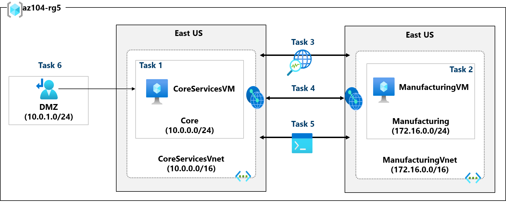
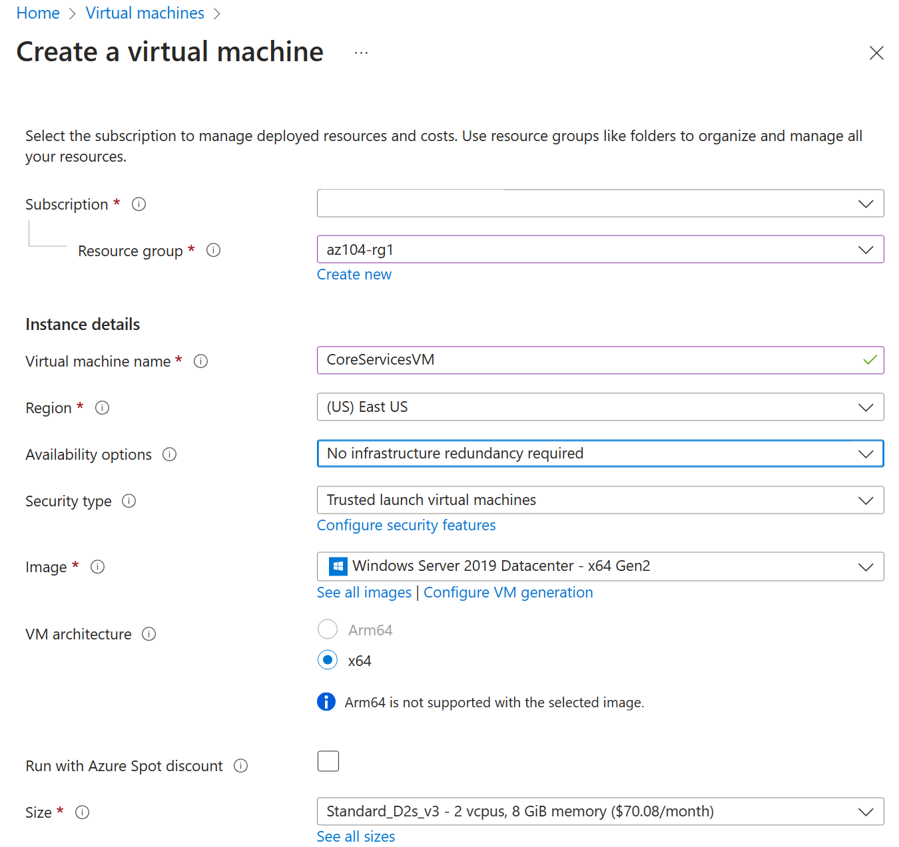
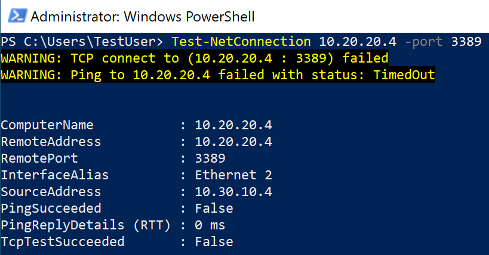

---
lab:
    title: 'Lab 05: Implement Intersite Connectivity'
    module: 'Administer Intersite Connectivity'
---

# Lab 05 - Implement Intersite Connectivity

## Lab introduction

In this lab you will explore communication between virtual networks. You will implement virtual network peering and run remote commands to test connections. You will also configure a custom route. 

This lab requires an Azure subscription. Your subscription type may affect the availability of features in this lab. You may change the region, but the steps are written using **East US**. 

## Estimated time: 40 minutes

## Lab scenario 

Your organization segments core IT apps and services (such as DNS and security services) from other parts of the business, including your manufacturing department. However, in some scenarios, apps and services in the core area need to communicate with apps and services in the manufacturing area. In this lab, you configure connectivity between the segmented areas. This is a common scenario for separating production from development or separating one subsidiary from another. Additionally, the vendor maintaining the manufacturing machines needs access through the firewall. This will require a custom route. 

## Interactive lab simulations

There are several interactive lab simulations that you might find useful for this topic. The simulation lets you to click through a similar scenario at your own pace. There are differences between the interactive simulation and this lab, but many of the core concepts are the same. An Azure subscription is not required. 

+ [Connect two Azure virtual networks using global virtual network peering](https://mslabs.cloudguides.com/guides/AZ-700%20Lab%20Simulation%20-%20Connect%20two%20Azure%20virtual%20networks%20using%20global%20virtual%20network%20peering). Test the connection between two virtual machines in different virtual networks. Create a virtual network peering and retest.
+ [Implement intersite connectivity](https://mslabs.cloudguides.com/en-us/guides/AZ-104%20Exam%20Guide%20-%20Microsoft%20Azure%20Administrator%20Exercise%209). Run a template to create a virtual network infrastructure with several virtual machines. Configure virtual network peerings and test the connections. 

## Architecture diagram



## Tasks

+ Task 1: Create a core services virtual machine and virtual network.
+ Task 2: Create a manufacturing services virtual machine and virtual network.
+ Task 3: Test the connection between the virtual machines. 
+ Task 4: Create VNet peerings between the virtual networks. 
+ Task 5: Retest the connection between the virtual machines.
+ Task 6: Create a custom route to the manufacturing services virtual machines. 
 

## Task 1:  Create a core services virtual machine and virtual network

In this task, we create a core services virtual network with a virtual machine. 

1. Sign in to the **Azure portal** - `https://portal.azure.com`.

1. Search for and select `Virtual Machines`.

1. From the virtual machines page, select **Create** then select **Azure Virtual Machine**.

1. On the Basics tab, use the following information to complete the form, and then select **Next: Disks >**. For any setting not specified, leave the default value.
 
    | Setting | Value | 
    | --- | --- |
    | Subscription |  *your subscription* |
    | Resource group |  `az104-rg5` (If necessary, **Create new**. )
    | Virtual machine name |    `CoreServicesVM` |
    | Region | **East US** |
    | Availability options | No infrastructure redundancy required |
    | Image | **Windows Server 2019 Datacenter: x64 Gen2** (notice your other choices) |
    | Size | **Standard_DS2_v3** |
    | Username | `localadmin` | 
    | Password | **Provide a complex password** |

    
   
1. On the Disks tab, set the OS disk type to **Standard HDD**, and then select **Next: Networking >**.

1. On the Networking tab, for Virtual network, select **Create new**.

1. Use the following information to configure the virtual network, and then select **Ok**. If necessary, remove or replace the existing address range.

    | Setting | Value | 
    | --- | --- |
    | Name | `CoreServicesVNet` (Create new) |
    | Address space | `10.0.0.0/16`  |
    | Subnet Name | `Core` | 
    | Subnet address range | `10.0.0.0/24` |

1. Select the **Monitoring** tab. For Boot Diagnostics, select **Disable**.

1. Select **Review + Create**, and then select **Create**.

1. You do not need to wait for the resources to be created. Continue on to the next task.

    >**Note:** Did you notice in this task you created the virtual network when you created the virtual machine? 

## Task 2: Create a manufacturing services virtual machine and virtual network

In this task, we create a manufacturing services virtual network with a virtual machine. 

1. From the Azure portal, search for and navigate to **Virtual Machines**.

1. From the virtual machines page, select **Create** then select **Azure Virtual Machine**.

1. On the Basics tab, use the following information to complete the form, and then select **Next: Disks >**. For any setting not specified, leave the default value.
 
    | Setting | Value | 
    | --- | --- |
    | Subscription |  *your subscription* |
    | Resource group |  `az104-rg5` |
    | Virtual machine name |    `ManufacturingVM` |
    | Region | **East US** |
    | Availability options | No infrastructure redundancy required |
    | Image | **Windows Server 2019 Datacenter: x64 Gen2** |
    | Size | **Standard_DS2_v3** | 
    | Username | `localadmin` | 
    | Password | **Provide a complex password** |

1. On the Disks tab, set the OS disk type to **Standard HDD**, and then select **Next: Networking >**.

1. On the Networking tab, for Virtual network, select **Create new**.

1. Use the following information to configure the virtual network, and then select **Ok**.  If necessary, remove or replace the existing address range.

    | Setting | Value | 
    | --- | --- |
    | Name | `ManufacturingVNet` |
    | Address space | `172.16.0.0/16`  |
    | Subnet Name | `Manufacturing` |
    | Subnet address range | `172.16.0.0/24` |

1. Select the **Monitoring** tab. For Boot Diagnostics, select **Disable**.

1. Select **Review + Create**, and then select **Create**.

## Task 3: Test the connection between the virtual machines

In this task, you test the connection between the virtual machines in different virtual networks. Before continuing ensure both virtual machines have been deployed and are running. 

### Verify the private IP address of the CoreServicesVM

1. From the Azure portal, search for and select the `CoreServicesVM` virtual machine.

1. On the **Overview** blade, in the **Networking** section, record the **Private IP address** of the machine. You need this information to test the connection.
   
### Test the connection to the CoreServicesVM from the **ManufacturingVM**.

1. Switch to the `ManufacturingVM` virtual machine.

1. In the **Operations** section, select the **Run command** blade.

1. Select **RunPowerShellScript** and run the **Test-NetConnection** command. Be sure to use the private IP address of the **CoreServicesVM**.

   ```Powershell
    Test-NetConnection <CoreServicesVM private IP address> -port 3389
   ```
   
1. It may take a couple of minutes for the script to time out. The top of the page shows an informational message *Script execution in progress.*
   
1. The test connection should fail. Virtual machines in different virtual networks should, by default, not be able to communicate. Your computer name and remote address may be different. 
   
   

 
## Task 4: Create VNet peerings between the virtual networks

In this task, you create virtual network peerings to enable communications between VNets.

1. In the Azure portal, select **Virtual Networks**, and then select **CoreServicesVnet**.

1. In CoreServicesVnet, under **Settings**, select **Peerings**.

1. On CoreServicesVnet | Peerings, select **+ Add**.

1. Use the information in the following table to create the peering.

    | **Section**                          | **Option**                                    | **Value**                             |
    | ------------------------------------ | --------------------------------------------- | ------------------------------------- |
    | This virtual network                 |                                               |                                       |
    |                                      | Peering link name                             | `CoreServicesVnet-to-ManufacturingVnet` |
    |                                      | Allow Allow CoreServicesVNet to access the peered virtual network            | selected (default)                       |
    |                                      | Allow CoreServicesVNet to receive forwarded traffic from the peered virtual network | selected                       |
    |                                      | Allow gateway in CoreServicesVNet to forward traffic to the peered virtual network | Not selected (default) |
    |                                      | Enable CoreServicesVNet to use the peered virtual networks' remote gateway       | Not selected (default)                        |
    | Remote virtual network               |                                               |                                       |
    |                                      | Peering link name                             | `ManufacturingVnet-to-CoreServicesVnet` |
    |                                      | Virtual network deployment model              | **Resource manager**                      |
    |                                      | I know my resource ID                         | Not selected                          |
    |                                      | Subscription                                  | *your subscription*    |
    |                                      | Virtual network                               | **ManufacturingVnet**                     |
    |                                      | Allow ManufacturingVNet to access CoreServicesVNet  | selected (default)                       |
    |                                      | Allow ManufacturingVNet to receive forwarded traffic from CoreServicesVNet | selected                        |
   |                                      | Allow gateway in CoreServicesVNet to forward traffic to the peered virtual network | Not selected (default) |
    |                                      | Enable ManufacturingVNet to use CoreServicesVNet's remote gateway       | Not selected (default)                        |

1. Review your settings and select **Add**.

    
 
1. In CoreServicesVnet | Peerings, verify that the **CoreServicesVnet-to-ManufacturingVnet** peering is listed. Refresh the page to ensure the **Peering status** is **Connected**.

1. Switch to the **ManufacturingVnet** and verify the **ManufacturingVnet-to-CoreServicesVnet** peering is listed. Ensure the **Peering status** is **Connected**. You may need to **Refresh** the page. 

 
## Task 5: Test the connection between the VMs

In this task, you verify the virtual machines in different virtual networks can communicate with each other.

1. Search for and select the **ManufacturingVM**.

1. In the **Operations** section, select the **Run command** blade.

1. Select **RunPowerShellScript** and add the Test-NetConnection command. Be sure to use the private IP address of the **CoreServicesVM**.

      ```Powershell
     Test-NetConnection <CoreServicesVM private IP address> -port 3389
      ```

1. It may take a couple of minutes for the script to run. The top of the page shows an informational icon *Script execution in progress.*
    
1. The test connection should succeed. Your computer name and remote address may be different.
   
   

## Task 6: Create a custom route to the manufacturing services virtual machines

In this task, you have contracted with a vendor to maintain the manufacturing virtual machines. The vendor needs to be routed from an external firewall to those machines. The firewall has not been configured but you want to go ahead and configure the route.

1. In the Azure portal, select **Route tables**, and then select **Create**. Provide the route table parameters.

    | Setting | Value | 
    | --- | --- |
    | Subscription | your subscription |
    | Resource group | `az104-rg5`  |
    | Region | **East US** |
    | Name | `rt-Manufacturing` |
    | Propagate gateway routes | **No** |

1. When finished select **Review + create** and then **Create**.

1. After the route table deploys, select **Go to resource.**.

1. Select **Routes** and then **+ Add**. Create a route from the future NVA to the Manufacturing virtual network. 

    | Setting | Value | 
    | --- | --- |
    | Route name | `NVAtoManufacturing` |
    | Destination type | **IP Addresses** |
    | Destination IP addresses | `172.16.0.0/16` (manufacturing virtual network) |
    | Next hop type | **Virtual appliance** |
    | Next hop address | `10.2.0.4` (future NVA) |

1. Select **+ Add** when the route is completed. The last thing to do is associate the route with the subnet.

1. Select **Subnets** and then **Associate**. Complete the configuration.

    | Setting | Value | 
    | --- | --- |
    | Virtual network | **ManufacturingVnet** |
    | Subnet | **Manufacturing** |    

>**Note**: You have created a user defined route to direct traffic from the NVA to a subnet. 


## Review the main points of the lab

Congratulations on completing the lab. Here are the main takeaways for this lab. 

+ By default, resources in different virtual networks cannot communicate.
+ Virtual network peering enables you to seamlessly connect two or more virtual networks in Azure.
+ Peered virtual networks appear as one for connectivity purposes.
+ The traffic between virtual machines in peered virtual networks uses the Microsoft backbone infrastructure.
+ System defined routes are automatically created for each subnet in a virtual network.
+ User-defined routes override or add to the default system routes. For example, a user-defined route could enable Azure Virtual Appliances to handle the traffic between a subnet and the internet.
+ Route tables contain the networking map that defines the network traffic from one place to another. 


## Learn more with self-paced training

+ [Distribute your services across Azure virtual networks and integrate them by using virtual network peering](https://learn.microsoft.com/en-us/training/modules/integrate-vnets-with-vnet-peering/). Use virtual network peering to enable communication across virtual networks in a way that's secure and minimally complex.


## Cleanup your resources

If you are working with your own subscription take a minute to delete the lab resources. This will ensure resources are freed up and cost is minimized. The easiest way to delete the lab resources is to delete the lab resource group. 

+ In the Azure portal, select the resource group, select **Delete the resource group**, **Enter resource group name**, and then click **Delete**.
+ Using Azure PowerShell, `Remove-AzResourceGroup -Name resourceGroupName`.
+ Using the CLI, `az group delete --name resourceGroupName`.

