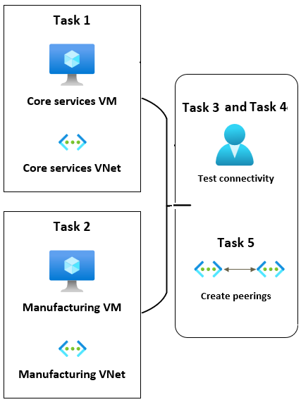
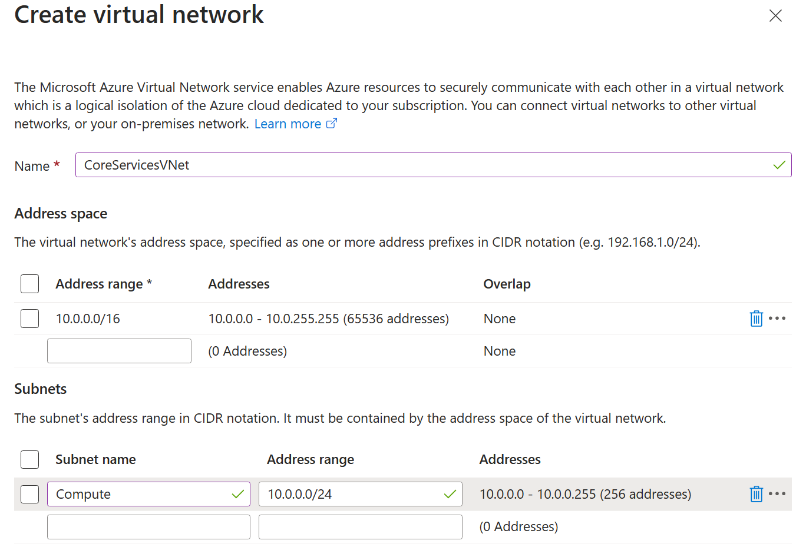
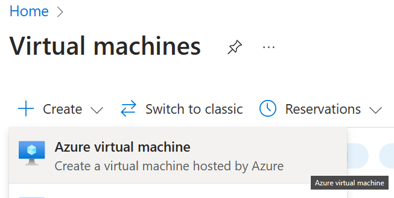
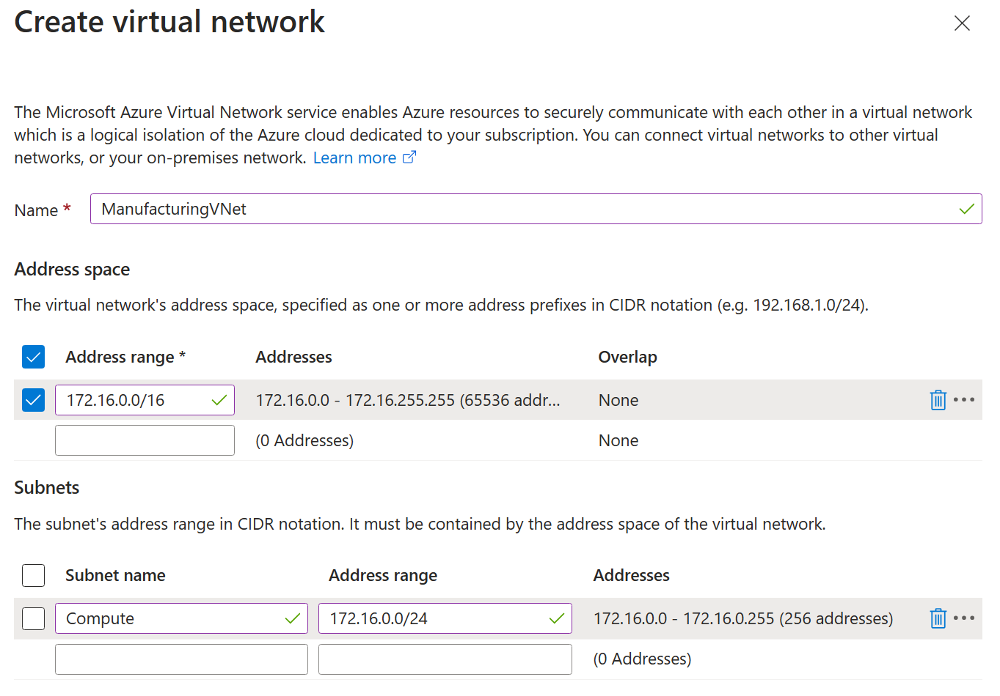
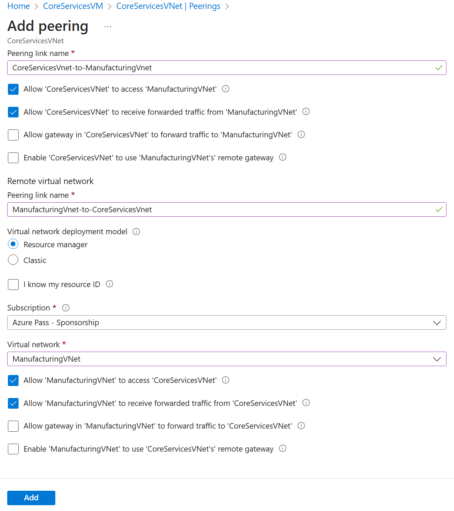
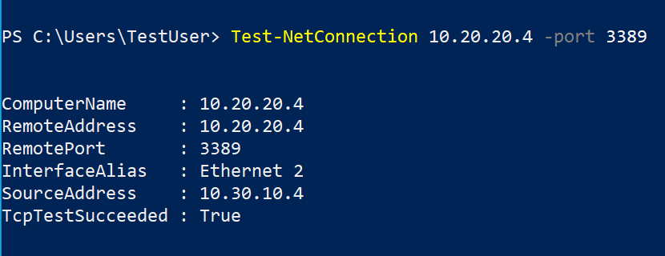

---
lab:
    title: 'Lab 05: Implement Intersite Connectivity'
    module: 'Administer Intersite Connectivity'
---

# Lab 05 - Implement Intersite Connectivity
# Student lab manual

## Exercise scenario 
Your organization segments core IT apps and services (such as DNS and security services) from other parts of the business, including your manufacturing department. However, in some scenarios, apps and services in the core area need to communicate with apps and services in the manufacturing area. In this lab, you will configure connectivity between the segmented areas. This is a common scenario which is also popular for separating production from development or separting one subsidiary from another.

In this unit, you will:

+ Task 1: Create a core services virtual machine and virtual network
+ Task 2: Create a manufacturing services virtual machine and virtual network
+ Task 3: Connect to a VM using RDP
+ Task 4: Test the connection between the VMs
+ Task 5: Create VNet peerings between VNets
+ Task 6: Test the connection between VMs
 

**Note:** An **[interactive lab simulation](https://mslabs.cloudguides.com/guides/AZ-700%20Lab%20Simulation%20-%20Connect%20two%20Azure%20virtual%20networks%20using%20global%20virtual%20network%20peering)** is available that allows you to click through this lab at your own pace. You may find slight differences between the interactive simulation and the hosted lab, but the core concepts and ideas being demonstrated are the same.

#### Estimated time: 30 minutes

## Architecture diagram



## Task 1: Create a core services VM and network

In this task, you will create a manufacturing virtual network and virtual machine. You will use this VM in a later task to try to communicate with a different VM in a different network. By default, two virtual networks in Azure *cannot* communicate. You will configure peering to enable communication between networks.

1. From the Azure portal, search for and navigate to **Virtual Machines**.

1. From the virtual machines page, select **Create** then select **Azure Virtual Machine**.

1. On the Basics tab, use the following information to complete the form, and then select **Next: Disks >**. For any setting not specified, leave the default value.
 
    | Setting | Value | 
    | --- | --- |
    |   Subscription |  The subscription that you have access to |
    | Resource group |  `az104-rg1` (If necessary, select **Create new**.)
    | Virtual machine name |    `CoreServicesVM` |
    | Region | **East US** |
    | Availability options | No infrastructure redundancy required | 
    | Size | **Standard_DS2_v3** | 
    | Username | `localadmin` | 
    | Password | `Provide a complex password` |

    
1. On the Disks tab, set the OS disk type to **Standard HDD**, and then select **Next: Networking >**.

1. On the Networking tab, for Virtual network, select **Create new**.

1. Use the following information to configure the virtual network, and then select **Ok**.

    | Setting | Value | 
    | --- | --- |
    | Name | `CoreServicesVNet` |
    | Address space | `10.0.0.0/16` (Remove or replace the existing address range) |
    | Subnet Name | `Compute` |
    | Subnet address range | `10.0.0.0/24` |

     <!-- This is not improperly cropped - there are no breadcrumbs on this UI. --> 

1. Select the **Monitoring** tab. For Boot Diagnostics, select **Disable**.

1. Select **Review + Create**, and then select **Create**.

## Task 2: Create the manufacturing services VM and network

In this task, you will create a manufacturing virtual network and virtual machine. You will use this VM in a later task to try to communicate with the core services VM in a different network.

1. From the Azure portal, search for and navigate to **Virtual Machines**.

1. From the virtual machines page, select **Create** then select **Azure Virtual Machine**.

    

1. On the Basics tab, use the following information to complete the form, and then select **Next: Disks >**. For any setting not specified, leave the default value.
 
    | Setting | Value | 
    | --- | --- |
    |   Subscription |  The subscription that you have access to |
    | Resource group |  `az104-rg1` (If necessary, select **Create new**.)
    | Virtual machine name |    `ManufacturingVM` |
    | Region | **East US** |
    | Availability options | No infrastructure redundancy required | 
    | Size | **Standard_DS2_v3** | 
    | Username | `localadmin` | 
    | Password | `Provide a complex password` |

    

1. On the Disks tab, set the OS disk type to **Standard HDD**, and then select **Next: Networking >**.

1. On the Networking tab, for Virtual network, select **Create new**.

1. Use the following information to configure the virtual network, and then select **Ok**.

    | Setting | Value | 
    | --- | --- |
    | Name | `ManufacturingVNet` |
    | Address space | `172.16.0.0/16` (Remove or replace the existing address range) |
    | Subnet Name | `Compute` |
    | Subnet address range | `172.16.0.0/24` |

     <!-- This is not improperly cropped - there are no breadcrumbs in on this UI. --> 

1. Select the **Monitoring** tab. For Boot Diagnostics, select **Disable**.

1. Select **Review + Create**, and then select **Create**.

## Task 3: Connect to a VM using RDP
In this task, you will connect to the VMs that you have deployed by using Remote Desktop Connection. This will confirm that they VMs have deployed successfully and you can document the IP addresses that have been assigned to the NICs.

1. On the Azure Portal home page, select **Virtual Machines**.

1. Select **ManufacturingVM**.

1. On ManufacturingVM, select **Connect**.

1. On ManufacturingVM | Connect, in the Native RDP card, select **Select**.

1. Save the RDP file to your desktop by selecting **Download RDP File**.

1. Connect to ManufacturingVM using the RDP file. Use the username `localadmin` and the password you provided during deployment.

1. On the Azure Portal home page, select **Virtual Machines**.

1. Select **CoreServicesVM**. On the overview tab, document the private IP address of the VM. It *should* be **10.0.0.4**.

1. On CoreServicesVM, select **Connect**.

1. On CoreServicesVM | Connect, in the Native RDP card, select **Select**.

1. Select **Download RDP file** to download the RDP file to your computer. 

1. Save the RDP file to your desktop.

1. Connect to the VM using the RDP file. Use the username `localadmin` and the password you provided during deployment.

1. On both VMs, in **Choose privacy settings for your device**, select **Accept**.

1. On both VMs, in **Networks**, select **Yes**.

1. On CoreServicesVM, open a PowerShell prompt, and run the following command: ipconfig

1. Note the IPv4 address, it should match what was documented earlier in this task.


## Task 4: Test the connection between the VMs
In this task, you will test whether the VMs can communicate with each other. This is a common troubleshooting step when setting up new networks, new VMs, or adjusting network security settings.

1. On the ManufacturingVM, open a PowerShell prompt.

1. Use the following command to verify that there is no connection to CoreServicesVM on the CoreServicesVnet. Be sure to use the IPv4 address for the CoreServicesVM.

   ```powershell
    Test-NetConnection 10.0.0.4 -port 3389
    ```


1. The test connection should fail, and you will see a result similar to the following:
   

 

## Task 5: Create VNet peerings between CoreServicesVnet and ManufacturingVnet
In this task, you will create peerings to enable communications between VNets.

1. On the Azure home page, select **Virtual Networks**, and then select **CoreServicesVnet**.

1. In CoreServicesVnet, under **Settings**, select **Peerings**.

1. On CoreServicesVnet | Peerings, select **+ Add**.

1. Use the information in the following table to create the peering.

    | **Section**                          | **Option**                                    | **Value**                             |
    | ------------------------------------ | --------------------------------------------- | ------------------------------------- |
    | This virtual network                 |                                               |                                       |
    |                                      | Peering link name                             | `CoreServicesVnet-to-ManufacturingVnet` |
    |                                      | Allow CoreServiceVNet to access the peered virtual network            | Allow (default)                       |
    |                                      | Traffic forwarded from remote virtual network | **Allow**                       |
    |                                      | Virtual network gateway or Route Server       | None (default)                        |
    | Remote virtual network               |                                               |                                       |
    |                                      | Peering link name                             | `ManufacturingVnet-to-CoreServicesVnet` |
    |                                      | Virtual network deployment model              | **Resource manager**                      |
    |                                      | I know my resource ID                         | Not selected                          |
    |                                      | Subscription                                  | Select your subscription      |
    |                                      | Virtual network                               | **ManufacturingVnet**                     |
    |                                      | Traffic to remote virtual network             | Allow (default)                       |
    |                                      | Traffic forwarded from remote virtual network | **Allow**                       |
    |                                      | Virtual network gateway or Route Server       | None (default)                        |

1. Review your settings and select **Add**.

    
 
1. In CoreServicesVnet | Peerings, verify that the **CoreServicesVnet-to-ManufacturingVnet** peering is listed.

1. Under Virtual networks, select **ManufacturingVnet**, and verify the **ManufacturingVnet-to-CoreServicesVnet** peering is listed.

 

## Task 6: Test the connection between the VMs
In this task, you will check whether the VMs can communicate with each other. You can use a variety of tools and methods for this testing. In this task, you'll use PowerShell which provides an easy and quick way to perform the test.

1. On the ManufacturingVM, open a PowerShell prompt.

1. Use the following command to verify that there is now a connection to CoreServicesVM on CoreServicesVnet. Ensure that you use the IP address of the VM as documented earlier in the lab.

   ```powershell
    Test-NetConnection 10.0.0.4 -port 3389
    ```


1. The test connection should succeed, and you will see a result similar to the following:
   

 

Congratulations! You have successfully created VMs, created peerings, and tested communications between virtual machines.
