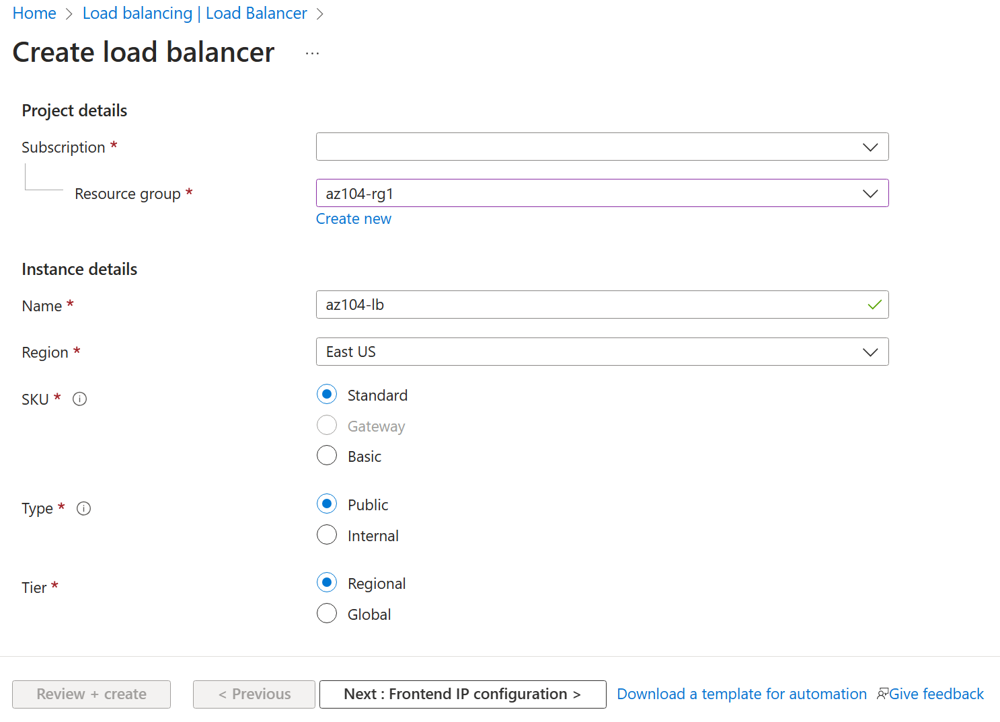
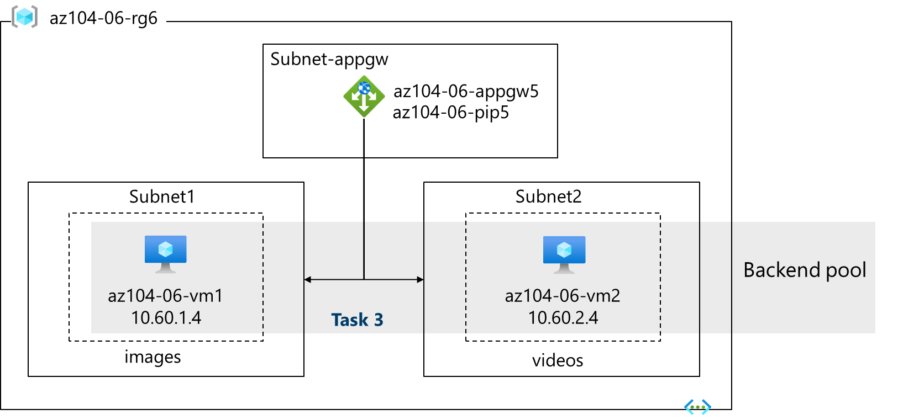
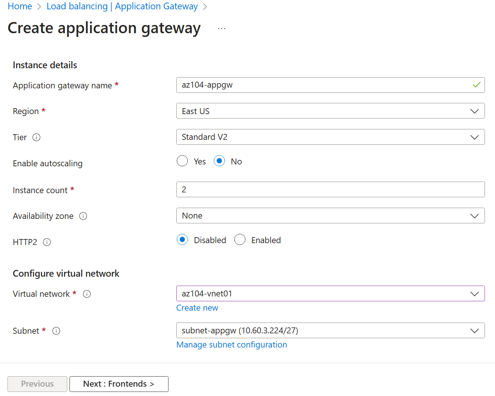

---
lab:
    title: 'Lab 06: Implement Traffic Management'
    module: 'Administer Network Traffic Management'
---

# Lab 06 - Implement Traffic Management

## Lab introduction

In this lab, you learn how to configure and test a public Load Balancer and an Application Gateway.

This lab requires an Azure subscription. Your subscription type may affect the availability of features in this lab. You may change the region, but the steps are written using **East US**.

## Estimated timing: 50 minutes

## Lab scenario

Your organization has a public website. You need to load balance incoming public requests across different virtual machines. You also need to provide images and videos from different virtual machines. You plan on implementing an Azure Load Balancer and an Azure Application Gateway. All resources are in the same region.

## Interactive lab simulations

There are interactive lab simulations that you might find useful for this topic. The simulation lets you to click through a similar scenario at your own pace. There are differences between the interactive simulation and this lab, but many of the core concepts are the same. An Azure subscription is not required.

+ [Create and configure and Azure load balancer](https://mslabs.cloudguides.com/guides/AZ-700%20Lab%20Simulation%20-%20Create%20and%20configure%20an%20Azure%20load%20balancer). Create a virtual network, backend servers, load balancer, and then test the load balancer.
+ [Deploy Azure Application Gateway](https://mslabs.cloudguides.com/guides/AZ-700%20Lab%20Simulation%20-%20Deploy%20Azure%20Application%20Gateway). Create an application gateway, create virtual machines, create the backend pool, and test the gateway.
+ [Implement traffic management](https://mslabs.cloudguides.com/guides/AZ-104%20Exam%20Guide%20-%20Microsoft%20Azure%20Administrator%20Exercise%2010). Implement complete hub and spoke network including virtual machines, virtual networks, peering, load balancer, and application gateway.

## Job skills

+ Task 1: Use a template to provision an infrastructure.
+ Task 2: Configure an Azure Load Balancer.
+ Task 3: Configure an Azure Application Gateway.

## Task 1: Use a template to provision an infrastructure

In this task, you will use a template to deploy one virtual network, one network security group, and two virtual machines.

1. Download the **\\Allfiles\\Lab06** lab files (template and parameters).

1. Sign in to the **Azure portal** - `https://portal.azure.com`.

1. Search for and select `Deploy a custom template`.

1. On the custom deployment page, select **Build you own template in the editor**.

1. On the edit template page, select **Load file**.

1. Locate and select the **\\Allfiles\\Lab06\\az104-06-vms-template.json** file and select **Open**.

1. Select **Save**.

1. Select **Edit parameters** and load the **\\Allfiles\\Lab06\\az104-06-vms-parameters.json** file.

1. Select **Save**.

1. Use the following information to complete the fields on the custom deployment page, leaving all other fields with the default value.

    | Setting       | Value         |
    | ---           | ---           |
    | Subscription  | your Azure subscription |
    | Resource group | `az104-rg6` (If necessary, select **Create new**) |
    | Password      | Provide a secure password |

    >**Note**: If you receive an error that the VM size is unavailable, select a SKU that is available in your subscription and has at least 2 cores.

1. Select **Review + Create** and then select **Create**.

    >**Note**: Wait for the deployment to complete before moving to the next task. The deployment should take approximately 5 minutes.

    >**Note**: Review the resources being deployed. There will be one virtual network with three subnets. Each subnet will have a virtual machine.

## Task 2: Configure an Azure Load Balancer

In this task, you implement an Azure Load Balancer in front of the two Azure virtual machines in the virtual network. Load Balancers in Azure provide layer 4 connectivity across resources, such as virtual machines. Load Balancer configuration includes a front-end IP address to accept connections, a backend pool, and rules that define how connections should traverse the load balancer.

## Architecture diagram - Load Balancer

>**Note**: Notice the Load Balancer is distributing across two virtual machines in the same virtual network.

1. In the Azure portal, search for and select `Load balancers` and, on the **Load balancers** blade, click **+ Create**.

1. Create a load balancer with the following settings (leave others with their default values) then click **Next: Frontend IP configuration**:

    | Setting | Value |
    | --- | --- |
    | Subscription | your Azure subscription |
    | Resource group | **az104-rg6** |
    | Name | `az104-lb` |
    | Region | The **same** region that you deployed the VMs |
    | SKU  | **Standard** |
    | Type | **Public** |
    | Tier | **Regional** |

     

1. On the **Frontend IP configuration** tab, click **Add a frontend IP configuration** and use the following settings:  

    | Setting | Value |
    | --- | --- |
    | Name | `az104-fe` |
    | IP type | IP address |
    | Gateway Load Balancer | None |
    | Public IP address | Select **Create new** (use the instructions in the next step) |

1. On the **Add a public IP address** popup, use the following settings before clicking **OK** and then **Add**. When completed click **Next: Backend pools**.

    | Setting | Value |
    | --- | --- |
    | Name | `az104-lbpip` |
    | SKU | Standard |
    | Tier | Regional |
    | Assignment | Static |
    | Routing Preference | **Microsoft network** |

    >**Note:** The Standard SKU provides a static IP address. Static IP addresses are assigned with the resource is created and released when the resource is deleted.  

1. On the **Backend pools** tab, click **Add a backend pool** with the following settings (leave others with their default values). Click **+ Add** (twice) and then click **Next: Inbound rules**.

    | Setting | Value |
    | --- | --- |
    | Name | `az104-be` |
    | Virtual network | **az104-06-vnet1** |
    | Backend Pool Configuration | **NIC** |
    | Click **Add** to add a virtual machine |  |
    | az104-06-vm0 | **check the box** |
    | az104-06-vm1 | **check the box** |

1. As you have time, review the other tabs, then click **Review and create**. Ensure there are no validation errors, then click **Create**.

1. Wait for the load balancer to deploy then click **Go to resource**.

**Add a rule to determine how incoming traffic is distributed**

1. In the **Settings** blade, select **Load balancing rules**.

1. Select **Add a load balancing rule**. Add a load balancing rule with the following settings (leave others with their default values).  As you configure the rule use the informational icons to learn about each setting. When finished click **Save**.

    | Setting | Value |
    | --- | --- |
    | Name | `az104-lbrule` |
    | IP Version | **IPv4** |
    | Frontend IP Address | **az104-fe** |
    | Backend pool | **az104-be** |
    | Protocol | **TCP** |
    | Port | `80` |
    | Backend port | `80` |
    | Health probe | **Create new** |
    | Name | `az104-hp` |
    | Protocol | **TCP** |
    | Port | `80` |
    | Interval | `5` |
    | Close the create health probe window | **Save** |
    | Session persistence | **None** |
    | Idle timeout (minutes) | `4` |
    | TCP reset | **Disabled** |
    | Floating IP | **Disabled** |
    | Outbound source network address translation (SNAT) | **Recommended** |

1. Select **Frontend IP configuration** from the Load Balancer page. Copy the public IP address.

1. Open another browser tab and navigate to the IP address. Verify that the browser window displays the message **Hello World from az104-06-vm0** or **Hello World from az104-06-vm1**.

1. Refresh the window to verify the message changes to the other virtual machine. This demonstrates the load balancer rotating through the virtual machines.

    > **Note**: You may need to refresh more than once or open a new browser window in InPrivate mode.

## Task 3: Configure an Azure Application Gateway

In this task, you implement an Azure Application Gateway in front of two Azure virtual machines. An Application Gateway provides layer 7 load balancing, Web Application Firewall (WAF), SSL termination, and end-to-end encryption to the resources defined in the backend pool. The Application Gateway routes images to one virtual machine and videos to the other virtual machine.

## Architecture diagram - Application Gateway

>**Note**: This Application Gateway is working in the same virtual network as the Load Balancer. This may not be typical in a production environment.

1. In the Azure portal, search and select `Virtual networks`.

1. On the **Virtual networks** blade, in the list of virtual networks, click **az104-vnet1**.

1. On the **az104-vnet1** virtual network blade, in the **Settings** section, click **Subnets**, and then click **+ Subnet**.

1. Add a subnet with the following settings (leave others with their default values).

    | Setting | Value |
    | --- | --- |
    | Name | `subnet-appgw` |
    | Subnet address range | `10.60.3.224/27` |

1. Click **Save**

    > **Note**: This subnet will be used by the Azure Application Gateway. The Application Gateway requires a dedicated subnet of /27 or larger size.

1. In the Azure portal, search and select `Application Gateways` and, on the **Application Gateways** blade, click **+ Create**.

1. On the **Basics** tab, specify the following settings (leave others with their default values):

    | Setting | Value |
    | --- | --- |
    | Subscription | your Azure subscription |
    | Resource group | `az104-rg6` |
    | Application gateway name | `az104-appgw` |
    | Region | The **same** Azure region that you used in Task 1 |
    | Tier | **Standard V2** |
    | Enable autoscaling | **No** |
    | Minimum instance count | `2` |
    | Availability zone | **None** |
    | HTTP2 | **Disabled** |
    | Virtual network | **az104-06-vnet1** |
    | Subnet | **subnet-appgw (10.60.3.224/27)** |

    

1. Click **Next: Frontends >** and specify the following settings (leave others with their default values). When complete, click **OK**.

    | Setting | Value |
    | --- | --- |
    | Frontend IP address type | **Public** |
    | Public IP address| **Add new** |
    | Name | `az104-gwpip` |
    | Availability zone | **None** |

    >**Note:** The Application Gateway can have both a public and private IP address.
 
1. Click **Next: Backends >** and then **Add a backend pool**. Specify the following settings (leave others with their default values). When completed click **Add**.

    | Setting | Value |
    | --- | --- |
    | Name | `az104-appgwbe` |
    | Add backend pool without targets | **No** |
    | Virtual machine | **az104-rg6-nic1 (10.60.1.4)** |
    | Virtual machine | **az104-rg6-nic2 (10.60.2.4)** |

1. Click **Add a backend pool**. This is the backend pool for **images**. Specify the following settings (leave others with their default values). When completed click **Add**.

    | Setting | Value |
    | --- | --- |
    | Name | `az104-imagebe` |
    | Add backend pool without targets | **No** |
    | Virtual machine | **az104-rg6-nic1 (10.60.1.4)** |

1. Click **Add a backend pool**. This is the backend pool for **video**. Specify the following settings (leave others with their default values). When completed click **Add**.

    | Setting | Value |
    | --- | --- |
    | Name | `az104-videobe` |
    | Add backend pool without targets | **No** |
    | Virtual machine | **az104-rg6-nic2 (10.60.2.4)** |

1. Select **Next: Configuration** and then **Add routing rules**. Complete the information.

    | Setting | Value |
    | --- | --- |
    | Rule name | `az104-gwrule` |
    | Priority | `10` |
    | Listener name | `az104-listener` |
    | Frontend IP | **Public** |
    | Protocol | **HTTP** |
    | Port | `80` |
    | Listener type | **Basic** |

1. Move to the **Backend targets** tab. Select **Add** after completing the basic information.

   | Setting | Value |
    | --- | --- |
    | Backend target | `az104-appgwbe` |
    | Backend settings | `az104-http` (create new) |

   >**Note:** Take a minute to read the information about **Cookie-based affinity** and **Connection draining**.

1. In the **Path based routing** section, select **Add multiple targets to create a path-based rule**. You will create two rules. Click **Add** after the first rule and then add the second rule.

    **Rule - routing to the images backend**

    | Setting | Value |
    | --- | --- |
    | Path | `/image/*` |
    | Target name | `images` |
    | Backend settings | **az104-http** |
    | Backend target | `az104-imagebe` |

    **Rule - routing to the videos backend**

    | Setting | Value |
    | --- | --- |
    | Path | `/video/*` |
    | Target name | `videos` |
    | Backend settings | **az104-http** |
    | Backend target | `az104-videobe` |

1. Select **Add** twice then select **Next: Tags >**. No changes are needed.

1. Select **Next: Review + create >** and then click **Create**.

    > **Note**: Wait for the Application Gateway instance to be created. This will take approximately 5-10 minutes. While you wait consider reviewing some of the self-paced training links at the end of this page.

1. After the application gateway deploys, search for and select **az104-appgw**.

1. In the **Application Gateway** resource, in the **Monitoring** section, select **Backend health**.

1. Ensure both servers in the backend pool display **Healthy**.

1. On the **Overview** blade, copy the value of the **Frontend public IP address**.

1. Start another browser window and test this URL - `http://<frontend ip address>/image/`.

1. Verify you are directed to the image server (vm1).

1. Start another browser window and test this URL - `http://<frontend ip address>/video/`.

1. Verify you are directed to the video server (vm2).

> **Note**: You may need to refresh more than once or open a new browser window in InPrivate mode.

## Cleanup your resources

If you are working with **your own subscription** take a minute to delete the lab resources. This will ensure resources are freed up and cost is minimized. The easiest way to delete the lab resources is to delete the lab resource group. 

+ In the Azure portal, select the resource group, select **Delete the resource group**, **Enter resource group name**, and then click **Delete**.
+ Using Azure PowerShell, `Remove-AzResourceGroup -Name resourceGroupName`.
+ Using the CLI, `az group delete --name resourceGroupName`.
  
## Key takeaways

Congratulations on completing the lab. Here are the main takeaways for this lab.

+ Azure Load Balancer is an excellent choice for distributing network traffic across multiple virtual machines at the transport layer (OSI layer 4 - TCP and UDP).
+ Public Load Balancers are used to load balance internet traffic to your VMs. An internal (or private) load balancer is used where private IPs are needed at the frontend only.
+ The Basic load balancer is for small-scale applications that don't need high availability or redundancy. The Standard load balancer is for high performance and ultra-low latency.
+ Azure Application Gateway is a web traffic (OSI layer 7) load balancer that enables you to manage traffic to your web applications.
+ The Application Gateway Standard tier offers all the L7 functionality, including load balancing, The WAF tier adds a firewall to check for malicious traffic.
+ An Application Gateway can make routing decisions based on additional attributes of an HTTP request, for example URI path or host headers.

## Learn more with self-paced training

+ [Improve application scalability and resiliency by using Azure Load Balancer](https://learn.microsoft.com/training/modules/improve-app-scalability-resiliency-with-load-balancer/). Discuss the different load balancers in Azure and how to choose the right Azure load balancer solution to meet your requirements.
+ [Load balance your web service traffic with Application Gateway](https://learn.microsoft.com/training/modules/load-balance-web-traffic-with-application-gateway/). Improve application resilience by distributing load across multiple servers and use path-based routing to direct web traffic.
