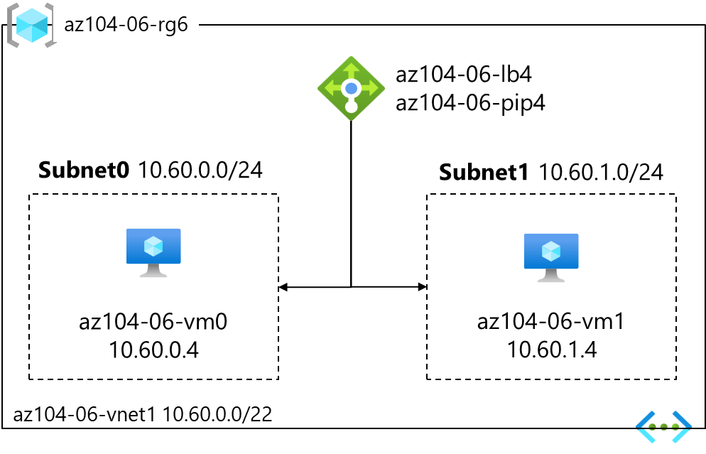
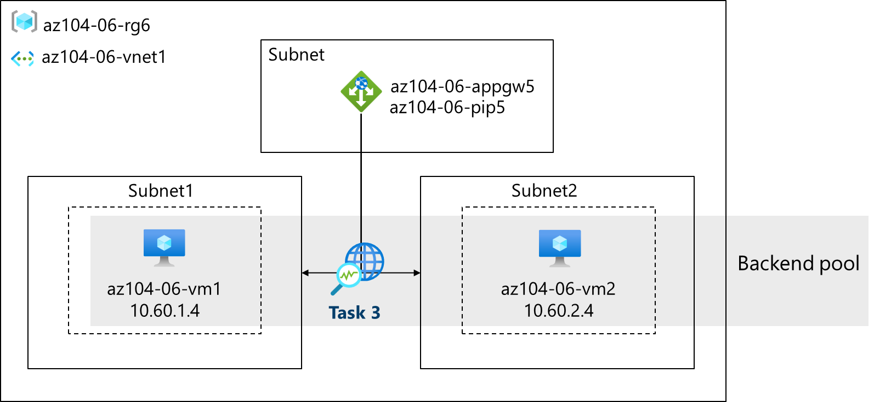
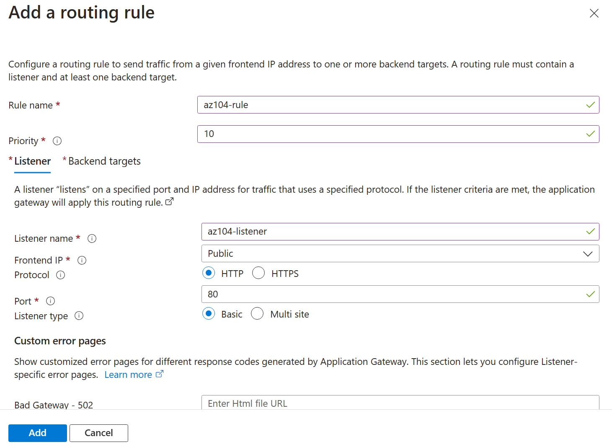

---
lab:
    title: 'Lab 06: Implement Traffic Management'
    module: 'Administer Network Traffic Management'
---

# Lab 06 - Implement Traffic Management

## Lab introduction

In this lab, you learn how to configure and test a public Load Balancer. You also learn how to configure and test an Application Gateway. 

This lab requires an Azure subscription. Your subscription type may affect the availability of features in this lab. You may change the region, but the steps are written using East US.

## Estimated timing: 40 minutes

## Lab scenario

Your organization recently finished testing managing network traffic for Azure virtual machines in a hub and spoke network topology. Now, you want to test traffic distribution across virtual machines by using layer 4 and layer 7 load balancers. For this purpose, you intend to use Azure Load Balancer (layer 4) and Azure Application Gateway (layer 7).

## Interactive lab simulations

There are interactive lab simulations that you might find useful for this topic. The simulation lets you to click through a similar scenario at your own pace. There are differences between the interactive simulation and this lab, but many of the core concepts are the same. An Azure subscription is not required.

+ [Create and configure and Azure load balancer](https://mslabs.cloudguides.com/guides/AZ-700%20Lab%20Simulation%20-%20Create%20and%20configure%20an%20Azure%20load%20balancer). Create a virtual network, backend servers, load balancer, and then test the load balancer. 
+ [Deploy Azure Application Gateway](https://mslabs.cloudguides.com/guides/AZ-700%20Lab%20Simulation%20-%20Deploy%20Azure%20Application%20Gateway). Create an application gateway, create virtual machines, create the backend pool, and test the gateway. 
+ [Implement traffic management](https://mslabs.cloudguides.com/guides/AZ-104%20Exam%20Guide%20-%20Microsoft%20Azure%20Administrator%20Exercise%2010). Implement complete hub and spoke network including virtual machines, virtual networks, peering, load balancer, and application gateway.

## Tasks

+ Task 1: Provision the lab environment
+ Task 2: Implement Azure Load Balancer
+ Task 3: Implement Azure Application Gateway
+ Task 4: Test network connectivity by using Network Watcher

## Task 1: Provision the lab environment

In this task, you will use a template to deploy one virtual network, one network security group, and two virtual machines along with associated virtual network interface cards. The VMs will reside in a hub virtual network named **az104-vnet1**.

1. If necessary, download the **\\Allfiles\\Labs\\06\\az104-06-vms-loop-template.json** and **\\Allfiles\\Labs\\06\\az104-06-vms-loop-parameters.json** lab files to your computer.

1. Sign in to the **Azure portal** - `https://portal.azure.com`.

1. Search for and select `Deploy a custom template`.

1. On the custom deployment page, select **Build you own template in the editor**.

1. On the edit template page, select **Load file**.

1. Locate and select the **\\Allfiles\\Labs\\06\\az104-06-vms-loop-template.json** file and select **Open**.

1. Select **Save**.

1. Use the following information to complete the fields on the custom deployment page, leaving all other fields with the default value.

    | Setting       | Value         | 
    | ---           | ---           |
    | Subscription  | Your Azure subscription |
    | Resource group| `az104-rg6` (If necessary, select **Create new**)
    | Region        | **East US**   |
    | VM Size       | **Standard DS2 v3** |
    | Admin Username| `localadmin` |
    | Password      | Provide a secure password |

     >**Note**: If you receive an error that the VM size is unavailable, select a SKU that is available in your subscription and has at least 2 cores.

1. Select **Review + Create** and then select **Create**.

    >**Note**: Wait for the deployment to finish before moving to the next task. The deployment should complete in approximately 5 minutes.
    
    >**Note:** While you wait, search for and select **Network Watcher**. Select the **Topology** blade to get a view of the virtual network infrastructure. Hover over the networks to view subnet and IP addressing information. 

## Task 2: Implement Azure Load Balancer

In this task, you will implement an Azure Load Balancer in front of the two Azure virtual machines in the hub virtual network. Load Balancers in Azure provide layer 4 connectivity across resources, such as virtual machines. Load Balancer configuration includes a front-end IP address to accept connections, a backend pool, and rules that define how connections should traverse the load balancer.

## Architecture diagram - Load Balancer

>**Note**: Notice the Load Balancer is distributing across two virtual machines in the same virtual network. 

1. In the Azure portal, search for and select `Load balancers` and, on the **Load balancers** blade, click **+ Create**.

1. Create a load balancer with the following settings (leave others with their default values) then click **Next : Frontend IP configuration**:

    | Setting | Value |
    | --- | --- |
    | Subscription | the name of your Azure subscription |
    | Resource group | **az104-rg6** |
    | Name | `az104-lb` |
    | Region | The **same** region that you deployed the VMs |
    | SKU  | **Standard** |
    | Type | **Public** |
    | Tier | **Regional** |
    
     

1. On the **Frontend IP configuration** tab, click **Add a frontend IP configuration** and use the following settings:  
     
    | Setting | Value |
    | --- | --- |
    | Name | `az104-fe` |
    | IP type | IP address |
    | Public IP address | Select **Create new**|
    | Gateway Load Balancer | None |
    
1. On the **Add a public IP address** popup, use the following settings before clicking **OK** and then **Add**. When completed click **Next: Backend pools**. 
     
    | Setting | Value |
    | --- | --- |
    | Name | `az104-pip` |
    | SKU | Standard |
    | Tier | Regional |
    | Assignment | Static |
    | Routing Preference | **Microsoft network** |

1. On the **Backend pools** tab, click **Add a backend pool** with the following settings (leave others with their default values). Click **+ Add** (twice) and then click  **Next: Inbound rules**. 

    | Setting | Value |
    | --- | --- |
    | Name | `az104-be` |
    | Virtual network | **az104-06-vnet1** |
    | Backend Pool Configuration | **NIC** | 
    | IP Version | **IPv4** |
    | Click **Add** to add a virtual machine |  |
    | az104-vm0 | **check the box** |
    | az104-vm1 | **check the box** |

1. On the **Inbound rules** tab, click **Add a load balancing rule**. Add a load balancing rule with the following settings (leave others with their default values). When completed click **Add**.

    | Setting | Value |
    | --- | --- |
    | Name | `az104-lbrule` |
    | IP Version | **IPv4** |
    | Frontend IP Address | **az104-fe** |
    | Backend pool | **az104-be** |
    | Protocol | **TCP** |
    | Port | `80` |
    | Backend port | `80` |
    | Health probe | **Create new** |
    | Name | `az104-hp` |
    | Protocol | **TCP** |
    | Port | `80` |
    | Interval | `5` |
    | Close the create health probe window | **Save** | 
    | Session persistence | **None** |
    | Idle timeout (minutes) | `4` |
    | TCP reset | **Disabled** |
    | Floating IP | **Disabled** |
    | Outbound source network address translation (SNAT) | **Recommended** |

1. As you have time, review the other tabs, then click **Review and create**. Ensure there are no validation errors, then click **Create**. 

1. Wait for the load balancer to deploy then click **Go to resource**.  

1. Select **Frontend IP configuration** from the Load Balancer resource page. Copy the public IP address.

1. Open another browser tab and navigate to the IP address. Verify that the browser window displays the message **Hello World from az104-06-vm0** or **Hello World from az104-06-vm1**.

1. Refresh the window to verify the message changes to the other virtual machine. This demonstrates the load balancer rotating through the virtual machines.

    > **Note**: You may need to refresh more than once or open a new browser window in InPrivate mode.

## Task 3: Implement Azure Application Gateway

In this task, you will implement an Azure Application Gateway in front of the two Azure virtual machines in the spoke virtual networks. An Application Gateway provides layer 7 load balancing, Web Application Firewall (WAF), SSL termination, and end-to-end encryption to the resources defined in the backend pool. 

## Architecture diagram - Application Gateway

>**Note**: Notice the Application Gateway is distributing across two virtual machines in the two different virtual networks. 

1. In the Azure portal, search and select `Virtual networks`.

1. On the **Virtual networks** blade, in the list of virtual networks, click **az104-vnet1**.

1. On the  **az104-vnet1** virtual network blade, in the **Settings** section, click **Subnets**, and then click **+ Subnet**.

1. Add a subnet with the following settings (leave others with their default values).

    | Setting | Value |
    | --- | --- |
    | Name | `subnet-appgw` |
    | Subnet address range | `10.60.3.224/27` |

1. Click **Save**

    > **Note**: This subnet will be used by the Azure Application Gateway instances, which you will deploy later in this task. The Application Gateway requires a dedicated subnet of /27 or larger size. This step could have done during the Application Gateway creation. 

1. In the Azure portal, search and select `Application Gateways` and, on the **Application Gateways** blade, click **+ Create**.

1. On the **Basics** tab, specify the following settings (leave others with their default values):

    | Setting | Value |
    | --- | --- |
    | Subscription | the name of the Azure subscription you are using in this lab |
    | Resource group | `az104-rg6` |
    | Application gateway name | `az104-appgw` |
    | Region | The **same** Azure region that you used in Task 1 |
    | Tier | **Standard V2** |
    | Enable autoscaling | **No** |
	| Instance count | `2` |
	| Availability zone | **None** |
    | HTTP2 | **Disabled** |
    | Virtual network | **az104-06-vnet1** |
    | Subnet | **subnet-appgw (10.60.3.224/27)** |

    

1. Click **Next: Frontends >** and specify the following settings (leave others with their default values). When complete, click **OK**. 

    | Setting | Value |
    | --- | --- |
    | Frontend IP address type | **Public** |
    | Public IP address| **Add new** | 
	| Name | `az104-gwpip` |
	| Availability zone | **None** |

1. Click **Next: Backends >** and then **Add a backend pool**. Specify the following settings (leave others with their default values). When completed click **Add**.

    | Setting | Value |
    | --- | --- |
    | Name | `az104-appgwbe` |
    | Add backend pool without targets | **No** |
    | IP address or FQDN | **10.62.0.4** | 
    | IP address or FQDN | **10.63.0.4** |

    > **Note**: The targets represent the private IP addresses of virtual machines **az104-vm0** and **az104-vm1**.

1. Click **Next: Configuration >** and then **+ Add a routing rule**. Specify the following settings:

    | Setting | Value |
    | --- | --- |
    | Rule name | `az104-rule` |
    | Priority | `10` |
    | Listener name | `az104-listener` |
    | Frontend IP | **Public** |
    | Protocol | **HTTP** |
    | Port | `80` |
    | Listener type | **Basic** |

    

1. Switch to the **Backend targets** tab and specify the following settings (leave others with their default values). When complete, click **Add** (twice).  

    | Setting | Value |
    | --- | --- |
    | Target type | **Backend pool** |
    | Backend target | **az104-appgwbe** |
	| Backend settings | **Add new** |
    | Backend settings name | `az104-http` |
    | Backend protocol | **HTTP** |
    | Backend port | `80` |
    | Additional settings | **take the defaults** |
    | Host name | **take the defaults** |

1. Click **Next: Tags >**, followed by **Next: Review + create >** and then click **Create**.

    > **Note**: Wait for the Application Gateway instance to be created. This will take approximately 10 minutes.

1. In the Azure portal, search and select **az104-appgw**.

1. On the **az104-appgw** Application Gateway blade, copy the value of the **Frontend public IP address**.

1. Start another browser window and navigate to the IP address you identified in the previous step.

1. Verify that the browser window displays the message **Hello World from az104-vm0** or **Hello World from az104-vm1**.

1. Refresh the window to verify the message changes to the other virtual machine. 

    > **Note**: You may need to refresh more than once or open a new browser window in InPrivate mode.

## Task 4: Test network connectivity by using Network Watcher

In this task, you will use Network Watcher in the Azure portal to test connectivity between vritual machines. Network Watcher provides troubleshooting and additional information around *why* connections are failing. Network Watcher contains several tools that can aid in troubleshooting networks.

### Test the connection between vm0 and vm1 

1. From the Azure portal, search for and select `Network Watcher`.

1. From Network Watcher, in the Network diagnostic tools menu, select **Connection troubleshoot**.

1. Use the following information to complete the fields on the **Connection troubleshoot** page.

    | Field | Value | 
    | --- | --- |
    | Source type           | **Virtual machine**   |
    | Virtual machine       | **vm0**    | 
    | Destination type      | **Virtual machine**   |
    | Virtual machine       | **vm1**   | 
    | Preferred IP Version  | **Both**              | 
    | Protocol              | **TCP**               |
    | Destination port      | `3389`                |  
    | Source port           | *Blank*         |
    | Diagnostic tests      | *Defaults*      |

    

1. Select **Run diagnostic tests**.

    >**Note**: It may take a couple of minutes for the results to return. The screen selections will be greyed out while the results are being collected. Notice the **Connectivity test** shows **Reachable**. This makes sense because the virtual machines are in the same virtual network. 

### Test the connection between vm2 and vm3 

1. FContinue with the **Network Watcher**.

1. Select **Connection troubleshoot**.

1. Use the following information to complete the fields on the **Connection troubleshoot** page.

    | Field | Value | 
    | --- | --- |
    | Source type           | **Virtual machine**   |
    | Virtual machine       | **vm0**    | 
    | Destination type      | **Virtual machine**   |
    | Virtual machine       | **vm3**   | 
    | Preferred IP Version  | **Both**              | 
    | Protocol              | **TCP**               |
    | Destination port      | `3389`                |  
    | Source port           | *Blank*         |
    | Diagnostic tests      | *Defaults*      |

    

1. Select **Run diagnostic tests**.

    >**Note**: Notice the **Connectivity test** shows **Unreachable**. This makes sense because the virtual machines are in different virtual networks. 

## Review the main points of the lab

Congratulations on completing the lab. Here are the main takeaways for this lab. 

+ Azure Load Balancer is an excellent choice for distributing network traffic across multiple virtual machines at the transport layer (OSI layer 4 - TCP and UDP).
+ Public Load Balancers are used to load balance internet traffic to your VMs. An internal (or private) load balancer is used where private IPs are needed at the frontend only.
+ The Basic load balancer is for small-scale applications that don't need high availability or redundancy. The Standard load balancer is for high performance and ultra-low latency.
+ Azure Application Gateway is a web traffic (OSI layer 7) load balancer that enables you to manage traffic to your web applications. 
+ An Application Gateway can make routing decisions based on additional attributes of an HTTP request, for example URI path or host headers. 

## Cleanup your resources

If you are working with your own subscription take a minute to delete the lab resources. This will ensure resources are freed up and cost is minimized. The easiest way to delete the lab resources is to delete the lab resource group. 

+ In the Azure portal, select the resource group, select **Delete the resource group**, **Enter resource group name**, and then click **Delete**.

+ Using Azure PowerShell, `Remove-AzResourceGroup -Name resourceGroupName`.

+ Using the CLI, `az group delete --name resourceGroupName`.
