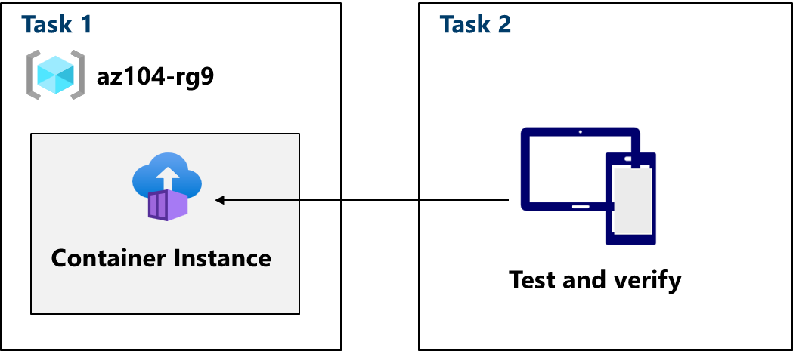
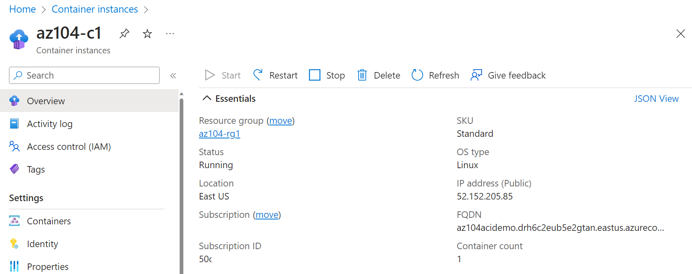
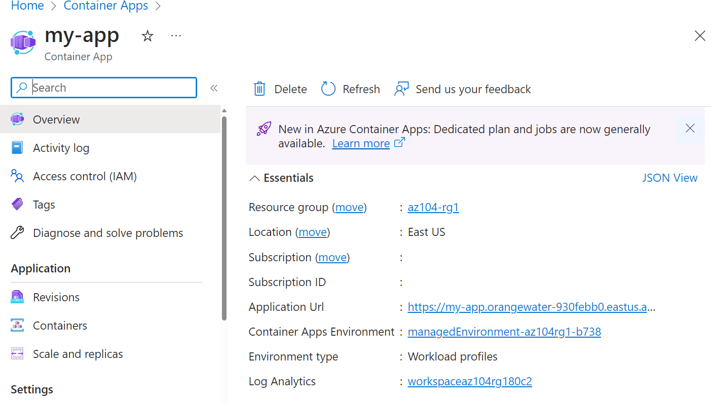

---
lab:
    title: 'Lab 09b: Implement Azure Containers'
    module: 'Administer PaaS Compute Options'
---

# Lab 09b - Implement Azure Containers

## Lab requirements

This lab requires an Azure subscription. Your subscription type may affect the availability of features in this lab. You may change the region, but the steps are written using East US.

## Estimated timing: 30 minutes

## Lab scenario

Your organization has a web application that runs on a virtual machine in your on-premises data center. The organization wants to move all applications to the cloud but doesn't want to have a large number of servers to manage. You decide to evaluate Azure Container Instances and Docker. Additionally, you want to deploy and test an Azure container app.

## Interactive lab simulations

There are interactive lab simulations that you might find useful for this topic. The simulation lets you to click through a similar scenario at your own pace. There are differences between the interactive simulation and this lab, but many of the core concepts are the same. An Azure subscription is not required.

+ [Deploy Azure Container Instances](https://mslearn.cloudguides.com/en-us/guides/AZ-900%20Exam%20Guide%20-%20Azure%20Fundamentals%20Exercise%203). Create, configure, and deploy a Docker container with Azure Container Instances. 
+ [Implement Azure Container Instances](https://mslabs.cloudguides.com/guides/AZ-104%20Exam%20Guide%20-%20Microsoft%20Azure%20Administrator%20Exercise%2014).  Deploy a Docker image using Azure Container Instances. 

## Architecture diagram

## Tasks

- Task 1: Deploy an Azure Container Instance using a Docker image
- Task 2: Review the functionality of the Azure Container Instance

## Task 1: Deploy an Azure Container Instance using a Docker image

In this task, you will create a new container instance for the web application. Docker is a platform that provides the ability to package and run applications in isolated environments called containers. Azure Container Instances provides the compute environment for a container image.

1. Sign in to the **Azure portal** - `http://portal.azure.com`.

1. In the Azure portal, search for and select `Container instances` and then, on the **Container instances** blade, click **+ Create**.

1. On the **Basics** tab of the **Create container instance** blade, specify the following settings (leave others with their default values):

    | Setting | Value |
    | ---- | ---- |
    | Subscription | the name of your Azure subscription |
    | Resource group | `az104-rg9` (If necessary, select **Create new**) |
    | Container name | `az104-c1` |
    | Region | **East US** (or a region available near you)|
    | Image Source | **Quickstart images** |
    | Image | **mcr.microsoft.com/azuredocs/aci-helloworld:latest (Linux)** |

1. Click **Next: Networking >** and, on the **Networking** tab of the **Create container instance** blade, specify the following settings (leave others with their default values):

    | Setting | Value |
    | --- | --- |
    | DNS name label | any valid, globally unique DNS host name |

    >**Note**: Your container will be publicly reachable at dns-name-label.region.azurecontainer.io. If you receive a **DNS name label not available** error message, specify a different value.

1. Click **Next: Advanced >**, review the settings on the **Advanced** tab of the **Create container instance** blade without making any changes.

 1. Click **Review + Create**, ensure that the validation passed and then select **Create**.

    >**Note**: Wait for the deployment to complete. This should take 2-3 minutes.

    >**Note**: While you wait, you may be interested in viewing the [code behind the sample application](https://github.com/Azure-Samples/aci-helloworld). To view it, browse the \\app folder.

## Task 2: Review the functionality of the Azure Container Instance

In this task, you will review the deployment of the container instance. By default, the Azure Container Instance will be accessible over port 80. After the instance has been deployed, you can navigate to the container using the DNS name that you provided in the previous task.

1. On the deployment blade, click the **Go to resource** link.

1. On the **Overview** blade of the container instance, verify that **Status** is reported as **Running**.

1. Copy the value of the container instance **FQDN**, open a new browser tab, and navigate to the corresponding URL.

     

1. Verify that the **Welcome to Azure Container Instance** page is displayed.

1. Close the new browser tab, back in the Azure portal, in the **Settings** section of the container instance blade, click **Containers**, and then click **Logs**.

1. Verify that you see the log entries representing the HTTP GET request generated by displaying the application in the browser.

## Architecture diagram

- Task 3: Create an Azure Container App and environment
- Task 4: Deploy and test the container app

## Task 3: Create a container app and environment

Azure Container Apps take the concept of a managed Kubernetes cluster a step further and manages the cluster environment as well as provides other managed services on top of the cluster. Unlike an Azure Kubernetes cluster, where you must still manage the cluster, an Azure Container Apps instance removes some of the complexity to setting up a Kubernetes cluster.

1. From the Azure portal, search for and select `Container Apps`.

1. From **Container Apps**, select **Create**.

1. Use the following information to fill out the details on the **Basics** tab, then select **Next: Container >**.

    | Setting | Action |
    |---|---|
    | Subscription | Select your Azure subscription |
    | Resource group | `az104-rg9` |
    | Container app name |  `my-app` |
    | Region    | **East US** (Or a region available near you) |
    | Container Apps Environment | Leave default |

1. Ensure that **Use quickstart image** is enabled and that the quickstart image is set to **Simple hello world container**.

1. Select the **Review and create** button at the bottom of the page. 

    >**Note**: If there are errors, any tab containing errors is marked with a red dot.  Navigate to the appropriate tab.  Fields containing an error will be highlighted in red.  Once all errors are fixed, select **Review and create** again.

1. Select **Create**.

    >**Note:** A page with the message *Deployment is in progress* is displayed.  Once the deployment is successfully completed, you'll see the message: *Your deployment is complete*.
 
## Task 4: Test and verify deployment of the container app
By default, the Azure container app that you create will accept traffic on port 80 using the sample Hello World application. Azure Container Apps will provide a DNS name for the application. Copy and navigate to this URL to ensure that the application is up and running.

1. Select **Go to resource** to view your new container app.

1. Select the link next to *Application URL* to view your application.

    

1. Verify you receive the **Your Azure Container Apps app is live** message.

## Review the main points of the lab

Congratulations on completing the lab. Here are the main takeaways for this lab. 

+ Azure Container Instances (ACI) is a service that enables you to deploy containers on the Microsoft Azure public cloud. ACI doesn't require you to provision or manage any underlying infrastructure. The service supports both Linux containers and Windows containers.
+ Azure Container Apps (ACA) is a serverless platform that allows you to maintain less infrastructure and save costs while running containerized applications. Instead of worrying about server configuration, container orchestration, and deployment details, Container Apps provides all the up-to-date server resources required to keep your applications stable and secure.
+ Workloads on ACI are usually started and stopped by some kind of process or trigger and are usually short-lived. Workloads on ACA are usually long-running processes like a Web app.

## Cleanup your resources

If you are working with your own subscription take a minute to delete the lab resources. This will ensure resources are freed up and cost is minimized. The easiest way to delete the lab resources is to delete the lab resource group. 

+ In the Azure portal, select the resource group, select **Delete the resource group**, **Enter resource group name**, and then click **Delete**.

+ Using Azure PowerShell, `Remove-AzResourceGroup -Name resourceGroupName`.

+ Using the CLI, `az group delete --name resourceGroupName`.
