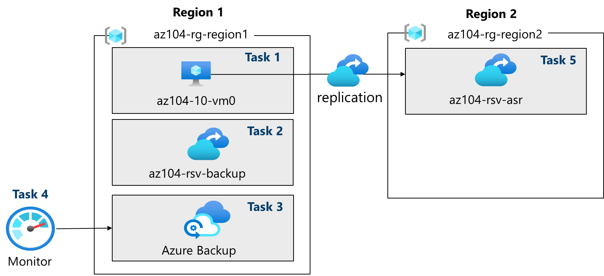
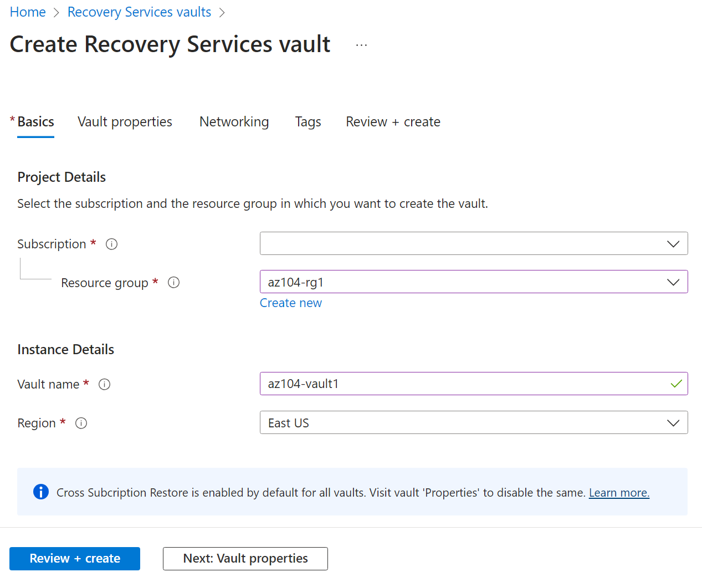
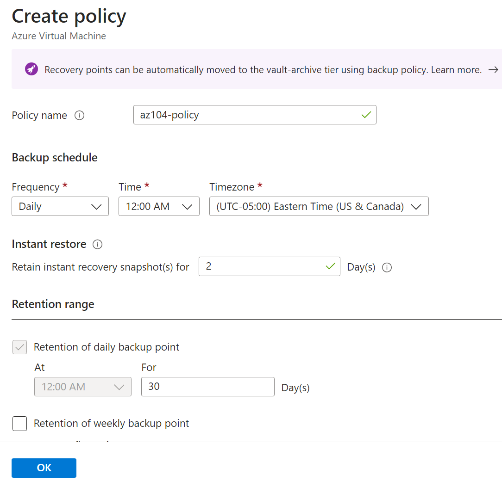

---
lab:
    title: 'Lab 10: Implement Data Protection'
    module: 'Administer Data Protection'
---

# Lab 10 - Implement Data Protection

## Lab introduction    

In this lab, you learn about backup and recovery of Azure virtual machines. You learn to create a Recovery Service vault and a backup policy for Azure virtual machines. You learn about disaster recovery with Azure Site Recovery. 

This lab requires an Azure subscription. Your subscription type may affect the availability of features in this lab. You may change the regions, but the steps are written using **East US** and **West US**.

## Estimated timing: 50 minutes

## Lab scenario

Your organization is evaluating how to backup and restore Azure virtual machines from accidental or malicious data loss. Additionally, the organization wants to explore using Azure Site Recovery for disaster recovery scenarios. 

## Interactive lab simulation

There is an interactive lab simulation that you might find useful for this topic. The simulation lets you to click through a similar scenario at your own pace. There are differences between the interactive simulation and this lab, but many of the core concepts are the same. An Azure subscription is not required.

+ **[Backup virtual machines and on-premises files.](https://mslabs.cloudguides.com/guides/AZ-104%20Exam%20Guide%20-%20Microsoft%20Azure%20Administrator%20Exercise%2016)**. Create a recovery services vault and implement an Azure virtual machine backup. Implement on-premises file and folder backup using the Microsoft Azure Recovery Services agent. On-premises backups are outside the scope of this lab but it might be helpful to view those steps. 

## Job skills

+ Task 1: Use a template to provision an infrastructure.
+ Task 2: Create and configure a Recovery Services vault.
+ Task 3: Configure Azure virtual machine-level backup.
+ Task 4: Monitor Azure Backup.
+ Task 5: Enable virtual machine replication. 

## Estimated timing: 40 minutes

## Architecture diagram

## Task 1: Use a template to provision an infrastructure

In this task, you will use a template to deploy a virtual machine. The virtual machine will be used to test different backup scenarios.

1. Download the **\\Allfiles\\Lab10\\** lab files.

1. Sign in to the **Azure portal** - `https://portal.azure.com`.

1. Search for and select `Deploy a custom template`.

1. On the custom deployment page, select **Build you own template in the editor**.

1. On the edit template page, select **Load file**.

1. Locate and select the **\\Allfiles\\Lab10\\az104-10-vms-edge-template.json** file and select **Open**.

   >**Note:** Take a moment to review the template. We are deploying a virtual network and virtual machine so we can demonstrate backup and recovery. 

1. **Save** your changes.

1. Select **Edit parameters** and then **Load file**.

1. Load and select the **\\Allfiles\\Lab10\\az104-10-vms-edge-parameters.json** file.

1. **Save** your changes.

1. Use the following information to complete the custom deployment fields, leaving all other fields with their default values:

    | Setting       | Value         | 
    | ---           | ---           |
    | Subscription  | Your Azure subscription |
    | Resource group| `az104-rg-region1` (If necessary, select **Create new**)
    | Region        | **East US**   |
    | Username      | **localadmin**   |
    | Password      | Provide a complex password |

1. Select **Review + Create**, then select **Create**.

    >**Note:** Wait for the template to deploy, then select **Go to resource**. You should have one virtual machine in one virtual network. 

## Task 2: Create and configure a Recovery Services vault

In this task, you will create a Recovery Services vault. A Recovery Services vault provides storage for the virtual machine data. 

1. In the Azure portal, search for and select `Recovery Services vaults` and, on the **Recovery Services vaults** blade, click **+ Create**.

1. On the **Create Recovery Services vault** blade, specify the following settings:

    | Settings | Value |
    | --- | --- |
    | Subscription | the name of your Azure subscription |
    | Resource group | `az104-rg-region1`  |
    | Vault Name | `az104-rsv-region1` |
    | Region | **East US** |

    >**Note**: Make sure that you specify the same region into which you deployed virtual machines in the previous task.

    

1. Click **Review + Create**, ensure that the validation passes and then click **Create**.

    >**Note**: Wait for the deployment to complete. The deployment should take a couple of minutes. 

1. When the deployment is completed, click **Go to Resource**.

1. On the Recovery Services vault blade, in the **Settings** section, click **Properties**.

1. Select the **Update** link under **Backup Configuration** label.

1. On the **Backup Configuration** blade, review the choices for **Storage replication type**. Leave the default setting of **Geo-redundant** in place and close the blade.

    >**Note**: This setting can be configured only if there are no existing backup items.
    
    >**Did you know?** The [Cross Region Restore](https://learn.microsoft.com/azure/backup/backup-create-recovery-services-vault#set-cross-region-restore) option allows you to restore data in a secondary, Azure paired region. 

1. Return to the Recovery Services vault blade, click the **Update** link under **Security Settings > Soft Delete and security settings** label.

1. On the **Security Settings** blade, note that **Soft Delete (For workload running in Azure)** is **Enabled**. Notice the **soft delete retention period** is **14** days. 

1. Return to the Recovery Services vault blade, select the **Overview** blade.

>**Did you know?** Azure has two types of vaults: Recovery Services vaults and Backup vaults. The main difference is the datasources that can be backed up. Learn more about [the differences](https://learn.microsoft.com/answers/questions/405915/what-is-difference-between-recovery-services-vault).

## Task 3: Configure Azure virtual machine-level backup

In this task, you will implement Azure virtual-machine level backup. As part of a VM backup, you will need to define the backup and retention policy that applies to the backup. Different VMs can have different backup and retention policies assigned to them.

   >**Note**: Before you start this task, make sure that the deployment you initiated in the first task of this lab has successfully completed.

1. On the Recovery Services vault blade, click **Overview**, then click **+ Backup**.

1. On the **Backup Goal** blade, specify the following settings:

    | Settings | Value |
    | --- | --- |
    | Where is your workload running? | **Azure** (notice your other options) |
    | What do you want to backup? | **Virtual machine** (notice your other options |

1. Select **Backup**.

1. Notice there a two **Policy sub types**: **Enhanced** and **Standard**. Review the choices and select **Standard**. 

1. In **Backup policy**, select **Create a new policy**.

1. Define a new backup policy with the following settings (leave others with their default values):

    | Setting | Value |
    | ---- | ---- |
    | Policy name | `az104-backup` |
    | Frequency | **Daily** |
    | Time | **12:00 AM** |
    | Timezone | the name of your local time zone |
    | Retain instant recovery snapshot(s) for | **12** Days(s) |

    

1. Click **OK** to create the policy and then, in the **Virtual Machines** section, select **Add**.

1. On the **Select virtual machines** blade, select **az-104-10-vm0**, click **OK**, and then back on the **Backup** blade, click **Enable backup**.

    >**Note**: Wait for the backup to be enabled. This should take approximately 2 minutes.

1. In the **Protected items** section, click **Backup items**, and then click the **Azure virtual machine** entry.

1. Select the **View details** link for **az104-10-vm0**, and review the values of the **Backup Pre-Check** and **Last Backup Status** entries.

    >**Note:** Notice the backup is pending.
    
1. Select **Backup now**, accept the default value in the **Retain Backup Till** drop-down list, and click **OK**.

    >**Note**: Do not wait for the backup to complete but instead proceed to the next task.

## Task 4: Monitor Azure Backup

In this task, you will deploy an Azure storage account. Then you will configure the vault to send the logs and metrics to the storage account. This repository can then be used with Log Analytics or other third-party monitoring solutions.

1. From the Azure portal, search for and select `Storage accounts`.

1. On the Storage accounts page, select **Create**.

1. Use the following information to define the storage account, then and select **Review**.

    | Settings | Value |
    | --- | --- | 
    | Subscription          | *Your subscription*    |
    | Resource group        | **az104-rg-region1**        |
    | Storage account name  | Provide a globally unique name   |
    | Region                | **East US**   |

1. On the Review tab, select **Create**.

    >**Note**: Wait for the deployment to complete. It should take about a minute.

1. Search and select your Recovery Services vault.

1. Select **Diagnostic Settings** and then select **Add diagnostic setting**.

1. Name the setting `Logs and Metrics to storage`.

1. Place a checkmark next to the following log and metric categories:

    - **Azure Backup Reporting Data**
    - **Addon Azure Backup Job Data**
    - **Addon Azure Backup Alert Data**
    - **Azure Site Recovery Jobs**
    - **Azure Site Recovery Events**
    - **Health**

1. In the Destination details, place a checkmark next to **Archive to a storage account**.

1. In the Storage account drop-down field, select the storage account that you deployed earlier in this task.

1. Select **Save**.

1. Return to your Recovery Services vault, in the **Monitoring** blade select **Backup jobs**.

1. Locate the backup operation for the **az104-10-vm0** virtual machine. 

1. Review the details of the backup job.

## Task 5: Enable virtual machine replication

1. In the Azure portal, search for and select `Recovery Services vaults` and, on the **Recovery Services vaults** blade, click **+ Create**.

1. On the **Create Recovery Services vault** blade, specify the following settings:

    | Settings | Value |
    | --- | --- |
    | Subscription | the name of your Azure subscription |
    | Resource group | `az104-rg-region2` (If necessary, select **Create new**) |
    | Vault Name | `az104-rsv-region2` |
    | Region | **West US** |

    >**Note**: Make sure that you specify a **different** region than the virtual machine.

1. Click **Review + Create**, ensure that the validation passes and then click **Create**.

    >**Note**: Wait for the deployment to complete. The deployment should take a couple of minutes. 

1. Search for and select the `az104-10-vm0` virtual machine.

1. In the **Backup + Disaster recovery** blade, select **Disaster recovery**. 

1. Select **Enable replication**.

1. On the **Basics** tab, notice the **Target region**.

1. Move to the **Advanced settings** tab. Resource selections have been made for you. It is important to review them. 

1. Verify your subscription, vm resource group, virtual network, and availability (take the default) settings.

1. In **Storage settings** select **Show details**.

    | Setting | Value |
    | ---- | ---- |
    | Churn for the vm | **Normal churn**  |
    | Cache storage account | **(new) xxx**  |

   >**Note:** It is important that both of these settings be populated, or the validation will fail. If values are not present, try refreshing the page. If that doesn't work, create an empty storage account and then return to this page.

1. In **Replication settings** select **Show details**. Notice your recovery resources vault in region 2 was automatically selected.

1. Select **Review + Start replication** and then **Enable replication**.

    >**Note**: Enabling replication will take a 10-15 minutes. Watch the notification messages in the upper right of the portal. While you wait, consider reviewing the self-paced training links at the end of this page.
    
1. Once the replication is complete, search for and locate your Recovery Services Vault, **az104-rsv-region2**. You may need to **Refresh** the page. 

1. In the **Protected items** section, select **Replicated items**.

1. Check that the virtual machine is showing as healthy for the replication health. Note that the status will show the synchronization (starting at 0%) status and ultimately show **Protected** after the initial synchronization completes.

   

1. Select the virtual machine to view more details.
   
>**Did you know?** It is a good practice to [test the failover of a protected VM](https://learn.microsoft.com/azure/site-recovery/tutorial-dr-drill-azure#run-a-test-failover-for-a-single-vm).

## Cleanup your resources

If you are working with **your own subscription** take a minute to delete the lab resources. This will ensure resources are freed up and cost is minimized. The easiest way to delete the lab resources is to delete the lab resource group. 

+ In the Azure portal, select the resource group, select **Delete the resource group**, **Enter resource group name**, and then click **Delete**.
+ Using Azure PowerShell, `Remove-AzResourceGroup -Name resourceGroupName`.
+ Using the CLI, `az group delete --name resourceGroupName`.

## Key takeaways

Congratulations on completing the lab. Here are the main takeaways for this lab. 

+ Azure Backup service provides simple, secure, and cost-effective solutions to back up and recover your data.
+ Azure Backup can protect on-premises and cloud resources including virtual machines and file shares.
+ Azure Backup policies configure the frequency of backups and the retention period for recovery points. 
+ Azure Site Recovery is a disaster recovery solution that provides protection for your virtual machines and applications.
+ Azure Site Recovery replicates your workloads to a secondary site, and in the event of an outage or disaster, you can failover to the secondary site and resume operations with minimal downtime.
+ A Recovery Services vault stores your backup data and minimizes management overhead.

## Learn more with self-paced training

+ [Protect your virtual machines by using Azure Backup](https://learn.microsoft.com/training/modules/protect-virtual-machines-with-azure-backup/). Use Azure Backup to help protect on-premises servers, virtual machines, SQL Server, Azure file shares, and other workloads.
+ [Protect your Azure infrastructure with Azure Site Recovery](https://learn.microsoft.com/en-us/training/modules/protect-infrastructure-with-site-recovery/). Provide disaster recovery for your Azure infrastructure by customizing replication, failover, and failback of Azure virtual machines with Azure Site Recovery.
