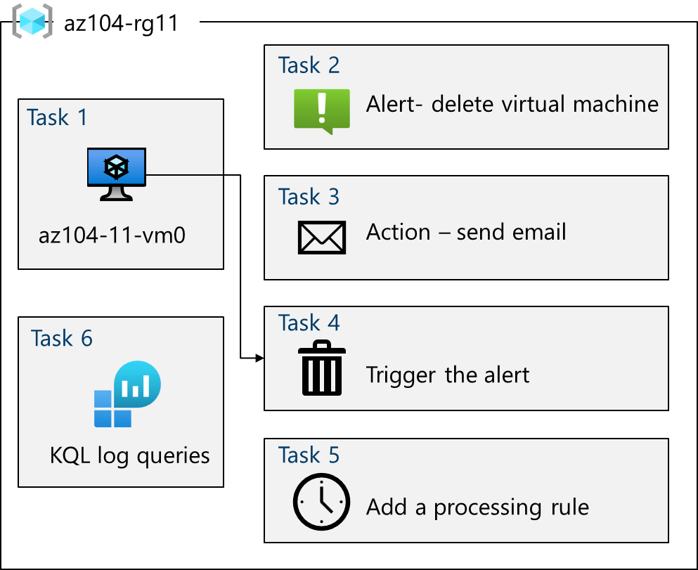

---
lab:
    title: 'Lab 11: Implement Monitoring'
    module: 'Administer Monitoring'
---

# Lab 11 - Implement Monitoring

## Lab introduction

In this lab, you learn about Azure Monitor. You learn to create an alert to be sent to an action group. You trigger the alert and check the activity log.  

This lab requires an Azure subscription. Your subscription type may affect the availability of features in this lab. You may change the region, but the steps are written using East US.

## Estimated timing: 40 minutes

## Lab scenario

Your organization has migrated their infrastructure to Azure. It is important that Administrators are notified of any significant infrastructure changes. You plan to examine the capabilities of Azure Monitor, including Log Analytics.

## Interactive lab simulation

There is an interactive lab simulation that you might find useful for this topic. The simulation lets you to click through a similar scenario at your own pace. There are differences between the interactive simulation and this lab, but many of the core concepts are the same. An Azure subscription is not required.

+ [Implement monitoring](https://mslabs.cloudguides.com/guides/AZ-104%20Exam%20Guide%20-%20Microsoft%20Azure%20Administrator%20Exercise%2017). Create a Log Analytics workspace and Azure-automation solutions. Review monitoring and diagnostic settings for virtual machines. Review Azure Monitor and Log Analytics functionality. 

## Architecture diagram



## Tasks

+ Task 1: Provision the lab environment.
+ Task 2: Create the Azure activity log alert.
+ Task 3: Trigger the alert.
+ Task 4: Add an alert rule.
+ Task 5: Use Azure Monitor log queries.

## Task 1: Provision the lab environment

In this task, you will deploy a virtual machine that will be used to test monitoring scenarios.

1. If necessary, download the **\\Allfiles\\Lab11\\az104-11-vm-template.json** and **\\Allfiles\\Labs\\11\\az104-11-vm-parameters.json** lab files to your computer.

1. Sign in to the **Azure portal** - `https://portal.azure.com`.

1. From the Azure portal, search for and select `Deploy a custom template`.

1. On the custom deployment page, select **Build you own template in the editor**.

1. On the edit template page, select **Load file**.

1. Locate and select the **\\Allfiles\\Labs11\\az104-11-vm-template.json** file and select **Open**.

1. Select **Save**.

1. Use the following information to complete the custom deployment fields, leaving all other fields with their default values:

    | Setting       | Value         | 
    | ---           | ---           |
    | Subscription  | Your Azure subscription |
    | Resource group| `az104-rg11` (If necessary, select **Create new**)
    | Region        | **East US**   |
    | Username      | `Student`   |
    | Password      | Provide a complex password |
    
1. Select **Review + Create**, then select **Create**.

1. Wait for the deployment to finish, then click **Go to resource group**.

1. Review what resources were deployed including a virtual machine and virtual network.

**Configure Azure Monitor (this will be used in the last task)**

1. In the portal, search for and select **Monitor**.

1. Take a minute to review all the insights, detection, triage, and diagnosis tools that are available.

1. Select **View** in the **VM Insights** box, and then select **Configure Insights**.

1. Select your virtual machine, and then **Enable** (twice).

1. Take the defaults for subscription and data collection rules, then select **Configure**. 

1. It will take a few minutes for the virtual machine agent to install and configure, proceed to the next step. 
   
## Task 2: Create the Azure activity log alert

In this task, you create an alert for when a virtual machine is deleted. 

1. On the Azure portal search for and select **Monitor**. 

1. In the Monitor menu, select **Alerts**. 

1. Select **Create +** and select **Alert rule**. 

1. Select the box for the **az104-rg11** resource group, then select **Apply**. This alert will apply to any virtual machines in the resource group. Alternatively, you could just specify one particular machine. 

1. Select the **Condition** tab and then select the **See all signals** link.

1. Search for and select **Delete Virtual Machine (Virtual Machines)**. Notice the other built-in signals. Select **Apply**

1. You want to receive alerts of all types, so leave **Alert logic** settings at their default of **All selected**.

1. Leave the **Create an alert rule** pane open for the next section.

## Task 3: Add an email alert action

In this task, if the alert is triggered an email notification will be sent to the operations team. 

1. On the **Create an alert rule** pane, select the **Next: Actions** button, and select **Create action group**. 

1. On the **Basics** tab, enter the following values for each setting.

    | Setting | Value |
    |---------|---------|
    | **Project details** |
    | Subscription | your subscription |
    | Resource group | **az104-rg11** |
    | Region | **Global** (default) |
    | **Instance details** |
    | Action group name | `Alert the operations team` (must be unique in the resource group) |
    | Display name | `AlertOps Team` |

1. Select **Next: Notifications** and enter the following values for each setting.

    | Setting | Value |
    |---------|---------|
    | Notification type | Select **Email/SMS message/Push/Voice** |
    | Name | **VM was deleted** |

1. Select **Email**, and in the **Email** box, enter your email address, and then select **OK**. 


1. The **Create an alert rule** pane reappears. Select the **Next: Details** button and enter the following values for each setting.

    | Setting | Value |
    |---------|---------|
    | Alert rule name | **VM was deleted** |
    | Description | **A VM in your resource group was deleted** |

1. Select **Review + create** to validate your input, then select **Create**.

    >**Note:** You should receive an email notification saying you were added to an action group. 

## Task 4: Trigger the alert

In this task, you trigger the alert and confirm a notification is sent. 

>**Note:** It can take up to five minutes for an activity log alert rule to become active. In this exercise, if you delete the virtual machine before the rule deploys, the alert rule might not be triggered. 

1. On the Azure portal menu or from the **Home** page, select **Virtual machines**.

1. Check the box for the **az104-vm0** virtual machine.

1. Select **Delete** from the menu bar.

1. Check the box for **Apply force delete**. Check the box to acknowledge the deletion, then select **Delete**. 

1. In the title bar, select the **Notifications** icon and wait until **vm0** is successfully deleted.

1. You should receive a notification email that reads, **Important notice: Azure Monitor alert VM was deleted was activated...** If not, open your email program and look for an email from azure-noreply@microsoft.com.

    

   >**Note:** There is no need to wail on the email, continue on. 

1. On the Azure portal resource menu, select **Monitor**, and then select **Alerts** in the menu on the left.

1. You should have three verbose alerts that were generated by deleting **vm0**.

1. Select the name of one of the alerts (For example, **VM was deleted**). An **Alert details** pane appears that shows more details about the event.

## Task 5: Add an alert rule

In this task, you create an alert rule to suppress notifications during maintenance periods. 

1. Continue in the **Alerts** blade, select **Alert processing rules** and then **+ Create**. 
   
1. Select your **resource group**, then select **Apply**.
   
1. Select **Next: Rule settings**, then select **Suppress notifications**.
   
1. Select **Next: Scheduling**.
   
1. By default, the rule works all the time, unless you disable it. We're going to define a rule to suppress notifications during overnight planned maintenance.
Enter these settings for the scheduling of the alert processing rule:

    | Setting | Value |
    |---------|---------|
    | Apply the rule | At a specific time |
    | Start | Enter today's date at 10pm. |
    | End | Enter tomorrow's date at 7am. |
    | Time zone | Select the local timezone. |

    

1. Select **Next: Details** and enter these settings:

    | Setting | Value |
    |---------|---------|
    | Resource group | **az104-rg11** |
    | Rule name | `Planned Maintenance` |
    | Description | `Suppress notifications during planned maintenance.` |

1. Select **Review + create** to validate your input, then select **Create**.

## Task 6: Use Azure Monitor log queries

In this task, you will use Azure Monitor to query the data captured from the virtual machine.

1. In the Azure portal, search for and select `Monitor` blade, click **Logs**.

    >**Note**: You might need to click **Get Started** if this is the first time you access Log Analytics. If you still see an **Enable** button, wait for the previous deployment to finish.

1. If necessary, click **Select scope**, on the **Select a scope** blade, expand your subscription, expand resource group **az104-rg1**, then select **az104-vm0**, and click **Apply**.

1. In the query window, paste the following query, click **Run**, and review the resulting chart:

   ```sh
   // Virtual Machine available memory
   // Chart the VM's available memory over the last hour.
   InsightsMetrics
   | where TimeGenerated > ago(1h)
   | where Name == "AvailableMB"
   | project TimeGenerated, Name, Val
   | render timechart
   ```

    > **Note**: The query should not have any errors (indicated by red blocks on the right scroll bar). If the query will not paste without errors, paste the query code into a text editor such as Notepad, and then copy and paste it into the query window from there.


1. Click **Queries** in the toolbar, 

    >**Note**: Depending on your screen resolution, **Queries** might be hidden behind an elipses.

1. Clear any existing filters. Using the query search, search for `Track VM Availability using Heartbeat` then select **Run**.

1. Select the **Results** tab of the query and review the results of the query.

## Review the main points of the lab

Congratulations on completing the lab. Here are the main takeaways for this lab. 

+ Alerts help you detect and address issues before users notice there might be a problem with your infrastructure or application.

+ You can alert on any metric or log data source in the Azure Monitor data platform.

+ An alert rule monitors your data and captures a signal that indicates something is happening on the specified resource.

+ An alert is triggered if the conditions of the alert rule are met. Several actions (email, SMS, push, voice) can be initiated and sent to an action group. 

## Cleanup your resources

If you are working with your own subscription take a minute to delete the lab resources. This will ensure resources are freed up and cost is minimized. The easiest way to delete the lab resources is to delete the lab resource group. 

+ In the Azure portal, select the resource group, select **Delete the resource group**, **Enter resource group name**, and then click **Delete**.

+ Using Azure PowerShell, `Remove-AzResourceGroup -Name resourceGroupName`.

+ Using the CLI, `az group delete --name resourceGroupName`.

