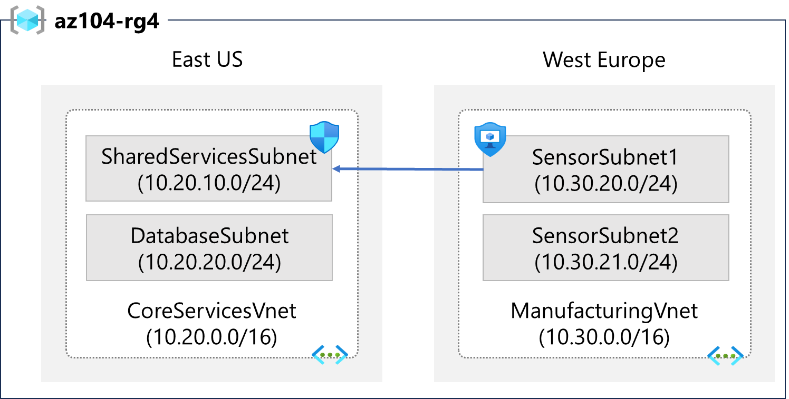
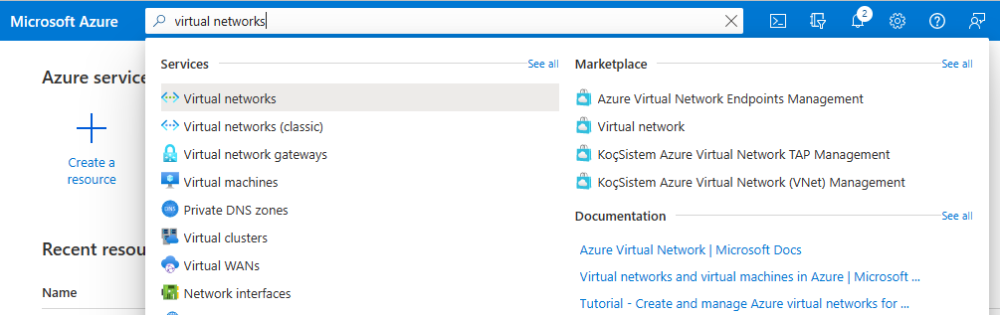
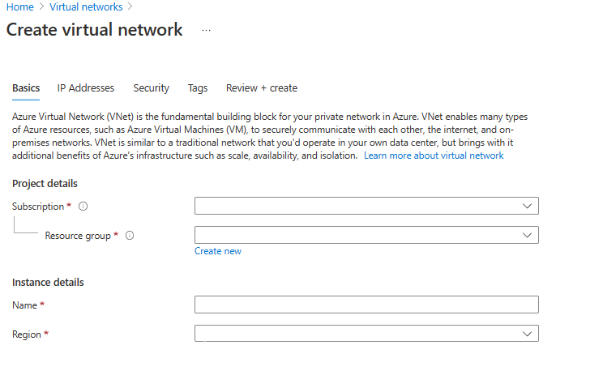
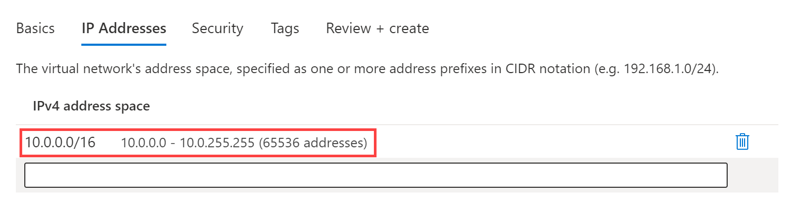
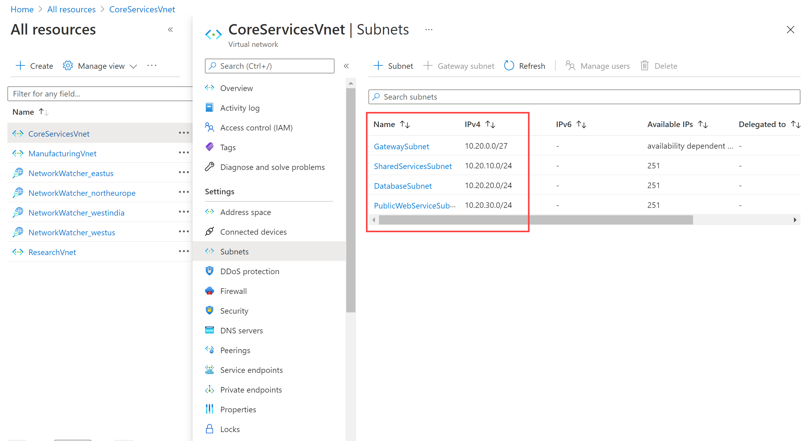

---
lab:
    title: 'Lab 04: Implement Virtual Networking'
    module: 'Administer Virtual Networking'
---

# Lab 04 - Implement Virtual Networking

## Lab requirements

This lab requires an Azure subscription. You must be able to create virtual networks and subnets. 

## Estimated time: 20 minutes

## Lab scenario 

Your global organization plans to implement virtual networks. These networks are in East US, West Europe, and Southeast Asia. The immediate goal is to accomodate all the existing resources. However, the organization is in a growth phase and wants to ensure there is additional capacity for the growth.

The **CoreServicesVnet** virtual network is deployed in the **East US** region. This virtual network has the largest number of resources. The network has connectivity to on-premises networks through a VPN connection. This network has web services, databases, and other systems that are key to the operations of the business. Shared services, such as domain controllers and DNS are located here. A large amount of growth is anticipated, so a large address space is necessary for this virtual network.

The **ManufacturingVnet** virtual network is deployed in the **West Europe** region, near the location of your organization's manufacturing facilities. This virtual network contains systems for the operations of the manufacturing facilities. The organization is anticipating a large number of internal connected devices for their systems to retrieve data from, such as temperature, and needs an IP address space that it can expand into.

The **ResearchVnet** virtual network is deployed in the **Southeast Asia** region, near the location of the organization's research and development team. The research and development team uses this virtual network. The team has a small, stable set of resources that is not expected to grow. The team needs a small number of IP addresses for a few virtual machines for their work.

## Interactive lab simulation

An **[interactive lab simulation](https://mslabs.cloudguides.com/guides/AZ-700%20Lab%20Simulation%20-%20Design%20and%20implement%20a%20virtual%20network%20in%20Azure)** is available for this topic. The simulation lets you to click through a similar scenario at your own pace. There are differences between the interactive simulation and this hosted lab, but the core concepts and ideas being demonstrated are the same. An Azure subscription is not required. 
## Tasks

+ Task 1: Create a resource group.
+ Task 2: Create the CoreServicesVnet virtual network and subnets.
+ Task 3: Create the ManufacturingVnet virtual network and subnets.
+ Task 4: Create the ResearchVnet virtual network and subnets.
+ Task 5: Verify the creation of VNets and Subnets.

## Architecture diagram

| **Virtual Network** | **Region**   | **Virtual network address space** | **Subnet**                | **Subnet**    |
| ------------------- | ------------ | --------------------------------- | ------------------------- | ------------- |
| CoreServicesVnet    | East US      | 10.20.0.0/16                      |                           |               |
|                     |              |                                   | GatewaySubnet             | 10.20.0.0/27  |
|                     |              |                                   | SharedServicesSubnet      | 10.20.10.0/24 |
|                     |              |                                   | DatabaseSubnet            | 10.20.20.0/24 |
|                     |              |                                   | PublicWebServiceSubnet    | 10.20.30.0/24 |
| ManufacturingVnet   | West Europe  | 10.30.0.0/16                      |                           |               |
|                     |              |                                   | ManufacturingSystemSubnet | 10.30.10.0/24 |
|                     |              |                                   | SensorSubnet1             | 10.30.20.0/24 |
|                     |              |                                   | SensorSubnet2             | 10.30.21.0/24 |
|                     |              |                                   | SensorSubnet3             | 10.30.22.0/24 |
| ResearchVnet        |Southeast Asia| 10.40.0.0/16                      |                           |               |
|                     |              |                                   | ResearchSystemSubnet      | 10.40.0.0/24  |

These virtual networks and subnets are structured in a way that accommodates existing resources yet allows for the projected growth. Let's create these virtual networks and subnets to lay the foundation for our networking infrastructure.

>**Did you know?**: It is a good practice to avoid overlapping IP address ranges to reduce issues and simplify troubleshooting. Overlapping is a concern across the entire network, whether in the cloud or on-premises. Many organizations design an enterprise-wide IP addressing scheme to avoid overlapping and plan for future growth.

## Task 1: Create a resource group

### Create a resource group for all the resources in this lab. 

1. Sign in to the **Azure portal** - `http://portal.azure.com`.

1. Search for and select **Resource groups**, then select **+ Create**.  

1. Create the resource group with these settings. 

| **Tab**         | **Option**                                 | **Value**            |
| --------------- | ------------------------------------------ | -------------------- |
| Basics          | Resource group                             | `az104-rg4` |
|                 | Region                                     | (US) **East US**     |
| Tags            | No changes required                        |                      |
| Review + create | Review your settings and select **Create** |                      |

1. Refresh the **Resource groups** page, and verify that **az104-rg4** appears in the list.

## Task 2: Create the CoreServicesVnet virtual network and subnets

The organization plans a large amount of growth for core services. In this task, you create the virtual network and the associated subnets to accomodate the existing resources and planned growth.

1. Search for and select **Virtual Networks**.

    

1. Select **Create** on the Virtual networks page.  

    

3. Use the information in the following table to create the CoreServicesVnet virtual network.  

| **Tab**      | **Option**         | **Value**            |
| ------------ | ------------------ | -------------------- |
| Basics       | Resource Group     | **az104-rg1** |
|              | Name               | `CoreServicesVnet`     |
|              | Region             | (US) **East US**         |
| IP Addresses | IPv4 address space | `10.20.0.0/16`         |

    >**Note:** Remove or overwrite the default IP Address space.
    

 4. Create the CoreServicesVnet subnets. To begin creating each subnet, select **+ Add subnet**. To finish creating each subnet, select **Add**.

| **Subnet**             | **Option**           | **Value**              |
| ---------------------- | -------------------- | ---------------------- |
| GatewaySubnet          | Subnet name          | `GatewaySubnet`          |
|                        | Subnet address range | `10.20.0.0/27`           |
| SharedServicesSubnet   | Subnet name          | `SharedServicesSubnet`   |
|                        | Subnet address range | `10.20.10.0/24`          |
| DatabaseSubnet         | Subnet name          | `DatabaseSubnet`         |
|                        | Subnet address range | `10.20.20.0/24  `        |
| PublicWebServiceSubnet | Subnet name          | `PublicWebServiceSubnet` |
|                        | Subnet address range | `10.20.30.0/24`          |

 1. To finish creating the CoreServicesVnet and its associated subnets, select **Review + create**.

 1. Verify your configuration passed validation, and then select **Create**.
 
## Task 3: Create the ManufacturingVnet virtual network and subnets

In this task, you continue to create an additional virtual network and associated subnets. The organization anticipates growth for the manufacturing offices so the subnets are sized for the expected growth.

    >**Note**: If you need help, use the detailed steps in Task 2. 

| **Tab**      | **Option**         | **Value**             |
| ------------ | ------------------ | --------------------- |
| Basics       | Resource Group     | **az104-rg1**  |
|              | Name               | `ManufacturingVnet`     |
|              | Region             | (Europe) **West Europe**  |
| IP Addresses | IPv4 address space | `10.30.0.0/16`          |

| **Subnet**                | **Option**           | **Value**                 |
| ------------------------- | -------------------- | ------------------------- |
| ManufacturingSystemSubnet | Subnet name          | `ManufacturingSystemSubnet` |
|                           | Subnet address range | `10.30.10.0/24`             |
| SensorSubnet1             | Subnet name          | `SensorSubnet1`             |
|                           | Subnet address range | `10.30.20.0/24`             |
| SensorSubnet2             | Subnet name          | `SensorSubnet2`             |
|                           | Subnet address range | `10.30.21.0/24`             |
| SensorSubnet3             | Subnet name          | `SensorSubnet3`             |
|                           | Subnet address range | `10.30.22.0/24`             |
 

## Task 4: Create the ResearchVnet virtual network and subnets

In this task, you create the final virtual network and associated subnet. The organization does not plan for growth and has limited needs for the research and development offices.

>**Note**: If you need help, use the detailed steps in Task 2. 

| **Tab**      | **Option**         | **Value**            |
| ------------ | ------------------ | -------------------- |
| Basics       | Resource Group     | **az104-rg1** |
|              | Name               | `ResearchVnet`         |
|              | Region             | **Southeast Asia**       |
| IP Addresses | IPv4 address space | `10.40.0.0/16`         |

| **Subnet**           | **Option**           | **Value**            |
| -------------------- | -------------------- | -------------------- |
| ResearchSystemSubnet | Subnet name          | `ResearchSystemSubnet` |
|                      | Subnet address range | `10.40.0.0/24 `        |
 

## Task 5: Verify the creation of VNets and Subnets

In this task, you validate that you have all the necessary virtual networks and subnets to meet the organization's requirements.

1. On the Azure portal home page, search for and select **All resources**.

2. Verify that the CoreServicesVnet, ManufacturingVnet, and ResearchVnet are listed.

3. Select **CoreServicesVnet**. 

4. In CoreServicesVnet, under **Settings**, select **Subnets**.

5. In CoreServicesVnet | Subnets, verify that the subnets you created are listed, and that the IP address ranges are correct.

   

6. Repeat steps 3 - 5 for each VNet. Just remember to change the virtual network selection to ensure you verify all of them.

## Review

Congratulations! You have successfully created a resource group, three virtual networks, and associated subnets.
