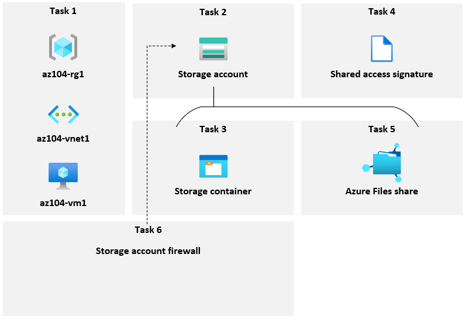

---
lab:
    title: 'Lab 07: Manage Azure storage'
    module: 'Administer Azure Storage'
---

# Lab 07 - Manage Azure Storage

## Estimated timing: 40 minutes

## Lab scenario

Your organization is currently storing data in on-premises data stores. The majority of these files are not accessed frequently. You would like to minimize the cost of storage by placing infrequently accessed files in lower-priced storage tiers. You also plan to explore different protection mechanisms that Azure Storage offers, including network access, authentication, authorization, and replication. Finally, you want to determine to what extent Azure Files is suitable for hosting your on-premises file shares.

## Interactive lab simulations

There are interactive lab simulations that you might find useful for this topic. The simulation lets you to click through a similar scenario at your own pace. There are differences between the interactive simulation and this lab, but many of the core concepts are the same. An Azure subscription is not required. 

+ [Create blob storage](https://mslearn.cloudguides.com/en-us/guides/AZ-900%20Exam%20Guide%20-%20Azure%20Fundamentals%20Exercise%205). Create a storage account, manage blob storage, and monitor storage activities. 
  
+ [Manage Azure storage](https://mslabs.cloudguides.com/guides/AZ-104%20Exam%20Guide%20-%20Microsoft%20Azure%20Administrator%20Exercise%2011). Create a storage account and review the configuration. Manage blob storage containers. Configure storage networking. 

## Architecture diagram



## Tasks

+ Task 1: Create and configure a storage account. 
+ Task 2: Implement secure blob storage.
+ Task 3: Provide limited access to blob storage. 

## Task 1: Create and configure the private storage account. 

In this task, you will create and configure a storage account.

1. Sign in to the **Azure portal** - `http://portal.azure.com`.

1. Search for and select **Storage accounts**, and then click **+ Create**.

1. On the **Basics** tab of the **Create storage account** blade, specify the following settings (leave others with their default values):

    | Setting | Value |
    | --- | --- |
    | Subscription          | the name of your Azure subscription  |
    | Resource group        | **az104-rg7** (create new) |
    | Storage account name  | any globally unique name between 3 and 24 in length consisting of letters and digits |
    | Region                | **East US**  |
    | Performance           | **Standard** (notice the Premium option) |
    | Redundancy            | **Geo-redundant storage** (notice the other options)|
    | Make read access to data in the event of regional availability | Check the box |

1. On the **Advanced** tab, review the available options, accept the defaults.

1. On the **Networking** tab, review the available options, select **Private (no anonymous access)**.

1. Review the **Data protection** tab. Notice 7 days is the default soft delete retention policy. Accept the defaults

1. Review the **Encryption** tab. Notice the additional security options. Accept the defaults.

1. Select **Review**, wait for the validation process to complete and then click **Create**.

1. Once the storage account deploys, **Go to resource**.

1. Review the **Overview** blade and the additional configurations that can be changed.

1. Notice in the **Data storage** section, this storage account can be used for Blob containers, File shares, Queues, and Tables.

1. In the **Data management** section, view the **Redundancy** blade. Notice the information about your primary and secondary data center locations.

1. In the **Data management** section, select **Lifecycle management**, and then select **Add rule**.

+ **Name** the rule `Movetocool`. Notice your options for limiting the scope of the rule.
+ On the **Base blobs** tab, if based blobs were last modified more than `30 days` ago then **move to cool storage**.

    

## Task 2: Manage blob storage

In this task, you will create a blob container and upload a blob into it. Blob containers are directory-like structures that store blobs (unstructured data) in the storage account. 

1. Continue working with your storage account.

1. In the **Data storage** section, click **Containers**. 

1. Click **+ Container** and **Create** a container with the following settings:

    | Setting | Value |
    | --- | --- |
    | Name | `data`  |
    | Public access level | **Private (no anonymous access)** |

    

1. Select your **data** container and then click **Upload**.

1. On the **Upload blob** blade, expand the **Advanced** section.

   >**Note**: Locate a file to upload. This can be any type of file, but a small file is best. 

    | Setting | Value |
    | --- | --- |
    | browse for files | add the file you have selected to upload |
    | Blob type | **Block blob** |
    | Block size | **4 MB** |
    | Access tier | **Hot**  (notice the other options) |
    | Upload to folder | **securitytest** |

    > **Note**: Access tiers can be set for individual blobs.

1. Click **Upload**.

1. Confirm you have a new folder and your file was uploaded. 

1. Select your upload file and review the options including **Download**, **Delete**, **Change tier**, and **Acquire lease**.

1. Copy the file **URL** and paste into a new **Inprivate** browsing window.

1. You should be presented with an XML-formatted message stating **ResourceNotFound** or **PublicAccessNotPermitted**.

    > **Note**: This is expected, since the container you created has the public access level set to **Private (no anonymous access)**.

## Task 3: Provide limited access to blob storage. 

In this task, you will configure limited access to the blob storage. 

1. Return to your **data** container and select your upload file.

1. Use the ellipses on the right side to select **Generate SAS**. Specify the following settings (leave others with their default values):

    | Setting | Value |
    | --- | --- |
    | Signing key | **Key 1** |
    | Permissions | **Read** |
    | Start date | yesterday's date |
    | Start time | current time |
    | Expiry date | tomorrow's date |
    | Expiry time | current time |
    | Allowed IP addresses | leave blank |

1. Click **Generate SAS token and URL**.

1. Click **Copy to clipboard** button next to the **Blob SAS URL** entry.

1. Open another browser window by using InPrivate mode and navigate to the URL you copied in the previous step.

    > **Note**: You should be able to view the content of the file by downloading it and opening it with Notepad. If you receive a Windows SmartScreen error, continue to the page.

    > **Note**: Save the blob SAS URL. You will need it later in this lab.

1. Close the InPrivate mode browser window, return to the browser window showing the **licenses/LICENSE** blade of the Azure Storage container, and from there, navigate back to the **data** blade.

1. Click the **Switch to the Azure AD User Account** link next to the **Authentication method** label.

    > **Note**: You can see an error when you change the authentication method (the error is *"You do not have permissions to list the data using your user account with Microsoft Entra ID"*). It is expected.  

    > **Note**: At this point, you do not have permissions to change the Authentication method.

    

1. On the **data** blade, click **Access Control (IAM)**.

1. On the **Check access** tab, click **Add role assignment**.

1. On the **Add role assignment** blade, specify the following settings:

    | Setting | Value |
    | --- | --- |
    | Role | **Storage Blob Data Owner** |
    | Assign access to | **User, group, or service principal** |
    | Members | the name of your user account |

1. Click **Review + Assign** and then **Review + assign**, and return to the **Overview** blade of the **data** container and verify that you can change the Authentication method to (Switch to Azure AD User Account).

    > **Note**: It might take about 5 minutes for the change to take effect.

## Task 5: Create and configure an Azure Files shares

In this task, you will create and configure Azure Files shares. Azure File Shares allow you to interact with Azure storage using either SMB or NFS protocols. You will then map a network drive from the VM that you deployed to the file share that you create.

> **Note**: Before you start this task, verify that the virtual machine you provisioned in the first task of this lab is running.

1. In the Azure portal, navigate back to the blade of the storage account you created in the first task of this lab and, in the **Data storage** section, click **File shares**.

1. Click **+ File share** and on the **Basics** tab give the file share a name, `share1`. Review the other settings on this tab. 

1. Move to the **Backup** tab, and ensure **Enable Backup** is **not** checked.

1. Click **Review and create**, and then **Create**. Wait for the file share to deploy.

    

1. Click the newly created file share and note the information available on the **share1** blade.

1. Click **Browse** and note that there are no files or folders in the new file share. Click **Connect**.

1. On the **Connect** blade, ensure that the **Windows** tab is selected. Below you will find a button with the label **Show Script**. Click on the button and you will find grey textbox with a script, in the bottom right corner of that box hover over the pages icon and click **Copy to clipboard**.

1. In the Azure portal, search for and select **Virtual machines**, and, in the list of virtual machines, click **az104-vm1**.

1. On the **az104-vm1** blade, in the **Operations** section, click **Run command**.

1. On the **az104-vm1** - Run command** blade, click **RunPowerShellScript**.

1. On the **Run Command Script** blade, paste the script you copied earlier in this task into the **PowerShell Script** pane and click **Run**.

    

1. Verify that the script completed successfully.

1. Replace the content of the **PowerShell Script** pane with the following script and click **Run**:

   ```powershell
   New-Item -Type Directory -Path 'Z:\folder1'

   New-Item -Type File -Path 'Z:\folder1\file1.txt'
   ```

1. Verify that the script completed successfully.

1. Navigate back to the **share1 \| Browse** file share blade, click **Refresh**, and verify that the **folder1** appears in the list of folders.

1. Click **folder1** and verify that **file1.txt** appears in the list of files.

    

## Task 6: Manage network access for Azure Storage

In this task, you will configure network access for Azure Storage. Earlier in this lab when you created the storage account, it was configured to allow connections from any public IP address. In this lab, you will restrict the network access for the storage account to your specific IP address.

1. In the Azure portal, navigate back to the blade of the storage account you created in the first task of this lab and, in the **Security + Networking** section, click **Networking**.

1. From the **Firewalls and virtual networks** tab, click the **Enabled from selected virtual networks and IP addresses** option and review the configuration settings that become available once this option is enabled.

    > **Note**: You can use these settings to configure direct connectivity between Azure virtual machines on designated subnets of virtual networks and the storage account by using service endpoints.

1. Click the checkbox **Add your client IP address** and select **Save**.

    

1. Open another browser window by using InPrivate mode and navigate to the blob SAS URL you generated in the previous task.

    > **Note**: If you did not record the SAS URL from task 4, you should generate a new one with the same configuration. Use Task 4 steps 4-6 as a guide for generating a new blob SAS URL. 

1. You should be presented with the content of **The MIT License (MIT)** page.

    > **Note**: This is expected, since you are connecting from your client IP address.

1. Close the InPrivate mode browser window, return to the browser window showing the **Networking** blade of the Azure Storage account.

## Review

Congratulations! You have successfully provisioned an Azure virtual machine and storage account, then configured the storage account for blob and file storage.
